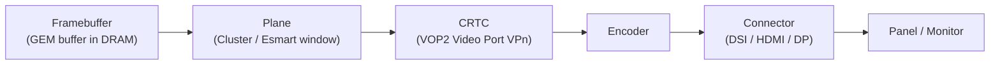

# Experiment 01: Hardware Resource Inventory & KMS Mapping

## 1. Objective
Enumerate the internal display resources of the Rockchip RK3588 (VOP2) and establish a mental model by comparing it with the **ASoC** (ALSA SoC) subsystem.

## 2. Environment
See the [Test Environment](../README.md#test-environment) section. This experiment only needs `modetest` (package `libdrm-tests` on Ubuntu) and root access to `/dev/dri/card0`.

## 3. Background: The KMS Object Model
KMS describes the display pipeline as a chain of objects. Userspace attaches a framebuffer to a plane, planes are blended by a CRTC, and the CRTC output is routed through an encoder to a connector.



### Cross-Subsystem Mapping (ASoC vs. DRM)
| Dimension | ASoC (Audio) | DRM (Display) | Description |
| :--- | :--- | :--- | :--- |
| **Hardware Interface** | `cat /proc/asound/cards` | `modetest -c` | Verifying physical connectivity. |
| **Path/Routing** | DAPM Widgets / Routes | KMS Pipeline | Plane -> CRTC -> Connector path. |
| **Data Scanout** | DMA Engine | CRTC (VOP) | Moving data from memory to hardware. |

## 4. Steps
`modetest` query options (as printed by `modetest -h`, libdrm 2.4.125):

| Option | Lists |
| :--- | :--- |
| `-c` | connectors |
| `-e` | encoders |
| `-p` | CRTCs and planes |
| `-f` | framebuffers |

```bash
# Run as root; -M selects the driver by name
sudo modetest -M rockchip -c   # connectors: ID, status, modes, properties
sudo modetest -M rockchip -e   # encoders:  ID, current CRTC, possible_crtcs mask
sudo modetest -M rockchip -p   # CRTCs and planes (with each plane's possible_crtcs)
```

## 5. Results
Based on `modetest -p` output, the system features **4 CRTCs**, corresponding to the 4 Video Ports (VP) in the VOP2 architecture:
* **VP0 (ID 88)**: Supports up to 8K output.
* **VP1 (ID 128)** / **VP2 (ID 168)**: Support up to 4K output.
* **VP3 (ID 208)**: Supports 2K output, currently driving the DSI panel.

> **Where do the resolution limits come from?** `modetest -p` lists CRTC IDs, but it does not print a maximum resolution per video port, so the 8K/4K/2K figures above need a separate source (e.g. the RK3588 datasheet/TRM or the Rockchip BSP driver).
> For comparison, the **mainline** kernel driver (`drivers/gpu/drm/rockchip/rockchip_vop2_reg.c`, `rk3588_vop_video_ports[]`, RK3588 support since `v6.8`) sets `max_output` to `4096x2304` for VP0/VP1/VP2 and `2048x1536` for VP3. The BSP kernel on the LubanCat 5 may use different limits.

> `TODO(on-hardware)`: paste the full `modetest -M rockchip -e` and `-p` output here, and record which source the 8K/4K/2K limits were taken from.

## 6. Analysis
* **Object IDs**: IDs in DRM are handles assigned by the kernel when objects are registered (allocated from the per-device `dev->mode_config.object_idr` in `drivers/gpu/drm/drm_mode_object.c`). They are unique within one DRM device, but they are **not stable across kernels or boards**—always discover them at runtime (which is what every program in `src/` does).
* **`possible_crtcs` is a bitmask of CRTC *indices*, not IDs**. The kernel builds it with `drm_crtc_mask()`, which returns `1 << drm_crtc_index(crtc)` (`include/drm/drm_crtc.h`). Bit *n* refers to the *n*-th entry of the CRTC list returned by `drmModeGetResources()`, so on this board bit 0 is VP0 (ID 88) and bit 3 is VP3 (ID 208)—assuming the CRTCs are listed in that order, which you should confirm from the `modetest -p` output.
* This mask is a critical constraint during multi-display bring-up: a plane or encoder whose mask does not include a CRTC's bit cannot be attached to it. [Experiment 16](./16_Multi_Display_and_Hotplug.md) prints this routing matrix programmatically.

## 7. Key Takeaways
* The KMS pipeline is Plane → CRTC → Encoder → Connector; on RK3588 each CRTC is one VOP2 video port.
* Never hard-code object IDs; resolve them at runtime.
* Routing masks (`possible_crtcs`) are indexed by CRTC position, not by ID.

## 8. References
* Kernel source: `include/drm/drm_crtc.h` (`drm_crtc_mask`), `include/drm/drm_plane.h` (`struct drm_plane::possible_crtcs`) — checked on `torvalds/linux` master
* Kernel source: `drivers/gpu/drm/rockchip/rockchip_vop2_reg.c` (`rk3588_vop_video_ports`, `rk3588_vop_win_data`) — present since `v6.8`
* Kernel documentation: [`Documentation/gpu/drm-kms.rst`](https://github.com/torvalds/linux/blob/master/Documentation/gpu/drm-kms.rst)
