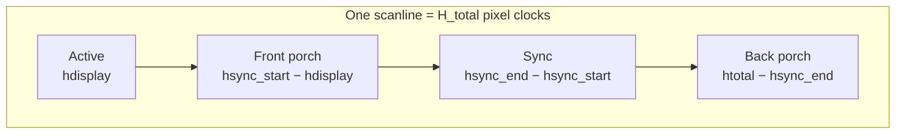

# Experiment 03: DSI Panel Bring-up & Video Timing Analysis

## 1. Objective
Verify that the DSI panel's video timing is consistent end to end: from the mode reported by KMS, through the pixel clock arithmetic, down to the values latched in the VOP2 video port registers.

## 2. Environment
See the [Test Environment](../README.md#test-environment) section. Register dumps require debugfs (`mount -t debugfs none /sys/kernel/debug` if it is not mounted) and root access.

## 3. Background: Video Timing
A display scans a larger rectangle than what is visible. Each line consists of the active pixels plus a horizontal blanking period (front porch + sync + back porch); each frame consists of the active lines plus a vertical blanking period.



`modetest -c` prints each mode as (see `dump_mode()` in libdrm `tests/modetest/modetest.c`):
```text
#index name refresh(Hz) hdisp hss hse htot vdisp vss vse vtot clock(kHz)
```
where `clock` is the pixel clock in **kHz** (`struct drm_mode_modeinfo::clock`, `include/uapi/drm/drm_mode.h`).

## 4. Steps
```bash
# 1. Read the panel's mode line
sudo modetest -M rockchip -c

# 2. Dump the VOP2 registers (file provided by the Rockchip driver on this board's kernel)
sudo cat /sys/kernel/debug/dri/0/regs
```

> The `regs` file is not part of the generic DRM debugfs set. It comes from the **Rockchip BSP** driver: `rockchip-linux/kernel` branch `develop-6.1`, `drivers/gpu/drm/rockchip/rockchip_drm_drv.c`, registers `active_regs`, `regs`, `summary` and `mm_dump` (checked on the branch head). Mainline kernels before `v6.14` have no VOP2 debugfs files; see [Experiment 14](./14_Debugging_and_Tracing.md) for details.

## 5. Results
### 5.1 Video Timing Breakdown
The target DSI panel resolution is 1024x600. The observed timing parameters are:
* **H-Pixels**: 1024 (Active), 1354 (Total)
* **V-Lines**: 600 (Active), 636 (Total)
* **Refresh Rate**: 60Hz

**Candidate porch values from the vendor device tree.** The LubanCat vendor kernel (`github.com/LubanCat/kernel`, branch `lbc-develop-6.1`) ships the overlay `arch/arm64/boot/dts/rockchip/overlay/rk3588-lubancat-5-dsi1-vp3-1024x600-7inch-ebf410173-overlay.dts`, which routes VP3 to DSI1 with this timing:

| | Active | Front porch | Sync | Back porch | Total |
| :--- | :--- | :--- | :--- | :--- | :--- |
| Horizontal | 1024 | 160 | 10 | 160 | **1354** |
| Vertical | 600 | 12 | 1 | 23 | **636** |

`clock-frequency = <51668640>` (Hz), i.e. 51668 kHz after truncation to the mode's kHz field. The totals match the measurements above exactly, but it has **not been confirmed that this overlay is the one loaded on the board**; see [Experiment 15](./15_Device_Tree_and_Driver_Walkthrough.md) for how to check.

> `TODO(on-hardware)`: paste the full mode line from `modetest -c` here to confirm the individual porch and sync values (`hss`, `hse`, `vss`, `vse`).

### 5.2 Pixel Clock Calculation
The Pixel Clock (PCLK) can be verified using the following formula:
$$PCLK = H_{total} \times V_{total} \times Refresh\_Rate$$
$$1354 \times 636 \times 60 = 51{,}668{,}640 \text{ Hz} \approx 51.669 \text{ MHz}$$
This matches the `51668` (kHz) value reported by `modetest`.

Working backwards from the reported clock shows that the panel does not run at *exactly* 60 Hz, because the clock is stored with 1 kHz resolution:

| Quantity | Formula | Value |
| :--- | :--- | :--- |
| Pixels per frame | $1354 \times 636$ | 861,144 |
| Actual refresh | $51{,}668{,}000 / 861{,}144$ | ≈ 59.9993 Hz |
| Frame period | $1 / 59.9993$ | ≈ 16.667 ms |
| Pixel period | $1 / 51.668\text{ MHz}$ | ≈ 19.35 ns |
| Horizontal blanking | $1354 - 1024$ | 330 pixel clocks |
| Vertical blanking | $636 - 600$ | 36 lines |

The 36 blanking lines per frame are the **VBlank** window that [Experiment 09](./09_VBlank_and_Tearing_Analysis.md) relies on to swap buffers safely: $36 \times 1354 / 51.668\text{ MHz} \approx 0.94$ ms per frame.

### 5.3 Register Level Verification
By reading `debugfs/dri/0/regs`, we located the hardware values in the VP3 section:
* **fdd90f40**: Found `054a` (1354 in Hex, H_total).
* **fdd90f50**: Found `027c` (636 in Hex, V_total).
This confirms that the software configuration has been correctly committed to the hardware IP registers.

**Register names (from the mainline driver).** In `drivers/gpu/drm/rockchip/rockchip_drm_vop2.h` (master), VP3's register block starts at offset `0x0F00` (`RK3588_VP3_CTRL_BASE`), and the VOP2 register base is `0xfdd90000`:

| Register | Offset in VP block | Address for VP3 | Contents (`vop2_crtc_atomic_enable()`) |
| :--- | :--- | :--- | :--- |
| `RK3568_VP_DSP_HTOTAL_HS_END` | `0x48` | `0xfdd90f48` | `htotal << 16 \| hsync_len` |
| `RK3568_VP_DSP_VTOTAL_VS_END` | `0x50` | `0xfdd90f50` | `vtotal << 16 \| vsync_len` |

So `027c` is the upper half-word of `VTOTAL_VS_END` at exactly `0xfdd90f50`. For H_total, the register is at `0xfdd90f48`, not `0xfdd90f40`; the most likely explanation is that the dump prints four 32-bit words per line labelled with the first word's address, so `054a` was read from the third word of the `fdd90f40:` line. That dump format was checked for mainline only, not for the BSP.

> `TODO(on-hardware)`: record the full 32-bit words at `0xfdd90f48` and `0xfdd90f50`. The low half-words should equal `hsync_len` (10) and `vsync_len` (1) if the vendor overlay above is in use.

## 6. Engineering Insights
* Checking the same number at three layers (KMS mode → clock arithmetic → hardware register) isolates where a bring-up problem lives: a wrong mode points to the panel description (see [Experiment 15](./15_Device_Tree_and_Driver_Walkthrough.md)), a wrong register value with a correct mode points to the CRTC driver.
* The refresh rate is derived from the clock, not configured directly. If the clock tree cannot produce the exact PCLK, the refresh rate drifts accordingly.

## 7. Key Takeaways
* `refresh = clock / (htotal × vtotal)`; `modetest` computes it the same way (`mode_vrefresh()` in `modetest.c`).
* The blanking intervals are not wasted time—VBlank is the safe window for display updates.

## 8. References
* `include/uapi/drm/drm_mode.h` — `struct drm_mode_modeinfo` (field `clock` in kHz)
* libdrm 2.4.125 `tests/modetest/modetest.c` — `dump_mode()`, `mode_vrefresh()`
