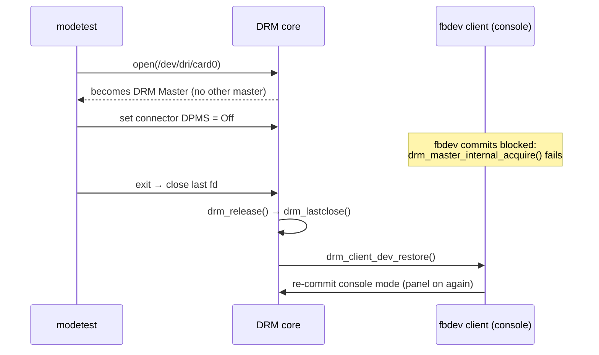

# Experiment 04: DRM Master Concepts & Race Conditions

## 1. Objective
Explain why a display change made with `modetest` is undone as soon as the tool exits, and learn how DRM Master ownership and the in-kernel console client interact.

## 2. Environment
See the [Test Environment](../README.md#test-environment) section. The console (`fbcon`) must be active on the panel, i.e. no display server is running.

## 3. Observation: DPMS Modification Failure
In a Ubuntu Lite environment with only a console running, attempting to set `DPMS:3` (Off) via `modetest` resulted in the screen turning off briefly and then immediately restoring.

## 4. Root Cause: In-Kernel Client Restore on Last Close
* **DRM Master**: Only one userspace file descriptor can be the current Master (allowed to perform modesetting) at a time. `modetest` becomes Master when it opens `/dev/dri/card0` and no other Master exists (`drm_master_open()` in `drivers/gpu/drm/drm_auth.c`: "if there is no current master make this fd it").
* **fbcon / fbdev emulation is an in-kernel client, not a Master**: The console is backed by the DRM fbdev emulation, which is registered as an *in-kernel DRM client*. In mainline, `drm_client_init()` → `drm_client_open()` (`drivers/gpu/drm/drm_client.c`) allocates a `drm_file` for it but puts it on `dev->filelist_internal`, separate from the userspace `dev->filelist`. It does not hold Master status; instead, before touching the display it calls `drm_master_internal_acquire()`, which fails while a userspace Master exists (see `drivers/gpu/drm/drm_fb_helper.c`). So while `modetest` is running, the console backs off.
* **What actually restores the screen**: `modetest` applies `DPMS=Off` and exits. Closing the last open file descriptor runs `drm_release()` → `drm_lastclose()` (`drivers/gpu/drm/drm_file.c`) → `drm_client_dev_restore()` (`drivers/gpu/drm/drm_client_event.c`), which asks the in-kernel client (fbdev) to re-commit its own display configuration. The console mode is restored, so the panel turns back on.

> **Note on kernel versions**: The call chain above was checked against the upstream kernel source at tags `v5.10`, `v6.1` and the current `master` branch of `torvalds/linux`. In `v5.10`/`v6.1`, `drm_client_dev_restore()` lives in `drm_client.c`; newer kernels moved it to `drm_client_event.c`. The LubanCat 5 runs a Rockchip BSP kernel that carries vendor patches, so confirm against your BSP tree (`drivers/gpu/drm/drm_file.c`) before relying on exact function names.

## 5. Debugging Technique
Monitor active userspace clients with:
```bash
sudo cat /sys/kernel/debug/dri/0/clients
```
The `master` column shows `y` for the file descriptor that is the current DRM Master.

* This list is built from `dev->filelist` only (see `drm_clients_info()` in `drivers/gpu/drm/drm_debugfs.c`), so **the fbdev/fbcon in-kernel client never appears here**. If no userspace process shows `master = y`, nobody holds Master—yet the console can still restore the display on last close, as described above.
* **Expected (not yet verified on hardware)**: to keep `DPMS=Off` in effect, the process that changed it must keep its file descriptor open—and therefore stay Master—instead of exiting like a one-shot `modetest` call.



## 6. Results
> `TODO(on-hardware)`: paste `/sys/kernel/debug/dri/0/clients` captured (a) with only the console running and (b) while a long-running KMS program (e.g. `sudo ./src/drm-atomic-demo --atomic`) is active, and confirm the expected behaviour above.

## 7. Key Takeaways
* The first process to open the primary node becomes DRM Master; the console is an in-kernel client, not a Master.
* "My setting was reverted" after a tool exits is usually the last-close restore, not a race inside the driver.
* debugfs `clients` shows userspace file descriptors only.

## 8. References
* Kernel source: `drivers/gpu/drm/drm_file.c` (`drm_release`, `drm_lastclose`)
* Kernel source: `drivers/gpu/drm/drm_client.c` (`drm_client_init`, `drm_client_open`)
* Kernel source: `drivers/gpu/drm/drm_client_event.c` (`drm_client_dev_restore`) — older kernels define it in `drm_client.c`
* Kernel source: `drivers/gpu/drm/drm_debugfs.c` (`drm_clients_info`)
* Kernel source: `drivers/gpu/drm/drm_auth.c` (`drm_master_open`), `drivers/gpu/drm/drm_fb_helper.c` (uses of `drm_master_internal_acquire`) — checked on master
* Kernel documentation: [`Documentation/gpu/drm-uapi.rst`](https://github.com/torvalds/linux/blob/master/Documentation/gpu/drm-uapi.rst), section "Primary Nodes, DRM Master and Authentication"
