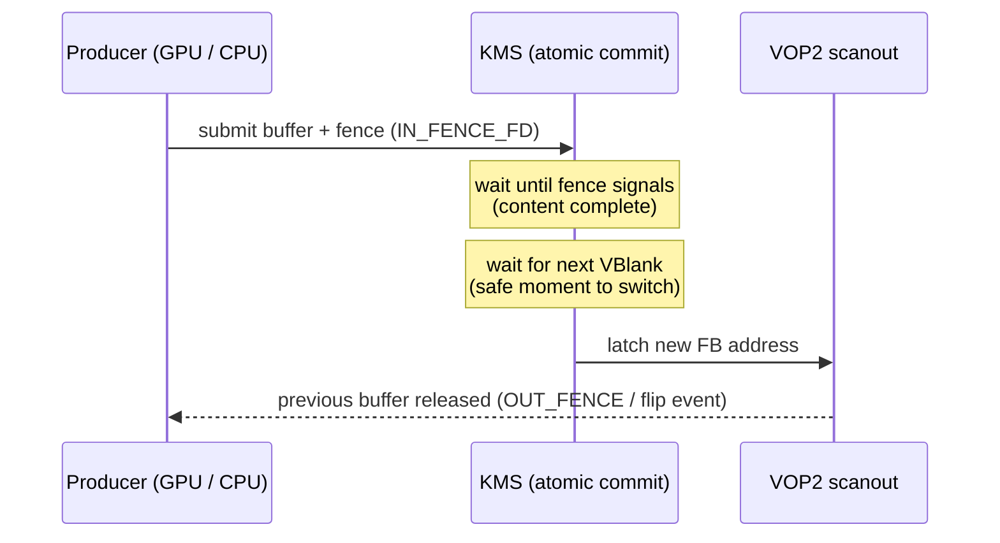

# Experiment 05: Hardware Plane Composition & Sync (GEM/Fence)

## 1. Objective
Understand how the display controller composes several layers in hardware, and which kernel mechanisms (GEM, dma-fence) make sure each layer's memory is valid when it is scanned out.

## 2. Environment
See the [Test Environment](../README.md#test-environment) section.

## 3. Background
### 3.1 Hardware Compositor
RK3588 VOP2 exposes its layers ("windows") as KMS planes. In the **mainline** kernel's window table for RK3588 (`rk3588_vop_win_data[]` in `drivers/gpu/drm/rockchip/rockchip_vop2_reg.c`, present since `v6.8`) there are two window types:

| Window type | Instances (mainline RK3588 table) |
| :--- | :--- |
| Cluster | `Cluster0`–`Cluster3` |
| Esmart | `Esmart0`–`Esmart3` |

The third type, **Smart**, appears in the RK3568 table (`Smart0`, `Smart1`) but not in the RK3588 table. The BSP kernel on the LubanCat 5 may describe windows differently—check `modetest -p` on the board.

* **Advantage**: By utilizing hardware planes for overlays, the system can skip GPU-based software composition, significantly reducing power consumption.
* The blending controls (Z-order, alpha, blend mode) are exposed as plane properties; [Experiment 12](./12_Plane_Properties_and_Blending.md) drives them from C.

### 3.2 Memory & Sync (GEM/Fence)
* **GEM (Graphics Execution Manager)**: Handles memory allocation for framebuffers. The demos in this project use *dumb buffers* (`DRM_IOCTL_MODE_CREATE_DUMB`), the simplest GEM allocation that the CPU can map.
* **dma-fence**: Solves the synchronization between the producer (GPU) and consumer (VOP). It ensures the VOP scans the buffer only after the GPU has finished rendering, preventing a **partially rendered frame** from reaching the screen.

> **Fences vs. tearing — two different problems**
> * **Incomplete frame** (fence problem): the display starts scanning a buffer the GPU is still writing to. A dma-fence makes the commit wait until rendering is complete.
> * **Tearing** (timing problem): the buffer address is switched *while* the display is in the middle of scanning out a frame, so the top and bottom of the screen come from different frames. This is solved by latching the new buffer only during **VBlank** (page flip / atomic commit), not by fences. See [Experiment 09](./09_VBlank_and_Tearing_Analysis.md).
>
> A correct pipeline needs both: the fence says *"the content is ready"*, VBlank says *"now is a safe moment to switch"*.



## 4. Steps
```bash
# List planes: type (Primary/Overlay/Cursor), supported formats, possible_crtcs, properties
sudo modetest -M rockchip -p

# Put a test pattern on an overlay plane on top of the primary (IDs from the listing above)
sudo modetest -M rockchip -s <connector_id>@208:1024x600 -P <overlay_plane_id>@208:400x300+100+100
```

## 5. Results
> `TODO(on-hardware)`: paste the plane list from `modetest -p` (plane IDs, `type` property, formats) and note which planes can reach VP3. Record whether the overlay command above shows two stacked patterns.

## 6. Summary
Successful hardware bring-up requires not just the physical link, but a synchronized dance between memory management, GPU rendering, and display scanout.

## 7. Key Takeaways
* Each VOP2 window is a KMS plane; composition happens in the display controller, not the GPU.
* Fences guarantee *content completeness*; VBlank-synchronized commits guarantee *no tearing*.
* [Experiment 11](./11_DMA_BUF_and_Fence_Sync.md) implements both explicit fences and DMA-BUF sharing.

## 8. References
* Kernel source: `drivers/gpu/drm/rockchip/rockchip_vop2_reg.c` (`rk3588_vop_win_data`, `rk3568_vop_win_data`) — checked on master; RK3588 entries first appear in `v6.8`
* Kernel documentation: [`Documentation/gpu/drm-kms.rst`](https://github.com/torvalds/linux/blob/master/Documentation/gpu/drm-kms.rst) (plane composition properties), [`Documentation/driver-api/dma-buf.rst`](https://github.com/torvalds/linux/blob/master/Documentation/driver-api/dma-buf.rst) (dma-fence)
