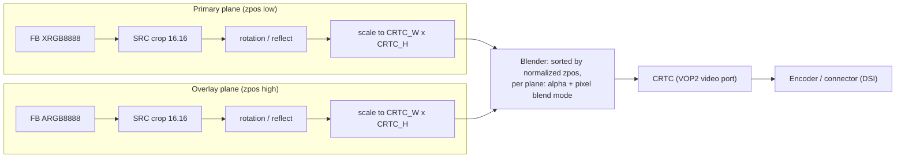

# Experiment 12: Plane Properties & Hardware Blending

## 1. Objective
[Experiment 05](./05_Composition_and_Sync.md) explained hardware plane composition in words: the display controller stacks several planes and blends them as it scans out, with no GPU pass. This experiment puts that into code with the **atomic API** and the standard KMS **composition properties**:

* **`zpos`**: stacking order
* **`alpha`**: opacity for the whole plane
* **`pixel blend mode`**: how the per-pixel alpha channel is interpreted
* **`rotation`**: rotate/reflect step between source and destination
* **Scaling**: there is no property for it. `SRC_W/H` (16.16) differs from `CRTC_W/H`, and only a `DRM_MODE_ATOMIC_TEST_ONLY` commit tells you whether the hardware accepts it.

The program `src/drm-plane-props.c` has two modes:
1. **`--list`** discovers, generically, what each plane on a CRTC offers.
2. **`--demo`** animates a semi-transparent overlay over a full-screen primary. It sweeps `alpha`, swaps `zpos`, scales the overlay, and cycles `pixel blend mode`. Every change is checked with `TEST_ONLY` first, and any feature the driver refuses is reported and skipped.

---

## 2. Environment
See the [Test Environment](../README.md#test-environment) section.

Specific to this experiment:
* The program only needs libdrm and libc, the same as every other demo. It deliberately avoids newer libdrm helpers (see §6.5).
* `--demo` and the scaling probe in `--list` use the atomic ioctl, which needs **DRM master**. Stop any other KMS client first. The fbdev console (`fbcon`) is an in-kernel client and does not hold master (see [Experiment 04](./04_DRM_Master_and_Race_Condition.md)).
* The code has **not yet been run on the LubanCat 5**. Everything under §5 is expected behaviour, not observation.

---

## 3. Background / Key Concepts

### 3.1 The plane composition model
The kernel documents the model in the `DOC: overview` comment of `drivers/gpu/drm/drm_blend.c` (v6.1 and master), which is rendered as "Plane Composition Properties" in `Documentation/gpu/drm-kms.rst`:

* A plane samples a **source rectangle** `SRC_X/Y/W/H` from its framebuffer. The values are **16.16 fixed point**, which gives sub-pixel precision.
* The sampled image is **scaled** to a pixel-aligned **destination rectangle** `CRTC_X/Y/W/H` in the CRTC's visible area. `CRTC_X/Y` may be negative, and the rectangle may extend past the screen. The driver clips it.
* "On top of this basic transformation additional properties can be exposed by the driver". These are `alpha`, `rotation`, `zpos` and `pixel blend mode`. All of them are **optional**.



### 3.2 The four standard composition properties

| Property | Kind | Created by (`drm_blend.c`) | Values / semantics |
| :--- | :--- | :--- | :--- |
| `zpos` | range; can be **immutable** | `drm_plane_create_zpos_property(plane, zpos, min, max)` / `drm_plane_create_zpos_immutable_property(plane, zpos)` | Higher values are closer to the viewer. Equal values have **undefined** order. "If any plane has a zpos property (either mutable or immutable), then all planes shall have a zpos property." |
| `alpha` | range `0 .. 0xffff` | `drm_plane_create_alpha_property()` | `0` is transparent, `0xffff` (`DRM_BLEND_ALPHA_OPAQUE`) is opaque. The initial value is opaque. |
| `pixel blend mode` | enum | `drm_plane_create_blend_mode_property(plane, supported_modes)` | Names are `"None"`, `"Pre-multiplied"` and `"Coverage"`. The driver chooses which ones exist. |
| `rotation` | bitmask | `drm_plane_create_rotation_property(plane, rotation, supported)` | `rotate-0/90/180/270` (counter-clockwise) and `reflect-x`/`reflect-y` |

Details verified in the source (v6.1 and master unless stated):

* **zpos normalization.** `drm_atomic_normalize_zpos()` sorts the planes of each CRTC by `zpos`, then by plane object ID, and writes `0..n-1` into `drm_plane_state.normalized_zpos`. `drm_atomic_helper_check()` (`drm_atomic_helper.c`) calls it when `dev->mode_config.normalize_zpos` is set. Rockchip sets that flag in `rockchip_drm_mode_config_init()` (`drivers/gpu/drm/rockchip/rockchip_drm_fb.c`). Userspace therefore only has to provide a relative order, not a dense `0..n-1` sequence.
* **Blend mode enum values are not UAPI.** The numbers behind the names are `DRM_MODE_BLEND_PREMULTI 0`, `DRM_MODE_BLEND_COVERAGE 1` and `DRM_MODE_BLEND_PIXEL_NONE 2`. They are defined in `include/drm/drm_blend.h`, a kernel-internal header, and are not in `include/uapi/drm/drm_mode.h`. Userspace must look them up **by name** in the property's enum list, which is what the program does.
* **Default blend mode changed after v6.1.** In v6.1, `supported_modes` *must* include `Pre-multiplied`, and that is always the default. On master, a driver may omit it. The default is then `Pre-multiplied`, falling back to `Coverage` and then `None` (`drm_plane_create_blend_mode_property`).
* **Rotation bits** are in the UAPI (`include/uapi/drm/drm_mode.h`, also in `/usr/include/libdrm/drm_mode.h`):
  * `DRM_MODE_ROTATE_0/90/180/270` = bits 0..3
  * `DRM_MODE_REFLECT_X/Y` = bits 4..5

  In a **bitmask** property, the enum "value" is the **bit index**, not the mask. `drm_property_change_valid_get()` (`drm_property.c`) builds its valid mask as `1ULL << values[i]`. The atomic setter additionally requires exactly one rotate bit: `is_power_of_2(val & DRM_MODE_ROTATE_MASK)` in `drm_atomic_plane_set_property()` (`drm_atomic_uapi.c`).
* **Immutable properties cannot be set.** `drm_property_change_valid_get()` returns false for `DRM_MODE_PROP_IMMUTABLE`, so the atomic ioctl fails with `-EINVAL`. It fails the same way for out-of-range values, unknown enum values and invalid bitmask bits. A program must therefore never put an immutable `zpos` into a request.
* **Visibility without the atomic cap.** These four properties are created with flags `0`, not `DRM_MODE_PROP_ATOMIC`, so a legacy (non-atomic) client can see them too. `FB_ID`, `CRTC_ID`, `SRC_*` and `CRTC_*` on planes, and `MODE_ID`/`ACTIVE` on CRTCs, are `DRM_MODE_PROP_ATOMIC` (`drm_mode_config.c`, `drm_mode_create_standard_properties`). They only appear after `DRM_CLIENT_CAP_ATOMIC` is set.
* **CRTC background colour (v7.1+).** A CRTC property, `BACKGROUND_COLOR` (`drm_crtc_attach_background_color_property()`), first appears in `drm_blend.c` at v7.1. It is not in v7.0, v6.8 or v6.1. The formulas below blend against "the background", which is black if this property does not exist.

### 3.3 Blending math: "Pre-multiplied" vs "Coverage" vs "None"
These formulas are quoted verbatim from the `pixel blend mode` section of the `DOC: overview` comment in `drivers/gpu/drm/drm_blend.c`, and are identical in v6.1 and master:

```
"None":            out.rgb = plane_alpha * fg.rgb +
                             (1 - plane_alpha) * bg.rgb

"Pre-multiplied":  out.rgb = plane_alpha * fg.rgb +
                             (1 - (plane_alpha * fg.alpha)) * bg.rgb

"Coverage":        out.rgb = plane_alpha * fg.alpha * fg.rgb +
                             (1 - (plane_alpha * fg.alpha)) * bg.rgb
```

Where:
* `fg.rgb` is the plane's pixel colour.
* `fg.alpha` is the pixel's alpha. It is 1.0 if the format has no alpha channel, and then "this property has no effect, as all three equations become equivalent".
* `bg.rgb` is the background.
* `plane_alpha` is the `alpha` property. It is 1.0 if the plane has no `alpha` property.

The same comment adds that framebuffer pixels "are expected to not be pre-multiplied by the global alpha associated to the plane". Hardware applies `plane_alpha` itself.

How to read them:
* **Pre-multiplied**: the buffer already holds `colour × alpha`, so the foreground term is not multiplied by `fg.alpha` again. Only the background is attenuated. This is the kernel's default. It is also a widespread convention in GPU compositing, but what the Mali stack on this board produces was not checked.
* **Coverage**: the buffer holds straight (un-multiplied) colour, and the blender does the multiplication.
* **None**: the alpha channel is ignored. Only `plane_alpha` matters.

**Worked example.** This is arithmetic, not a measurement. The foreground is orange, straight colour `(1.0, 0.502, 0)` with alpha `0.502` (`0x80`), over a white background, with `plane_alpha = 1`. The demo stores it pre-multiplied, as bytes `A=0x80 R=0x80 G=0x40 B=0x00`, which are `(0.502, 0.251, 0)` as `fg.rgb`.

| Mode selected | out.r | out.g | out.b | Appearance |
| :--- | :--- | :--- | :--- | :--- |
| Pre-multiplied (matches the buffer) | 0.502 + 0.498 = **1.00** | 0.251 + 0.498 = **0.75** | 0 + 0.498 = **0.50** | Correct 50 % orange over white |
| Coverage (buffer is pre-multiplied, so alpha is applied twice) | 0.502·0.502 + 0.498 = **0.75** | 0.502·0.251 + 0.498 = **0.62** | **0.50** | Washed-out, too dim |
| None (alpha ignored) | **0.50** | **0.25** | **0** | Opaque dark orange |

So the blend mode has to match how the buffer was produced. The demo's `pixel blend mode` phase shows exactly this mismatch on screen.

### 3.4 Scaling is decided by `atomic_check`, not by a property
No standard property advertises scaling limits. A driver usually enforces them in its plane `atomic_check`, for example through `drm_atomic_helper_check_plane_state(plane_state, crtc_state, min_scale, max_scale, can_position, can_update_disabled)`. Here `min_scale`/`max_scale` are the minimum and maximum **src:dest** ratios in 16.16 (`drm_atomic_helper.c`), and the ratio is `src width / dst width` (`drm_rect_calc_hscale()`, `drm_rect.c`). A `TEST_ONLY` commit runs exactly this check without touching the hardware. That is the only portable way to learn whether a given scale factor is accepted.

### 3.5 What mainline Rockchip VOP2 exposes
> **Scope warning.** This section describes the **mainline** driver (`torvalds/linux`). LubanCat 5 images normally ship a **Rockchip BSP kernel with its own, heavily patched VOP2 driver**. Its plane types, property names and limits **may differ**. `--list` exists to show what *your* kernel really exposes. Also note that **mainline v6.1 has no RK3588 support in VOP2**: `rockchip_vop2_reg.c` at v6.1 only lists `rockchip,rk3566-vop` / `rockchip,rk3568-vop`. RK3588 window data first appears at **v6.8** (checked: no `rk3588` in v6.6 or v6.7; present in v6.8).

`vop2_plane_init()` in `drivers/gpu/drm/rockchip/rockchip_drm_vop2.c` is identical in property creation at v6.1, v6.8 and master. For **every** window it calls:

| Property | Call | Result |
| :--- | :--- | :--- |
| `rotation` | `drm_plane_create_rotation_property(..., DRM_MODE_ROTATE_0, DRM_MODE_ROTATE_0 \| win->data->supported_rotations)` (only if `supported_rotations != 0`) | See per-window table below |
| `alpha` | `drm_plane_create_alpha_property()` | range 0..0xffff, mutable |
| `pixel blend mode` | `drm_plane_create_blend_mode_property(..., BIT(NONE) \| BIT(PREMULTI) \| BIT(COVERAGE))` | all three modes; default "Pre-multiplied" |
| `zpos` | `drm_plane_create_zpos_property(..., win->win_id, 0, vop2->registered_num_wins - 1)` | **mutable**, range `0 .. N-1`, initial value = window index |

RK3588 window data (`rk3588_vop_win_data[]` in `rockchip_vop2_reg.c`, v6.8 and master). There are 8 windows, so `registered_num_wins = win_size = 8`, which gives `zpos` 0..7:

| Window | `.type` in the table | `supported_rotations` (+ `rotate-0`) | Declared `max_upscale_factor` / `max_downscale_factor` |
| :--- | :--- | :--- | :--- |
| Cluster0..3-win0 | `DRM_PLANE_TYPE_PRIMARY` | `ROTATE_90 \| ROTATE_270 \| REFLECT_X \| REFLECT_Y` | 4 / 4 |
| Esmart0..3-win0 | `DRM_PLANE_TYPE_OVERLAY` | `REFLECT_Y` | 8 / 8 |

Further mainline details that matter for this experiment:
* **Plane types after registration.** In `vop2_create_crtcs()`, each video port that has a remote endpoint gets **one** `PRIMARY` window. Every remaining window is registered as `OVERLAY` with `possible_crtcs` covering all registered CRTCs. So on mainline, spare Cluster windows show up as overlays.
* **Scaling check.** `vop2_plane_atomic_check()` passes `min_scale = FRAC_16_16(1, 8)` and `max_scale = FRAC_16_16(8, 1)` to `drm_atomic_helper_check_plane_state()`, which allows 8× up and 8× down at the core-helper level, the same at v6.1, v6.8 and master. In the files checked, the per-window `max_upscale_factor`/`max_downscale_factor` fields are only declared in the tables; they are not referenced in the atomic check. There are extra driver checks too: 4×4 minimum size, `max_input`, and even `src_x` for YUV. Esmart windows also have a downscaling quirk, handled differently by version:
  * **v6.1 / v6.8:** the quirk is worked around in `vop2_plane_atomic_update()` ("esmart can't support scale down when actual_w % 16 == 1"). The driver logs an error and shrinks the width by one pixel instead of rejecting the commit.
  * **v7.0 and later (absent in v6.19):** `vop2_plane_atomic_check()` **rejects** any odd source width when downscaling ("Esmart windows cannot downscale odd-width source regions").

  The demo keeps its overlay width even for this reason.
* **Global alpha is 8-bit in hardware.** The register field is `glb_alpha:8`, and the driver writes `alpha >> 8`. `is_opaque()` treats `(alpha >> 8) == 0xff` as opaque (`vop2_parse_alpha()`, `is_opaque()`). This is in `rockchip_drm_vop2.c` at v6.1 and v6.8, and in `rockchip_vop2_reg.c` on master. The 16-bit sweep therefore collapses to 256 steps.
* **Only "Pre-multiplied" is special-cased.** `vop2_setup_alpha()` sets `premulti_en = 1` only when `pixel_blend_mode == DRM_MODE_BLEND_PREMULTI`, and enables per-pixel alpha from `fb->format->has_alpha` regardless of the mode. No code path mentions `DRM_MODE_BLEND_PIXEL_NONE` except the capability mask. **From reading the code, not verified on hardware:** on mainline VOP2, `"None"` on an ARGB buffer is likely handled like `"Coverage"` rather than ignoring pixel alpha. The demo's blend phase is designed to make this visible.
* **Background colour (v7.1+).** `vop2_create_crtcs()` attaches `BACKGROUND_COLOR`, and `vop2_plane_atomic_check()` rejects alpha blending when a non-black background is set ("Alpha-blending with background color is unsupported").

---

## 4. Implementation

### 4.1 Key implementation details
* **Generic discovery by name.** `load_plane()` walks `drmModeObjectGetProperties()` / `drmModeGetProperty()`. For each plane it records the id, flags, current value, range limits, and the enum names of `pixel blend mode` and the `rotate-0` bit of `rotation`. Nothing is assumed to exist, and `--list` prints "not exposed by this driver/plane" when a property is missing.
* **Kind decoding without new libdrm helpers.** The property kind comes from `flags & (DRM_MODE_PROP_LEGACY_TYPE | DRM_MODE_PROP_EXTENDED_TYPE)`, which covers range, signed range, enum, bitmask, blob and object. Fallback `#define`s cover older headers.
* **Scaling probe (`--list`).** There are three `TEST_ONLY` commits with a 64×64 dumb buffer: 1:1 (baseline), 64→128 (2× up) and 64→32 (½ down). They run only if the CRTC is lit and the plane is free or already on this CRTC. If the baseline itself is refused, the result is reported as *inconclusive*. Some drivers require a primary plane to cover the whole CRTC, so a refusal is not necessarily a scaling limit. `EACCES` is reported as "not DRM master".
* **Demo plane choice.** The primary is the `PRIMARY` plane already on the CRTC, if there is one. The overlay is a free `OVERLAY` plane, scored by ARGB8888 support (+4), mutable `alpha` (+2) and mutable `zpos` (+1). The plane's `formats[]` list is checked for `DRM_FORMAT_ARGB8888`. Without it the overlay is XRGB8888, and the blend phase is skipped, because the kernel doc says all three equations are then equivalent.
* **Buffers.** The primary is XRGB8888 colour bars with a grey checkerboard, so anything showing through is obvious. The overlay is `hdisplay/2 × vdisplay/2` (even width) orange with a per-pixel alpha ramp from `0x40` to `0xff` left to right, a 6-px opaque white border, and colours stored **pre-multiplied**.
* **zpos swap without guessing.** `plan_zpos()` takes the two planes' ranges (an immutable zpos is treated as `min == max`). It needs both "overlay above" (`primary=pmin, overlay=omax`) and "overlay below" (`primary=pmax, overlay=omin`) to be strictly ordered. Otherwise the phase is skipped. Immutable `zpos` values are never written.
* **Every change goes through TEST_ONLY.** `commit_frame()` tests the frame with all still-enabled features. On failure it tests the base overlay alone, then base plus each feature on its own. A feature that fails alone is disabled and reported, for example `!! TEST_ONLY rejected feature "scaling" (SRC 512x300 -> CRTC 516x302: Invalid argument) -- continuing without it`. The real commit is `NONBLOCK | PAGE_FLIP_EVENT`, paced by the flip event as in Experiment 10.
* **Initial modeset with fallbacks.** The request contains connector `CRTC_ID`, CRTC `MODE_ID` (blob) + `ACTIVE`, primary + overlay, and "reset" values: `rotate-0`, opaque primary alpha, and `Pre-multiplied` on the primary. Leftovers from a previous client cannot skew the result. Other planes currently on the CRTC are switched off. If `TEST_ONLY` rejects this, the program retries without composition properties, then without the overlay.
* **Restore on exit / SIGINT / SIGTERM.** At startup it saves connector `CRTC_ID`, CRTC `ACTIVE`, the mode (from `drmModeGetCrtc()`), and every mutable property of every plane it may touch. On exit it waits for the pending flip, rebuilds a mode blob, and commits the saved values with `TEST_ONLY` first. A new blob is created because the saved `MODE_ID` blob may not exist any more: blobs die with their last reference, see `drm_mode_destroyblob_ioctl()`. If the restore fails, the fbdev console (if any) is still restored by the kernel when the last client closes the device: `drm_lastclose()` → `drm_client_dev_restore()` (`drm_file.c`, v6.1 and master).
* **`--selftest`.** This checks the pure helpers (16.16 conversion, argument parsing, zpos planning, the frame planner) without a DRM device.

### 4.2 Compilation and usage
The universal Makefile picks up every `src/*.c`:

```bash
make                                  # builds src/drm-plane-props among others

sudo ./src/drm-plane-props            # same as --list: auto-selects the CRTC of the connected display
sudo ./src/drm-plane-props --list -c 208   # a specific CRTC (IDs are board/kernel specific!)
sudo ./src/drm-plane-props --demo     # animate; Ctrl+C restores the previous state
./src/drm-plane-props --selftest      # no device needed
./src/drm-plane-props --help
```

`-d <path>` selects another DRM device. The default is `/dev/dri/card0`. In `--demo`, `-c` must name a CRTC that the connector can use and that is not driving another connector. Moving a connector between CRTCs is refused, because a clean restore would then have to touch two CRTCs.

### 4.3 High-level logic flow (C-style pseudocode)
```c
drmSetClientCap(fd, DRM_CLIENT_CAP_UNIVERSAL_PLANES, 1);
drmSetClientCap(fd, DRM_CLIENT_CAP_ATOMIC, 1);

// ---- discovery (both modes) ----
for (plane in planes where possible_crtcs & (1 << crtc_index)) {
    props = drmModeObjectGetProperties(fd, plane, DRM_MODE_OBJECT_PLANE);
    for (p in props) {
        info = drmModeGetProperty(fd, p);
        kind = info->flags & (DRM_MODE_PROP_LEGACY_TYPE | DRM_MODE_PROP_EXTENDED_TYPE);
        if (name is "zpos" / "alpha" / "pixel blend mode" / "rotation")
            record(kind, min/max or enum names, IMMUTABLE flag, current value);
    }
}

// ---- demo ----
save(connector.CRTC_ID, crtc.ACTIVE, crtc.mode, every mutable prop of touched planes);
enabled = SCALE | (alpha mutable ? ALPHA : 0) | (zpos plannable ? ZPOS : 0)
        | (blend mutable && ARGB8888 ? BLEND : 0);
modeset(TEST_ONLY | ALLOW_MODESET, then ALLOW_MODESET)      // with fallbacks

while (!sigint) {
    f = plan_frame(frame++);       // alpha ramp / zpos toggle / scale / blend cycle
    if (test(f, enabled) fails) {
        if (test(f, NONE) fails) break;               // even the base overlay is refused
        for (feat in enabled) if (test(f, feat) fails) enabled &= ~feat;  // report
    }
    commit(f, enabled, NONBLOCK | PAGE_FLIP_EVENT);
    wait_for_flip_event();
}
restore(saved);                     // TEST_ONLY first, then ALLOW_MODESET commit
```

---

## 5. Results (pending hardware verification)

> Nothing in this section has been observed on the LubanCat 5 yet. The program compiles cleanly (`gcc -Wall -Wextra -Werror`) and `--selftest` passes. Its control flow was also exercised off-target against a stub libdrm (a throwaway test double, not part of this repository), which is **not** a hardware result.

### 5.1 `--list`
Run it on the target and compare with `modetest -M rockchip -p`, which lists the same planes and properties:

```bash
sudo ./src/drm-plane-props --list
sudo modetest -M rockchip -p
```

What to look for:
* Which planes are `Primary` and which are `Overlay` for the DSI CRTC, and their `possible_crtcs`.
* Whether `zpos` is **mutable** and its range. Mainline RK3588 would show `0..7`; the BSP may differ.
* Whether `alpha` shows `max 0xffff`.
* Which `pixel blend mode` names exist.
* Which `rotation` bits each window offers. Mainline: Cluster windows `rotate-0/90/270, reflect-x/y`; Esmart windows `rotate-0, reflect-y`.
* The scaling probe line, and any BSP-specific properties in the "other properties" line.

> TODO(on-hardware): paste the output of `sudo ./src/drm-plane-props --list` here.

> TODO(on-hardware): paste the matching part of `sudo modetest -M rockchip -p` here for cross-checking.

### 5.2 `--demo`
```bash
sudo ./src/drm-plane-props --demo     # let it run through all phases (~16 s at 60 Hz), then Ctrl+C
```

Expected on screen, if every feature is accepted:
1. **Alpha sweep (4 s).** The orange rectangle fades in from invisible to its per-pixel-alpha look. On VOP2 the 16-bit value is quantized to 8 bits (§3.5), which should not be visible.
2. **zpos swap (4 s).** Every second the overlay disappears behind the opaque primary and comes back.
3. **Scaling (4 s).** The overlay grows from 0.5× to 1.5× and shrinks back, staying centred.
4. **Blend modes (4 s).** For the three modes, in the order the driver lists them:
   * `Pre-multiplied`: a smooth fade from mostly transparent (left) to opaque (right).
   * `Coverage`: noticeably washed out towards the left, because alpha is applied twice.
   * `None`: an opaque ramp from dark to bright orange.

   If `None` looks like `Coverage`, that confirms the mainline code-reading in §3.5 (or reveals the BSP's behaviour).
5. On Ctrl+C the terminal should print `Original KMS state restored.` and the console should reappear.

> TODO(on-hardware): paste the terminal output of `sudo ./src/drm-plane-props --demo` (including any `!! TEST_ONLY rejected feature ...` lines) here.

> TODO(on-hardware): add a photo of each phase, especially the three blend modes.

---

## 6. Analysis / Engineering Insights

### 6.1 Properties describe capability, TEST_ONLY describes reality
A property's existence and range say what the *uAPI* accepts, not what the *hardware* will do in a given configuration. Scaling limits, format/rotation combinations, and "overlay below primary" are enforced in `atomic_check`. Examples are the Esmart odd-width downscale rule (v7.0+) and the background-colour rule (v7.1+) in mainline VOP2. Robust userspace, such as a compositor or this demo, therefore treats `TEST_ONLY` as the source of truth and degrades gracefully. Wayland compositors do the same thing when they try to put a surface on an overlay plane.

### 6.2 Blend mode must match the producer
The table in §3.3 shows that a mismatch between how pixels were produced (pre-multiplied or straight) and the selected blend mode causes visible errors. The kernel default is `Pre-multiplied`. Whether a particular producer (GPU, camera/ISP, video decoder) writes pre-multiplied or straight alpha has to be checked for that producer. This is a system-integration decision, not just a display-driver setting.

### 6.3 16-bit uAPI, 8-bit hardware
`alpha` is 16-bit in the uAPI so that it can describe any hardware. Mainline VOP2 keeps only the top 8 bits (`alpha >> 8`), and treats anything from `0xff00` up as opaque. That also means the global-alpha blender stage is bypassed, per `is_opaque()`. Small changes below 256 LSB have no visible effect on this SoC.

### 6.4 zpos is relative, and the helper normalizes it
With `normalize_zpos = true`, the core sorts planes by `(zpos, plane_id)` and assigns dense `normalized_zpos` values. Drivers such as VOP2 then program their layer mixer from `normalized_zpos`. Userspace only needs a strict order. Equal values are legal but produce an *undefined* order, which is why the demo always uses distinct values.

### 6.5 Portability choices (libdrm version unknown on target)
* The code uses only long-standing libdrm entry points that the existing demos already use: `drmModeObjectGetProperties`, `drmModeGetProperty`, `drmModeGetPlane(Resources)`, `drmModeAtomic*`, `drmModeCreatePropertyBlob`, `drmModeAddFB2`, and `drmHandleEvent` with a version-2 event context. The exact libdrm version that introduced each one was **not verified**. All are present in 2.4.125.
* It avoids `drmModeGetPropertyType()` / `drm_property_type_is()` (inline helpers in 2.4.125's `xf86drmMode.h`; introduction version not verified) and decodes the UAPI flag bits itself.
* In libdrm 2.4.125, `drmModeAtomicCommit()` returns `-errno` (via the `DRM_IOCTL()` wrapper in `xf86drmMode.c`). The demo reads `errno` as well, so its error reporting does not depend on that detail.
* `DRM_PLANE_TYPE_*` comes from `xf86drmMode.h` and has an `#ifndef` fallback.

### 6.6 Mainline vs BSP
Every Rockchip-specific statement in this document comes from **mainline** sources: v6.1 for the generic VOP2 code, and v6.8/master for RK3588 data. The BSP kernel on the board may:
* register planes differently (types and names),
* expose extra vendor properties,
* implement `None` properly, or
* enforce different scaling limits.

The program is written so that none of this breaks it. It only reports differently.

---

## 7. Key Takeaways
* Hardware composition is controlled entirely by **optional, named plane properties**: `zpos` (range, possibly immutable), `alpha` (0..0xffff), `pixel blend mode` (enum), and `rotation` (bitmask of bit indices). Discover them by name. Never assume enum numbers.
* **Scaling has no property.** Only a `TEST_ONLY` commit reveals whether `SRC_W/H` (16.16) ≠ `CRTC_W/H` is accepted.
* **Pre-multiplied vs Coverage** is about who multiplies colour by alpha: the producer or the blender. Choosing the wrong one double-applies or ignores alpha.
* On **mainline** VOP2 (RK3588 support from v6.8), every window gets a mutable `zpos` (0..N-1), `alpha`, all three blend modes, and window-specific `rotation`. Global alpha is 8-bit in hardware, and only `Pre-multiplied` is special-cased. The **BSP may differ**, so run `--list`.
* Save what you change and **restore it on exit**, including after Ctrl+C. The mode blob must be recreated, because the old one may no longer exist.

---

## 8. References
Kernel sources are from `torvalds/linux` at tags **v6.1**, **v6.8** (first tag with RK3588 VOP2 data; absent in v6.6/v6.7) and **master**, fetched 2026-09-24 via `raw.githubusercontent.com` (e.g. <https://raw.githubusercontent.com/torvalds/linux/v6.1/drivers/gpu/drm/drm_blend.c>). Specific features were dated by also checking v6.19, v7.0 and v7.1, as stated in the text.

* `drivers/gpu/drm/drm_blend.c`: `DOC: overview` (composition model, blend formulas), `drm_plane_create_alpha_property`, `drm_plane_create_rotation_property`, `drm_rotation_simplify`, `drm_plane_create_zpos_property`, `drm_plane_create_zpos_immutable_property`, `drm_atomic_normalize_zpos`, `drm_plane_create_blend_mode_property`; v7.1+/master: `drm_crtc_attach_background_color_property`
* `include/drm/drm_blend.h`: `DRM_MODE_BLEND_PREMULTI/COVERAGE/PIXEL_NONE`, `DRM_BLEND_ALPHA_OPAQUE`
* `include/uapi/drm/drm_mode.h`: `DRM_MODE_ROTATE_*`, `DRM_MODE_REFLECT_*`, `DRM_MODE_PROP_*`, `DRM_MODE_ATOMIC_TEST_ONLY`
* `drivers/gpu/drm/drm_property.c`: `drm_property_change_valid_get`, `drm_property_add_enum`, `drm_mode_destroyblob_ioctl`
* `drivers/gpu/drm/drm_atomic_uapi.c`: `drm_atomic_plane_set_property`, `drm_atomic_set_property`
* `drivers/gpu/drm/drm_atomic_helper.c`: `drm_atomic_helper_check` (calls `drm_atomic_normalize_zpos`), `drm_atomic_helper_check_plane_state`
* `drivers/gpu/drm/drm_rect.c` (v6.1): `drm_rect_calc_hscale`
* `drivers/gpu/drm/drm_mode_config.c`: `drm_mode_create_standard_properties` (plane `type` enum names, `DRM_MODE_PROP_ATOMIC` on `SRC_*`/`FB_ID`/`MODE_ID`)
* `drivers/gpu/drm/drm_ioctl.c`: `DRM_IOCTL_MODE_ATOMIC` is `DRM_MASTER`
* `drivers/gpu/drm/drm_file.c`: `drm_lastclose` → `drm_client_dev_restore`
* `drivers/gpu/drm/rockchip/rockchip_drm_vop2.c` (v6.1, v6.8, master): `vop2_plane_init`, `vop2_create_crtcs`, `vop2_plane_atomic_check`; at v6.1/v6.8 also `vop2_plane_atomic_update`, `vop2_parse_alpha`, `is_opaque`, `vop2_setup_alpha`
* `drivers/gpu/drm/rockchip/rockchip_vop2_reg.c`: v6.1 (RK3566/RK3568 only); v6.8 and master: `rk3588_vop_win_data[]`; master: `vop2_parse_alpha`, `is_opaque`, `vop2_setup_alpha`
* `drivers/gpu/drm/rockchip/rockchip_drm_fb.c`: `rockchip_drm_mode_config_init` (`normalize_zpos = true`)
* `Documentation/gpu/drm-kms.rst`: "Plane Composition Properties" and "Plane Composition Functions Reference" (both `kernel-doc` includes of `drm_blend.c`)
* libdrm 2.4.125: `xf86drmMode.h` (`drmModeGetPropertyType`, `DRM_PLANE_TYPE_*`), `xf86drmMode.c` (`drmModeAtomicCommit`, `DRM_IOCTL` wrapper), `include/drm/drm_mode.h`
* Previous experiments: [05 Composition & Sync](./05_Composition_and_Sync.md), [10 Atomic KMS](./10_Atomic_KMS_Implementation.md)
