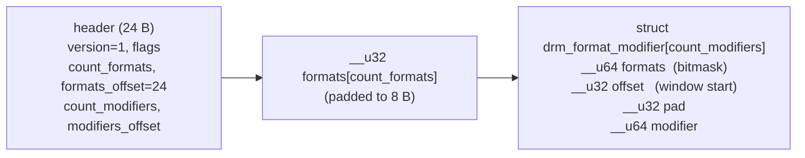
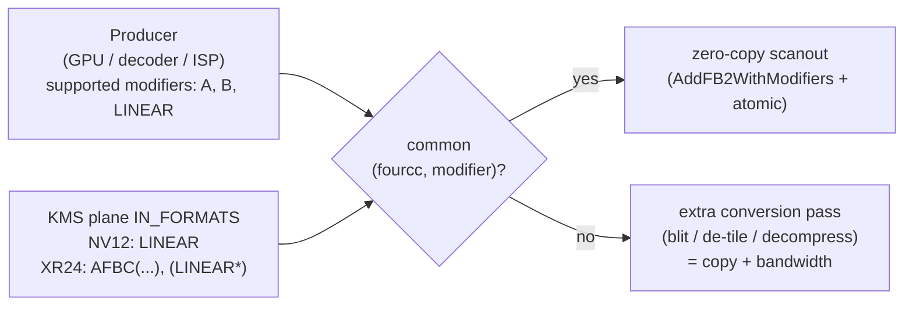

# Experiment 13: Pixel Formats & Format Modifiers

## 1. Objective
Until now every buffer in this project was `XRGB8888`, linear, one memory plane. Real media pipelines (camera → ISP → video codec → display) mostly move **YUV** data, often in **tiled or compressed** layouts. This experiment looks at the two pieces of metadata that describe any KMS framebuffer:

* **fourcc format**: *what* the pixels are (`XR24`, `RG16`, `NV12`, ...): channel order, bit depth, number of memory planes, chroma subsampling.
* **format modifier**: *how* those pixels are arranged in memory (`LINEAR`, vendor tiling, ARM AFBC compression, ...).

The demo `src/drm-formats-modifiers.c`:
1. **`--list`** (default): for every plane it prints the classic `drmModePlane->formats` list, then **parses the `IN_FORMATS` blob by hand** (no libdrm helpers) and prints a *format × modifier* matrix. Each modifier is decoded: the vendor from the top 8 bits, plus the full flag set for ARM AFBC/AFRC.
2. **`--nv12`**: shows BT.601 limited-range colour bars from an **NV12 dumb buffer** on the primary plane, or on the first idle plane that accepts linear NV12. It uses `drmModeAddFB2` with two handles, pitches and offsets and an atomic commit with `TEST_ONLY` first. When it exits, it restores the previous state.
3. **`--selftest`**: runs host-only checks of the blob parser, the modifier decoder and the YCbCr maths. It needs no DRM device.

---

## 2. Environment
See the [Test Environment](../README.md#test-environment) section.

Specific to this experiment:
* libdrm: the program only uses long-standing APIs (`drmModeGetPlane`, `drmModeGetPropertyBlob`, `drmModeAddFB2`, atomic). It **does not** use `drmGetFormatModifierName()` or `drmModeFormatModifierBlobIterNext()` (see §3.6).
* Kernel: the LubanCat 5 runs a Rockchip **BSP** kernel. Every Rockchip statement below comes from the **mainline** driver and says which tag was checked. **The BSP VOP2 driver is a different code base and may advertise different planes, formats and modifiers.** The `--list` output from the board is what counts.
* "master" below means `torvalds/linux` master as fetched on 2026-09-24 (top-level `Makefile`: 7.3-rc4).

---

## 3. Background / Key Concepts

### 3.1 fourcc codes
`include/uapi/drm/drm_fourcc.h` (v6.1 and master) packs four ASCII characters little-endian:

```c
#define fourcc_code(a, b, c, d) ((__u32)(a) | ((__u32)(b) << 8) | \
                                 ((__u32)(c) << 16) | ((__u32)(d) << 24))
#define DRM_FORMAT_BIG_ENDIAN (1U<<31)
```

So `DRM_FORMAT_XRGB8888` prints as `XR24` and `DRM_FORMAT_NV12` as `NV12`. The demo's `fourcc_str()` masks off bit 31 (the big-endian flag) before decoding.

NV12 is defined as a 2-plane format ("index 0 = Y plane, [7:0] Y; index 1 = Cr:Cb plane, [15:0] Cr:Cb little endian", `DRM_FORMAT_NV12` = "2x2 subsampled Cr:Cb plane"). Because the 16-bit Cr:Cb word is little-endian, **Cb is the byte at the lower address**. The kernel's format table agrees: `drivers/gpu/drm/drm_fourcc.c` (`__drm_format_info`, v6.1 and master) lists NV12 with `.num_planes = 2, .cpp = { 1, 2, 0 }, .hsub = 2, .vsub = 2, .is_yuv = true`.

### 3.2 Modifiers: a 64-bit layout tag
From `include/uapi/drm/drm_fourcc.h`:

```c
#define fourcc_mod_get_vendor(modifier) (((modifier) >> 56) & 0xff)
#define fourcc_mod_code(vendor, val) \
    ((((__u64)DRM_FORMAT_MOD_VENDOR_## vendor) << 56) | ((val) & 0x00ffffffffffffffULL))
#define DRM_FORMAT_MOD_INVALID  fourcc_mod_code(NONE, DRM_FORMAT_RESERVED)  /* 0x00ffffffffffffff */
#define DRM_FORMAT_MOD_LINEAR   fourcc_mod_code(NONE, 0)                    /* 0 */
```

Vendor IDs in master: `NONE 0, INTEL 0x01, AMD 0x02, NVIDIA 0x03, SAMSUNG 0x04, QCOM 0x05, VIVANTE 0x06, BROADCOM 0x07, ARM 0x08, ALLWINNER 0x09, AMLOGIC 0x0a, MTK 0x0b, APPLE 0x0c`. v6.1 stops at `AMLOGIC`.

For **ARM**, the header subdivides the 56-bit payload further (`DRM_FORMAT_MOD_ARM_CODE`): bits 55:52 are a *category* (`AFBC 0x0`, `MISC 0x1`, `AFRC 0x2`), and the rest is category-specific. The AFBC bits decoded by the demo are:

| Bits | Macro | Meaning (paraphrasing the header comments) |
| :--- | :--- | :--- |
| 3:0 | `AFBC_FORMAT_MOD_BLOCK_SIZE_16x16 / 32x8 / 64x4 / 32x8_64x4` (1/2/3/4) | Superblock size |
| 4 | `AFBC_FORMAT_MOD_YTR` | Lossless colour-space transform |
| 5 | `AFBC_FORMAT_MOD_SPLIT` | Superblock payload is split |
| 6 | `AFBC_FORMAT_MOD_SPARSE` | Each superblock payload stored at a fixed position |
| 7 | `AFBC_FORMAT_MOD_CBR` | Copy-block restriction |
| 8 | `AFBC_FORMAT_MOD_TILED` | Superblocks grouped in 8x8/4x4 tiles |
| 9 | `AFBC_FORMAT_MOD_SC` | Solid-colour blocks |
| 10 | `AFBC_FORMAT_MOD_DB` | Double-buffer (front-buffer rendering safe) |
| 11 | `AFBC_FORMAT_MOD_BCH` | Per-superblock content hints |
| 12 | `AFBC_FORMAT_MOD_USM` | Uncompressed storage mode |

Example: `DRM_FORMAT_MOD_ARM_AFBC(BLOCK_SIZE_16x16 | YTR | SPARSE | SPLIT)` = `0x0800000000000071`. The self-test checks this value.

### 3.3 The `IN_FORMATS` blob
`IN_FORMATS` is an immutable blob property on each plane. It answers the question: which (format, modifier) pairs does this plane accept? The layout is fixed by `include/uapi/drm/drm_mode.h` (`struct drm_format_modifier_blob`, `struct drm_format_modifier`; identical in v6.1 and master). The kernel builds it in `drivers/gpu/drm/drm_plane.c` (`create_in_format_blob`):



Details verified in `create_in_format_blob()`:
* `formats_offset = sizeof(struct drm_format_modifier_blob)` (24; a `BUILD_BUG_ON` enforces a multiple of 8).
* `modifiers_offset = ALIGN(formats_offset + 4*format_count, 8)`.
* For modifier *i*, bit *j* of `formats` is set when `plane->funcs->format_mod_supported(plane, format[j], modifier[i])` returns true, or when the driver has no such hook. **The kernel always writes `offset = 0`**, so only the first 64 formats can be described. The parser in the demo still honours `offset`, as the UAPI comment describes.
* The list of *modifiers* is the driver's `format_modifiers` array passed to `drm_universal_plane_init()`. A driver that passes `NULL` gets `{ DRM_FORMAT_MOD_LINEAR }` (`default_modifiers[]` in `__drm_universal_plane_init`), unless `mode_config.fb_modifiers_not_supported` is set.
* **v6.1 vs master:** in v6.1, `create_in_format_blob()` attaches the property itself. In master it returns the blob, and the caller attaches it as `IN_FORMATS`. Master also builds a second blob, `IN_FORMATS_ASYNC`, from `format_mod_supported_async` (first present in **v6.16** of the tags checked: absent in v6.15, present in v6.16). The blob layout is unchanged. The demo prints `IN_FORMATS_ASYNC` too when it exists.
* The `IN_FORMATS` DOC comment in `drm_plane.c` (v6.1) says: without this property "the plane doesn't support buffers with modifiers". If `DRM_CAP_ADDFB2_MODIFIERS` is set, every plane has the property. Before v5.1 the two were not always consistent.

The parser (`parse_in_formats_blob()`) checks every offset and count against the blob length and `memcpy`s the arrays out, so it never dereferences an unaligned or out-of-range pointer. The self-test feeds it a truncated blob to check that it rejects it.

### 3.4 Where modifiers are enforced
`IN_FORMATS` is only the advertisement. The authoritative check runs at commit time. `drm_atomic_plane_check()` in `drivers/gpu/drm/drm_atomic.c` calls `drm_plane_check_pixel_format()` (v6.1) or `drm_plane_has_format()` (master). Both accept a (format, modifier) pair if the format is in the plane's list **and** `format_mod_supported()` says yes. Only if the driver has no such hook does the pair have to appear in the modifier list. This distinction matters on VOP2 (§3.5).

At `ADDFB2` time, `framebuffer_check()` in `drivers/gpu/drm/drm_framebuffer.c` (v6.1) validates per-plane pitches against `drm_format_info_min_pitch()`. It rejects a non-zero modifier unless `DRM_MODE_FB_MODIFIERS` is set. For Rockchip, `rockchip_fb_create()` (`rockchip_drm_fb.c`) uses `drm_gem_fb_init_with_funcs()`, which checks that each GEM object holds at least `(height-1)*pitch + min_pitch + offset` bytes. For AFBC modifiers it also calls `drm_gem_fb_afbc_init()`.

### 3.5 What mainline VOP2 advertises: Cluster vs Esmart
**Mainline only; the BSP driver may differ.** RK3588 VOP2 support is **not in v6.1**: `rockchip_vop2_reg.c` there describes only RK3568/RK3566. Among the tags checked, it first appears in **v6.8** (v6.7 has no `rk3588` entries).

**RK3588, master** (`drivers/gpu/drm/rockchip/rockchip_vop2_reg.c`, `rk3588_vop_win_data[]`):

| Window | Default type | `formats` | `format_modifiers` (goes into `IN_FORMATS`) |
| :--- | :--- | :--- | :--- |
| Cluster0..3 | PRIMARY | `formats_cluster`: XRGB2101010, XBGR2101010, XRGB8888, ARGB8888, XBGR8888, ABGR8888, RGB888, BGR888, RGB565, BGR565, YUV420_8BIT, YUV420_10BIT, YUYV, Y210 (the YUV entries are commented "non-Linear mode only") | `format_modifiers_afbc`: nine `ARM_AFBC(16x16 \| …)` variants (plain, SPARSE, YTR, CBR, YTR\|SPARSE, CBR\|SPARSE, YTR\|CBR, YTR\|CBR\|SPARSE, YTR\|SPARSE\|SPLIT). **No `LINEAR` entry.** |
| Esmart0..3 | OVERLAY | `formats_esmart`: the 8 RGB formats + NV12, NV21, NV16, NV61, NV20, NV24, NV42, NV30, NV15, YVYU, VYUY, YUYV, UYVY | `format_modifiers`: `LINEAR` only |

In v6.8, `formats_cluster` also listed ARGB2101010 and ABGR2101010.

Consequences, **derived from reading the code and not yet observed on hardware**:
* **AFBC is Cluster-only** on mainline RK3588. Esmart windows advertise only `LINEAR`.
* **The Cluster windows do not list NV12 at all**, so `--nv12` should skip a mainline Cluster primary and use an idle Esmart overlay.
* `rockchip_vop2_mod_supported()` (master, `rockchip_drm_vop2.c`) returns **true for `LINEAR`** on RK3588 Cluster windows, except for XRGB2101010/XBGR2101010 ("10bpc formats on 3588 are AFBC-only"). The same function rejects linear on **RK3568** Cluster windows ("AFBC-only"). So on RK3588 a Cluster primary **accepts a linear XRGB8888 FB even though its `IN_FORMATS` blob has no `LINEAR` column**, because `create_in_format_blob()` only iterates the driver's modifier list. A client that strictly trusts `IN_FORMATS` would never put a linear buffer on a Cluster window. An atomic `TEST_ONLY` commit is the final authority.
* Primary-plane assignment (`vop2_create_crtcs()`, master): for each enabled video port, the first not-yet-used window of type PRIMARY that can attach becomes its primary plane. All remaining windows are registered as overlays.

**RK3568, v6.1** (for comparison): Cluster0/1 are OVERLAY with `formats_win_full_10bit` (includes NV12, NV16, NV24) and `format_modifiers_afbc`. Esmart/Smart windows use `format_modifiers` (LINEAR). In v6.1, `rockchip_vop2_mod_supported()` returns true for `LINEAR` on every window.

YUV → RGB conversion on mainline VOP2 (`vop2_setup_csc_mode()`, v6.1 and master): for YUV input on an RGB output, the driver sets `input_csc = V4L2_COLORSPACE_DEFAULT`, which `vop2_convert_csc_mode()` maps to **`CSC_BT709L`**. Mainline VOP2 does **not** create the standard `COLOR_ENCODING`/`COLOR_RANGE` plane properties (`drm_plane_create_color_properties()` is not called). **So mainline decodes every YUV plane as BT.709 limited range.** Our BT.601 bars will therefore be decoded with the wrong matrix on mainline. §5 predicts what that looks like. If the driver does expose the standard properties (their enum names come from `drm_color_mgmt.c`: `"ITU-R BT.601 YCbCr"`, `"YCbCr limited range"`, ...), the demo sets them.

### 3.6 libdrm portability
The board's libdrm version is unknown. Checked against the upstream release tarballs (Ubuntu `*.orig.tar.*`):

| Symbol | 2.4.91 | 2.4.99 | 2.4.101 | 2.4.107 | 2.4.110 | 2.4.125 |
| :--- | :-: | :-: | :-: | :-: | :-: | :-: |
| `struct drm_format_modifier_blob` (drm_mode.h) | ✔ | ✔ | ✔ | ✔ | ✔ | ✔ |
| `drmModeAddFB2WithModifiers` | ✔ | ✔ | ✔ | ✔ | ✔ | ✔ |
| `drmGetFormatModifierName` | ✘ | ✘ | ✘ | ✔ | ✔ | ✔ |
| `drmModeFormatModifierBlobIterNext` | ✘ | ✘ | ✘ | ✘ | ✔ | ✔ |
| `AFBC_FORMAT_MOD_SPARSE/TILED/BCH` | ✘ | ✔ | ✔ | ✔ | ✔ | ✔ |
| `AFBC_FORMAT_MOD_USM` | ✘ | ✘ | ✘ | ✔ | ✔ | ✔ |

The exact release that introduced each "✘→✔" symbol lies between the columns shown and was not pinned down. The demo therefore parses the blob itself and guards every AFBC/vendor constant with `#ifndef … #define` fallbacks. The fallback values are copied from kernel master `drm_fourcc.h`.

### 3.7 BT.601 limited-range YCbCr, derived
The primary definitions of the `V4L2_YCBCR_ENC_601` / `709` encodings used here are in `Documentation/userspace-api/media/v4l/colorspaces-details.rst`. The quantization ranges (Y′ 16…235, Cb/Cr 16…240) are in `colorspaces.rst` (v6.1):

```
Y'  = Kr·R' + (1−Kr−Kb)·G' + Kb·B'
Cb' = (B' − Y') / (2·(1−Kb))        ∈ [−0.5, 0.5]
Cr' = (R' − Y') / (2·(1−Kr))        ∈ [−0.5, 0.5]
Y   = 16  + 219·Y'                  (8-bit, limited range)
Cb  = 128 + 224·Cb'
Cr  = 128 + 224·Cr'

BT.601: Kr = 0.299,  Kb = 0.114  → Cb' = −0.1687R' − 0.3313G' + 0.5B',  Cr' = 0.5R' − 0.4187G' − 0.0813B'
BT.709: Kr = 0.2126, Kb = 0.0722 → Y' = 0.2126R' + 0.7152G' + 0.0722B'
```

The expanded BT.601 coefficients match those printed in `colorspaces-details.rst`. For 100 % bars (R′G′B′ ∈ {0,1}), rounding to nearest gives:

| Bar | BT.601 Y / Cb / Cr | BT.709 Y / Cb / Cr |
| :--- | :-: | :-: |
| White | 235 / 128 / 128 | 235 / 128 / 128 |
| Yellow | 210 / 16 / 146 | 219 / 16 / 138 |
| Cyan | 170 / 166 / 16 | 188 / 154 / 16 |
| Green | 145 / 54 / 34 | 173 / 42 / 26 |
| Magenta | 106 / 202 / 222 | 78 / 214 / 230 |
| Red | 81 / 90 / 240 | 63 / 102 / 240 |
| Blue | 41 / 240 / 110 | 32 / 240 / 118 |
| Black | 16 / 128 / 128 | 16 / 128 / 128 |

`--selftest` checks the program's BT.601 row values against this table.

### 3.8 Why a CPU cannot simply write into an AFBC buffer
* `drm_fourcc.h` describes AFBC as "a **proprietary** lossless image compression protocol and format". An AFBC buffer does not hold pixels at `y*pitch + x*cpp`. It holds a **header per superblock** followed by **variable-size compressed payloads**. The kernel sizes it that way in `drm_gem_afbc_min_size()` (`drm_gem_framebuffer_helper.c`, v6.1): `AFBC_HEADER_SIZE 16` bytes per superblock of `AFBC_SUPERBLOCK_PIXELS 256`, header area aligned to 64 bytes (4096 with `TILED`), each payload slot aligned to 128 bytes.
* If a CPU writes linear pixels into such a buffer, the decoder reads them as headers and payloads, and the result is garbage. Changing one pixel means re-encoding its whole superblock, and the encoding is not public. The kernel has no AFBC encoder, and neither does libdrm.
* In practice AFBC buffers come from hardware blocks that include an encoder, typically a GPU. Whether the Mali stack and video blocks on this board produce AFBC buffers that the BSP VOP2 accepts was **not verified** here.
* `Documentation/gpu/afbc.rst` adds that producer and consumer must agree on component order and plane count, and that the fourcc carries this information. The (fourcc, modifier) *pair* is the contract.

### 3.9 Why modifiers matter for zero-copy (back to Experiment 11)
[Experiment 11](./11_DMA_BUF_and_Fence_Sync.md) showed that a DMA-BUF fd lets two devices share the **same pages** without copying. It also exposed a gap: **the fd carries no description of what is in those pages.** The importer must be told the fourcc, the per-plane pitches and offsets **and the modifier** separately. In KMS that is done with `drmModeAddFB2WithModifiers(..., modifier[], ..., DRM_MODE_FB_MODIFIERS)`. For a zero-copy pipeline the producer must therefore write a layout that the consuming plane advertises:



\* See the mainline Cluster caveat in §3.5.

AFBC is also described as a way to minimise "the amount of data transferred between IP blocks" (`drm_fourcc.h`, `Documentation/gpu/afbc.rst`). A compressed modifier therefore also cuts the memory traffic the display engine generates on every refresh.

---

## 4. Implementation

### Key implementation details
* **Hand-written blob parser**: `parse_in_formats_blob()` / `in_formats_bit()` / `in_formats_supports()` follow §3.3 exactly. They need no libdrm helper.
* **Modifier decoder**: `describe_modifier()` extracts the vendor (bits 63:56), the ARM category (55:52) and the AFBC/AFRC/MISC fields. Unknown bits are printed as `unknown:0x…`, never dropped silently.
* **Plane choice for `--nv12`**: the program keeps the connector's current CRTC and mode (no modeset) when the CRTC is already lit, for example by fbcon. It prefers that CRTC's PRIMARY plane. If the primary does not accept linear NV12, it takes the first idle (`CRTC_ID == 0`) plane that does. "Accepts" means NV12 is in the format list **and**, if `IN_FORMATS` exists, NV12 is paired with `DRM_FORMAT_MOD_LINEAR`. For an overlay, `zpos` is raised to its maximum (if mutable) so the plane sits above the console.
* **The NV12 dumb-buffer trick**: `CREATE_DUMB` only knows `width/height/bpp`. The program asks for `bpp = 8`, `height = h*3/2` and uses the kernel-returned `pitch` for **both** planes:

```
offset 0             +------------------------------+  <- plane 0 (Y), pitch P
                     |  Y  : h rows x w bytes       |
offset P*h           +------------------------------+  <- plane 1 (CbCr), pitch P
                     |  CbCr: h/2 rows x (w/2 pairs)|     byte 2k = Cb, 2k+1 = Cr
offset P*h*3/2       +------------------------------+
```

  `rockchip_gem_dumb_create()` sets `pitch = ALIGN(DIV_ROUND_UP(width*bpp, 8), 64)` in v6.1. Master calls `drm_mode_size_dumb(dev, args, SZ_64, 0)`. So `P` can be larger than `w`, and the code never assumes `P == w`. The size check in `drm_gem_fb_init_with_funcs()` for plane 1 is `(h/2−1)·P + w + P·h ≤ P·h·3/2`, which holds.
* **FB creation**: `drmModeAddFB2(fd, w, h, DRM_FORMAT_NV12, {handle, handle}, {P, P}, {0, P*h}, &fb_id, 0)`. The same GEM handle is passed twice. With no `DRM_MODE_FB_MODIFIERS` flag, `fb->modifier` is 0, numerically `DRM_FORMAT_MOD_LINEAR`, which is the dumb buffer's real layout. A strictly modifier-aware client would use `drmModeAddFB2WithModifiers()` with explicit `LINEAR`.
* **Pattern**: the top ¾ holds eight 100 % bars. The bottom ¼ holds a luma ramp over the **full** code range 0…255 with neutral chroma. A limited-range decoder maps 16 to black and 235 to white, so the outer ends of the ramp should appear clipped (flat).
* **Colour properties**: if the plane has `COLOR_ENCODING`/`COLOR_RANGE`, they are set to BT.601 (or BT.709 with `--bt709`) and limited range. Otherwise the program says that the driver chooses the matrix.
* **Safety**: `TEST_ONLY` runs first. If the driver rejects the configuration, the program prints the errno, explains how to get the reason from `drm.debug`, frees everything and exits with status 1. On exit, every plane property it snapshotted is written back in one atomic commit. That covers `FB_ID`, `CRTC_ID`, `SRC_*`, `CRTC_*`, `zpos`, `COLOR_*`, plus CRTC/connector state if the program had to modeset. SIGINT/SIGTERM end the display loop early. If the restore commit fails, the kernel's fbdev emulation (enabled by `drm_fbdev_generic_setup()` in `rockchip_drm_drv.c`, v6.1) restores the console when the last DRM client closes (`drm_lastclose()` → `drm_client_dev_restore()`, `drm_file.c` v6.1).

### Compilation / usage
```bash
# Build everything (repo Makefile builds every src/*.c)
make

# Host-only self-test (no /dev/dri needed)
./src/drm-formats-modifiers --selftest

# Mode 1: dump formats and the format x modifier matrix of every plane
sudo ./src/drm-formats-modifiers            # same as --list

# Mode 2: NV12 colour bars for 10 s (BT.601 limited range)
sudo ./src/drm-formats-modifiers --nv12

# Same with BT.709 encoding and 30 s hold, on another device node
sudo ./src/drm-formats-modifiers --nv12 --bt709 -t 30 -d /dev/dri/card0
```

### High-Level Logic Flow (C-Style Pseudocode)
```c
// ---- --list ----
drmSetClientCap(fd, DRM_CLIENT_CAP_UNIVERSAL_PLANES, 1);
for (plane in drmModeGetPlaneResources(fd)) {
    print(plane->formats[]);                         // fourcc -> "NV12"
    blob = drmModeGetPropertyBlob(fd, value_of(plane, "IN_FORMATS"));
    hdr  = (struct drm_format_modifier_blob *)blob->data;   // validated first
    fmts = blob->data + hdr->formats_offset;
    mods = blob->data + hdr->modifiers_offset;
    for (i < hdr->count_modifiers)                    // one column per modifier
        for (j < hdr->count_formats)
            cell[j][i] = (mods[i].formats >> (j - mods[i].offset)) & 1;
    print_matrix(); decode(mods[i].modifier);         // vendor = mod >> 56, AFBC bits
}

// ---- --nv12 ----
drmSetClientCap(fd, DRM_CLIENT_CAP_ATOMIC, 1);
pick connector -> current CRTC + mode (modeset only if CRTC is off);
plane = primary_if_linear_NV12 ?: first_idle_plane_with_linear_NV12;
snapshot(plane props, CRTC ACTIVE/MODE_ID, connector CRTC_ID);

create_dumb(w, h*3/2, bpp=8) -> handle, pitch P;
fill Y rows [0,h) and CbCr rows [h, h*3/2) through mmap;
drmModeAddFB2(fd, w, h, DRM_FORMAT_NV12,
              {handle, handle}, {P, P}, {0, P*h}, &fb, 0);

req = { plane.FB_ID=fb, CRTC_ID, SRC_*=w,h<<16, CRTC_*=w,h,
        [zpos=max], [COLOR_ENCODING=BT.601], [COLOR_RANGE=limited] };
if (drmModeAtomicCommit(fd, req, TEST_ONLY) != 0) { explain; cleanup; exit(1); }
drmModeAtomicCommit(fd, req, 0);
sleep(t) or until SIGINT;
drmModeAtomicCommit(fd, snapshot_as_request, [ALLOW_MODESET]);   // restore
RmFB; munmap; DESTROY_DUMB;
```

---

## 5. Results (pending hardware verification)

Nothing in this section has been observed on the LubanCat 5 yet. Items marked *expected* are predictions from reading mainline code, and the BSP kernel may behave differently.

### 5.1 Host self-test (ran on the development machine, not on the board)
`./src/drm-formats-modifiers --selftest` builds an `IN_FORMATS` blob the same way `create_in_format_blob()` does (3 formats × {LINEAR, AFBC}) and parses it back. It also checks the decoder output `0x0800000000000071 -> ARM AFBC(16x16|YTR|SPLIT|SPARSE)` and the BT.601 bar values of §3.7. It reported `SELFTEST PASSED (0 failures)`. This validates the pure logic only; it says nothing about the board.

### 5.2 `--list`
What to look for:
* `DRM_CAP_ADDFB2_MODIFIERS = 1`, and an `IN_FORMATS` line on every plane.
* Which planes have ARM AFBC columns, and whether they are the PRIMARY planes. On mainline RK3588 the *expected* result is AFBC on the four Cluster windows only (PRIMARY, 14 formats × 9 AFBC modifiers, no LINEAR column) and LINEAR-only on Esmart overlays. The BSP may name, type and populate planes differently.
* Whether NV12 appears on the primary plane of the DSI CRTC.
* Whether `COLOR_ENCODING`/`COLOR_RANGE` exist (mainline VOP2: *expected* absent).

> TODO(on-hardware): paste the output of `sudo ./src/drm-formats-modifiers --list` here.

### 5.3 `--nv12`
What to look for:
* Which plane is chosen, and whether `TEST_ONLY` passes. If it fails, capture `dmesg` with `drm.debug=0x16` (see the program's hint) to get the driver's reason.
* **Colour accuracy.** If the pipeline decodes BT.601 correctly, the bars are pure primaries/secondaries. If it decodes our BT.601 data with **BT.709** (mainline `vop2_setup_csc_mode()` → `CSC_BT709L`), the *expected* shift from the maths in §3.7 is roughly: yellow → (255, 240, 0), cyan → (0, 231, 255), green → (0, 216, 0), magenta → (255, 39, 255), red → (255, 24, 0), blue → (0, 15, 255). That means slightly darker greens and a warmer red. Comparing `--nv12` with `--nv12 --bt709` shows which matrix the hardware uses. The exact coefficients programmed in the VOP2 hardware were not verified.
* **Range.** With a limited-range decode, the leftmost ~6 % and rightmost ~8 % of the bottom luma ramp (codes 0–16 and 235–255) should look flat black and flat white.
* After exit, the console (or the previous picture) must come back unchanged.

> TODO(on-hardware): paste the output of `sudo ./src/drm-formats-modifiers --nv12` and a photo/description of the screen here.
> TODO(on-hardware): same for `--nv12 --bt709`; note which variant shows correct colours.

---

## 6. Analysis / Engineering Insights
* **Format lists are not enough.** `drmModePlane->formats` says NV12 is supported but not in which layout. `IN_FORMATS` adds the layout axis, so userspace can pick a (format, modifier) pair that both the producer and the plane support *before* allocating.
* **Advertisement ≠ enforcement.** On mainline RK3588, the Cluster windows' `IN_FORMATS` omits `LINEAR`, yet `format_mod_supported()` accepts it. Treat `IN_FORMATS` as a strong hint and let `TEST_ONLY` decide. This is exactly what `--nv12` does.
* **Plane heterogeneity is a VOP2 design point.** Per mainline `rk3588_vop_win_data[]`, Cluster windows offer AFBC, 90°/270° rotation and X/Y reflection, with `max_upscale_factor`/`max_downscale_factor` = 4. Esmart windows offer linear YUV (NV12/NV16/NV24/…), only `DRM_MODE_REFLECT_Y`, and a scale factor of 8. The two kinds are complementary. A video path that wants a *linear NV12* decoder output must land on an Esmart window on mainline. A GPU-rendered UI in AFBC must land on a Cluster window. Plane allocation therefore depends on the buffer layout, not only on z-order.
* **Colour metadata is part of the format contract.** fourcc + modifier still do not tell the display which YCbCr matrix or range to use. Without `COLOR_ENCODING`/`COLOR_RANGE`, the driver's default applies (BT.709 limited on mainline VOP2). Content encoded as BT.601 then shows a visible hue shift (§5.3 gives the predicted numbers).
* **Single-allocation multi-planar buffers** (one GEM handle, several offsets) are legal and common. The kernel validates each plane's `offset + pitch × height` against the object size, so the offset arithmetic must use the pitch the kernel returned, not the width.

---

## 7. Key Takeaways
1. A KMS buffer is described by **(fourcc, modifier, pitches[], offsets[])**. A DMA-BUF fd transports none of that metadata.
2. `IN_FORMATS` is a versioned blob: header → `u32 formats[]` → `drm_format_modifier[]` with a 64-bit format bitmask per modifier. It is easy to parse by hand and should be bounds-checked.
3. Modifier = 8-bit vendor + 56-bit vendor payload. ARM further splits it into a category and, for AFBC, a block size plus feature flags.
4. AFBC buffers are compressed and headered and the encoding is not public, so the CPU cannot paint into them. Dumb buffers are linear.
5. NV12 fits in a single 8-bpp dumb buffer of height `h*3/2` with two offsets into it.
6. On mainline RK3588: AFBC on Cluster (PRIMARY) windows, linear YUV on Esmart (OVERLAY) windows, and YUV decoded as BT.709 limited. **The BSP may differ. Verify with `--list`.**

---

## 8. References
Kernel (`torvalds/linux`, raw sources):
* `include/uapi/drm/drm_mode.h`: `struct drm_format_modifier_blob`, `struct drm_format_modifier`, `FORMAT_BLOB_CURRENT` ([v6.1](https://raw.githubusercontent.com/torvalds/linux/v6.1/include/uapi/drm/drm_mode.h), [master](https://raw.githubusercontent.com/torvalds/linux/master/include/uapi/drm/drm_mode.h))
* `include/uapi/drm/drm_fourcc.h`: `fourcc_code`, `DRM_FORMAT_NV12`, `fourcc_mod_get_vendor`, `DRM_FORMAT_MOD_LINEAR/INVALID`, `DRM_FORMAT_MOD_ARM_*`, `AFBC_FORMAT_MOD_*`, `AFRC_FORMAT_MOD_*` ([v6.1](https://raw.githubusercontent.com/torvalds/linux/v6.1/include/uapi/drm/drm_fourcc.h), [master](https://raw.githubusercontent.com/torvalds/linux/master/include/uapi/drm/drm_fourcc.h))
* `drivers/gpu/drm/drm_plane.c`: `create_in_format_blob()`, `__drm_universal_plane_init()`, `drm_plane_check_pixel_format()` (v6.1) / `drm_plane_has_format()` (master), `IN_FORMATS` DOC ([v6.1](https://raw.githubusercontent.com/torvalds/linux/v6.1/drivers/gpu/drm/drm_plane.c), [master](https://raw.githubusercontent.com/torvalds/linux/master/drivers/gpu/drm/drm_plane.c))
* `drivers/gpu/drm/drm_atomic.c`: `drm_atomic_plane_check()` ([v6.1](https://raw.githubusercontent.com/torvalds/linux/v6.1/drivers/gpu/drm/drm_atomic.c), [master](https://raw.githubusercontent.com/torvalds/linux/master/drivers/gpu/drm/drm_atomic.c))
* `drivers/gpu/drm/drm_framebuffer.c`: `framebuffer_check()` ([v6.1](https://raw.githubusercontent.com/torvalds/linux/v6.1/drivers/gpu/drm/drm_framebuffer.c))
* `drivers/gpu/drm/drm_modeset_helper.c`: `drm_helper_mode_fill_fb_struct()` ([v6.1](https://raw.githubusercontent.com/torvalds/linux/v6.1/drivers/gpu/drm/drm_modeset_helper.c))
* `drivers/gpu/drm/drm_gem_framebuffer_helper.c`: `drm_gem_fb_init_with_funcs()`, `drm_gem_afbc_min_size()`, `drm_gem_fb_afbc_init()` ([v6.1](https://raw.githubusercontent.com/torvalds/linux/v6.1/drivers/gpu/drm/drm_gem_framebuffer_helper.c))
* `drivers/gpu/drm/drm_fourcc.c`: `__drm_format_info()` NV12 entry ([v6.1](https://raw.githubusercontent.com/torvalds/linux/v6.1/drivers/gpu/drm/drm_fourcc.c), [master](https://raw.githubusercontent.com/torvalds/linux/master/drivers/gpu/drm/drm_fourcc.c))
* `drivers/gpu/drm/drm_color_mgmt.c`: `color_encoding_name[]`, `color_range_name[]`, `drm_plane_create_color_properties()` ([v6.1](https://raw.githubusercontent.com/torvalds/linux/v6.1/drivers/gpu/drm/drm_color_mgmt.c))
* `drivers/gpu/drm/drm_file.c`: `drm_lastclose()` ([v6.1](https://raw.githubusercontent.com/torvalds/linux/v6.1/drivers/gpu/drm/drm_file.c))
* `drivers/gpu/drm/rockchip/rockchip_vop2_reg.c`: `formats_cluster`, `formats_esmart`, `format_modifiers`, `format_modifiers_afbc`, `rk3588_vop_win_data[]`, `rk3568_vop_win_data[]` ([v6.1, RK3568 only](https://raw.githubusercontent.com/torvalds/linux/v6.1/drivers/gpu/drm/rockchip/rockchip_vop2_reg.c), [v6.8, first RK3588](https://raw.githubusercontent.com/torvalds/linux/v6.8/drivers/gpu/drm/rockchip/rockchip_vop2_reg.c), [master](https://raw.githubusercontent.com/torvalds/linux/master/drivers/gpu/drm/rockchip/rockchip_vop2_reg.c))
* `drivers/gpu/drm/rockchip/rockchip_drm_vop2.c`: `rockchip_vop2_mod_supported()`, `vop2_convert_format()`, `vop2_convert_afbc_format()`, `vop2_setup_csc_mode()`, `vop2_convert_csc_mode()`, `vop2_plane_init()`, `vop2_create_crtcs()` ([v6.1](https://raw.githubusercontent.com/torvalds/linux/v6.1/drivers/gpu/drm/rockchip/rockchip_drm_vop2.c), [master](https://raw.githubusercontent.com/torvalds/linux/master/drivers/gpu/drm/rockchip/rockchip_drm_vop2.c))
* `drivers/gpu/drm/rockchip/rockchip_drm_gem.c`: `rockchip_gem_dumb_create()` ([v6.1](https://raw.githubusercontent.com/torvalds/linux/v6.1/drivers/gpu/drm/rockchip/rockchip_drm_gem.c), [master](https://raw.githubusercontent.com/torvalds/linux/master/drivers/gpu/drm/rockchip/rockchip_drm_gem.c))
* `drivers/gpu/drm/rockchip/rockchip_drm_fb.c`: `rockchip_fb_create()` ([v6.1](https://raw.githubusercontent.com/torvalds/linux/v6.1/drivers/gpu/drm/rockchip/rockchip_drm_fb.c))
* `Documentation/gpu/afbc.rst` ([v6.1](https://raw.githubusercontent.com/torvalds/linux/v6.1/Documentation/gpu/afbc.rst))
* `Documentation/userspace-api/media/v4l/colorspaces-details.rst` (SMPTE 170M / Rec. 709 Y′CbCr encodings) and `colorspaces.rst` (quantization ranges) ([v6.1 details](https://raw.githubusercontent.com/torvalds/linux/v6.1/Documentation/userspace-api/media/v4l/colorspaces-details.rst), [v6.1 overview](https://raw.githubusercontent.com/torvalds/linux/v6.1/Documentation/userspace-api/media/v4l/colorspaces.rst))

libdrm:
* `/usr/include/libdrm/drm_mode.h`, `/usr/include/libdrm/drm_fourcc.h`, `/usr/include/xf86drmMode.h` (2.4.125 installed on the build host)
* Symbol availability in §3.6 checked in the libdrm 2.4.91 / 2.4.99 / 2.4.101 / 2.4.107 / 2.4.110 / 2.4.125 release tarballs (`xf86drm.h`, `xf86drmMode.h`, `include/drm/*.h`)

Related experiments: [Experiment 10: Atomic KMS](./10_Atomic_KMS_Implementation.md), [Experiment 11: DMA-BUF & Fence Sync](./11_DMA_BUF_and_Fence_Sync.md).
