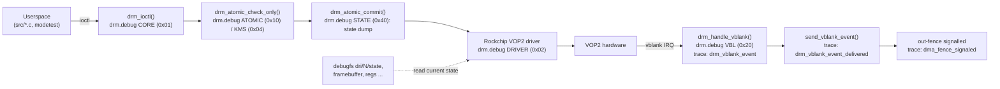

# Experiment 14: DRM Debugging & Tracing Toolkit

## 1. Objective
Experiments 01–11 each hit the same wall at some point: an ioctl returns `-EINVAL`, `-EBUSY` or `-EACCES`, the panel stays black, or a flip seems to take two frames instead of one, and the return code alone does not say why. This experiment puts together the kernel's own debugging tools for DRM/KMS and explains when to use each:

* **`drm.debug`**: the DRM core's categorized `printk` logging, which says *which* check rejected a commit.
* **debugfs** (`/sys/kernel/debug/dri/<N>/`): read-only snapshots of what the kernel currently holds (atomic state, framebuffers, clients, and on Rockchip kernels the VOP registers).
* **ftrace tracepoints** (`drm:*`, `dma_fence:*`): low-overhead, timestamped events for vblank delivery and fence signalling. These are useful where `printk` would itself change the timing.

The experiment adds a helper script, [`tools/drm-debug-capture.sh`](../tools/drm-debug-capture.sh), that turns the three tools on together around a time window or around one of the demo programs in `src/`, saves the results into one directory, and puts every setting back the way it was.

Unlike the other experiments, there is no C program here. The deliverable is the method and the script.

---

## 2. Environment
See the [Test Environment](../README.md#test-environment) section.

Additional requirements specific to this experiment:
* **Root**. `/sys/module/drm/parameters/debug` is created with mode `0600` (`module_param_named(debug, __drm_debug, ulong, 0600)` in `drivers/gpu/drm/drm_print.c`, v6.1 and master), and debugfs/tracefs are normally root-only.
* **debugfs**. Every DRM debugfs file below is compiled only with `CONFIG_DEBUG_FS` (for example the `#ifdef CONFIG_DEBUG_FS` block around `drm_state_info()` in `drivers/gpu/drm/drm_atomic.c`). If it is not mounted: `mount -t debugfs none /sys/kernel/debug`.
* **tracefs**. Needed for the tracepoints. It is normally at `/sys/kernel/tracing`, and older setups also expose it at `/sys/kernel/debug/tracing` (`Documentation/trace/ftrace.rst`). If it is not mounted: `mount -t tracefs nodev /sys/kernel/tracing`. If `/sys/kernel/tracing/events/drm/` does not exist, the kernel was built without event tracing for DRM, and the `-T` option of the script will say so.
* **Kernel version**. The LubanCat 5 runs a Rockchip BSP kernel with vendor patches. Everything below was checked against upstream `v6.1` (the likely BSP base) and upstream `master`, and against Rockchip's public BSP tree (`rockchip-linux/kernel`, branches `develop-5.10` and `develop-6.1`, fetched from GitHub on 2026-09-24) where noted. Run `uname -r` on the board and treat any mismatch with this document as "check your tree".

---

## 3. Background / Key Concepts

### 3.1 Where each tool attaches to the pipeline



`drm.debug` and the tracepoints show *events* as they happen. debugfs shows the *state* at the moment you read it. You normally need both: the log tells you that a commit failed, and `state` shows what the kernel had before it failed.

### 3.2 The `drm.debug` module parameter

#### Category bits

The categories are the `enum drm_debug_category` in `include/drm/drm_print.h`. The check is `__drm_debug & BIT(category)` (`drm_debug_enabled_raw()`), so each enum value is a **bit index**:

| Bit | Mask | Category | What it covers (per the header's kernel-doc) |
| :-- | :-- | :-- | :-- |
| 0 | `0x001` | `DRM_UT_CORE` | Generic DRM code: `drm_ioctl.c`, `drm_mm.c`, ... Also every call to `DRM_DEBUG()`. |
| 1 | `0x002` | `DRM_UT_DRIVER` | Vendor-specific part of the driver |
| 2 | `0x004` | `DRM_UT_KMS` | Modesetting code |
| 3 | `0x008` | `DRM_UT_PRIME` | PRIME code |
| 4 | `0x010` | `DRM_UT_ATOMIC` | Atomic code |
| 5 | `0x020` | `DRM_UT_VBL` | Verbose vblank messages |
| 6 | `0x040` | `DRM_UT_STATE` | Verbose atomic state dumps |
| 7 | `0x080` | `DRM_UT_LEASE` | Lease code |
| 8 | `0x100` | `DRM_UT_DP` | DisplayPort code |
| 9 | `0x200` | `DRM_UT_DRMRES` | DRM managed-resources code |

All ten categories together are `0x3ff`.

**Differences between kernel tags** (checked in `include/drm/drm_print.h` and `drivers/gpu/drm/drm_print.c`):

| Item | v5.10 | v6.1 | master |
| :-- | :-- | :-- | :-- |
| Enum values | Explicit masks (`DRM_UT_CORE = 0x01` … `DRM_UT_DRMRES = 0x200`) | Bit indices 0…9 used through `BIT()` | Same as v6.1 |
| Masks a user writes | Same as the table above | Same | Same |
| `MODULE_PARM_DESC` (what `modinfo -p drm` prints) | Lists bits 0–5, 7, 8 only (omits STATE and DRMRES) | Same omission | Lists all ten bits |
| Header comment "enable all" | `0x1ff` (outdated) | `0x1ff` (outdated) | `0x3ff` |
| Parameter type | `int` | `ulong`, or a dynamic-debug class map (see below) | Same as v6.1 |

On a 6.1-based BSP kernel the built-in help text therefore does not mention `0x40` or `0x200`, but both bits still work.

**Dynamic-debug variant.** When `CONFIG_DRM_USE_DYNAMIC_DEBUG=y`, `drm_print.c` registers the same `debug` parameter through `param_ops_dyndbg_classes` instead of a plain `ulong`. In v6.1 that option is `default y` (it depends on `DYNAMIC_DEBUG || DYNAMIC_DEBUG_CORE` and `JUMP_LABEL`). In master it moved to `drivers/gpu/drm/Kconfig.debug`, is `default n` and `depends on BROKEN`. You can see which variant you have when you read the value back:
* plain parameter: decimal, e.g. `22` (`param_get_ulong`, format `"%lu"`, `kernel/params.c`);
* dynamic-debug variant: hex, e.g. `0x16` (`param_get_dyndbg_classes`, format `"0x%lx"`, `lib/dynamic_debug.c`).

Both variants parse what you write with `kstrtoul(..., 0, ...)`. That means `0x16` and `22` are the same value, but a leading zero means **octal** (`010` = 8). The script rejects such values to avoid that trap.

#### How to set it

```bash
# At runtime (takes effect immediately, lost on reboot)
cat /sys/module/drm/parameters/debug            # remember the old value
echo 0x16 | sudo tee /sys/module/drm/parameters/debug
sudo dmesg -w | grep '\[drm'                    # watch
echo 0 | sudo tee /sys/module/drm/parameters/debug

# At boot: add to the kernel command line
drm.debug=0x16
```

The boot form follows the generic rule in `Documentation/admin-guide/kernel-parameters.rst` (v6.1): a module parameter is written `<module>.<param>=` on the command line. This works whether DRM is built in or a module, because modprobe also reads `/proc/cmdline`. For a loadable `drm.ko`, `options drm debug=0x16` in `/etc/modprobe.d/` is the modprobe equivalent. *Where the LubanCat image keeps its kernel command line (extlinux, U-Boot env, …) was not verified.*

#### What the output looks like

* Category messages are printed at `KERN_DEBUG` with the prefix `[drm:<function>]` (`__drm_dev_dbg` / `__drm_dbg` in `drm_print.c`, `DRM_NAME` = `"drm"` in `include/uapi/drm/drm.h`). They go to the kernel ring buffer, so read them with `dmesg`. Whether they also show up on a console depends on the console log level.
* **CORE (`0x01`) is noisy.** `drm_ioctl()` (`drivers/gpu/drm/drm_ioctl.c`, v6.1) logs *every* ioctl as `comm="…" pid=…, dev=0x…, auth=…, <IOCTL_NAME>`, and logs every failure as `comm="…", pid=…, ret=<errno>`. That makes it the quickest way to see which ioctl failed and with which errno, even when no other category printed anything.
* **VBL (`0x20`) is noisier still.** `drm_update_vblank_count()` (`drivers/gpu/drm/drm_vblank.c`) prints `updating vblank count on crtc …` on each counter update, which means about 60 lines per second per active CRTC at 60 Hz. Use it for a few seconds only, or use the `drm_vblank_event` tracepoint instead (Section 3.4).
* **STATE (`0x40`) has a narrow trigger.** The full "new state" dump comes from `drm_atomic_print_new_state()`, and in both v6.1 and master it is called **only from `drm_atomic_commit()`**, the *blocking* path. `drm_atomic_nonblocking_commit()` and the `DRM_MODE_ATOMIC_TEST_ONLY` path (`drm_atomic_check_only()`) do not dump. `drm_mode_atomic_ioctl()` (`drm_atomic_uapi.c`) picks one of the three from the flags. So for the `NONBLOCK` flips in `src/drm-atomic-demo.c` and `src/drm-dmabuf-fence.c`, `0x40` adds nothing. It does fire on their blocking modeset commit. The dump is printed through `drm_info_printer()`, i.e. `dev_info` with a `[drm]` prefix, not at `KERN_DEBUG`.
* **PRIME (`0x08`) may print nothing for Experiment 11.** `drivers/gpu/drm/drm_prime.c` contains no `drm_dbg_prime()` calls in v6.1 or master. Whether any Rockchip or other driver file uses this category was not verified. For DMA-BUF problems, use the CORE `ret=` line together with `dma_buf/bufinfo` (Section 3.3).

#### Practical masks for this project

| Goal (experiment) | Mask | Bits | Notes |
| :-- | :-- | :-- | :-- |
| Why did an atomic commit / `TEST_ONLY` fail? (10, 11) | `0x14` | KMS + ATOMIC | Prints the exact check that failed (Section 6). |
| Same, plus which ioctl returned which errno | `0x15` | CORE + KMS + ATOMIC | CORE adds a line per ioctl. Keep the window short. |
| Atomic plus driver-side reasons (10, 11) | `0x16` | DRIVER + KMS + ATOMIC | Default of `tools/drm-debug-capture.sh`. |
| Full state of each *blocking* commit (10) | `0x54` | KMS + ATOMIC + STATE | Only blocking commits dump state (see above). |
| Master / permission problems (04) | `0x01` | CORE | Look for `ret=-13` (`-EACCES`). |
| Vblank counting / missed vblanks (06, 09) | `0x20` | VBL | High volume. Prefer the tracepoints for timing. |
| Everything | `0x3ff` | all | Only for a second or two. It can overrun the log buffer. |

A related parameter: `drm.vblankoffdelay` (`/sys/module/drm/parameters/vblankoffdelay`, `drm_vblank.c`) is the delay in ms before an unused vblank interrupt is switched off. The default is `5000`, `0` means never disable, and a negative value means disable immediately. This matters for the tracepoints (Section 3.4).

### 3.3 debugfs: `/sys/kernel/debug/dri/<N>/`

#### Directory layout differs between v6.1 and master

* **v6.1**: `drm_minor_register()` → `drm_debugfs_init(minor, minor->index, …)` (`drm_drv.c`, `drm_debugfs.c`) creates a real directory per *minor*, named by the minor index. `card0` → `dri/0`, `renderD128` → `dri/128`.
* **master**: `drm_debugfs_dev_init()` creates one real directory per *device*, named after `dev->unique`. `drm_debugfs_register()` adds `dri/<minor index>` as a **symlink** to it. `dri/0` therefore keeps working. Master also creates per-open-file directories `dri/client-<id>/` with `proc_info` (pid, comm) and a `device` symlink (`drm_debugfs_clients_add()`). These are not present in v6.1.

#### Generic files (DRM core)

| File | Created by (v6.1 / master) | Exists when | Content |
| :-- | :-- | :-- | :-- |
| `name` | `drm_debugfs_list[]` in `drm_debugfs.c` (`drm_name_info`) | always | Driver name, `dev=`, `master=`, `unique=` |
| `clients` | `drm_debugfs_list[]` (`drm_clients_info`) | always | One line per userspace open file. v6.1 columns: `command pid dev master a uid magic`. Master renames `pid` to `tgid` and adds `name` and `id` columns. `master`=`y` marks the current DRM master. In-kernel clients (fbdev) are **not** listed. See Experiment 04. |
| `gem_names` | `drm_debugfs_list[]` (`drm_gem_name_info`), flag `DRIVER_GEM` | driver has `DRIVER_GEM` | Only GEM objects that were given a global *flink* name (`drm_gem_flink_ioctl` adds them to `dev->object_name_idr`). Dumb buffers and PRIME-exported buffers without a flink name do **not** appear. |
| `framebuffer` | `drm_framebuffer_debugfs_init()` in `drm_framebuffer.c` | `DRIVER_MODESET` | Every FB: id, `allocated by` (process name), refcount, format fourcc, modifier, size, per-plane layers |
| `internal_clients` | `drm_client_debugfs_init()` (`drm_client.c` in v6.1, `drm_client_event.c` in master) | `DRIVER_MODESET` | Names of the in-kernel DRM clients (e.g. fbdev emulation). This is where the client that restores the console in Experiment 04 shows up. |
| `state` | `drm_atomic_debugfs_init()` in `drm_atomic.c` (`drm_state_info` → `__drm_state_dump(dev, p, true)`) | driver uses atomic modesetting (`drm_drv_uses_atomic_modeset()`) | Every plane (`crtc=`, `fb=`, `crtc-pos=`, `src-pos=`, `rotation=`, `normalized-zpos=`, …), every CRTC (`enable`, `active`, `self_refresh_active`, `*_changed` flags, `plane_mask`, `connector_mask`, `encoder_mask`, `mode:`), every connector (`crtc=`, …). Reading it takes the modeset locks. |
| `crtc-<index>/` | `drm_debugfs_crtc_add()` | every CRTC | Holds `crc/` if supported, plus anything the driver adds |
| `crtc-<index>/crc/{control,data}` | `drm_debugfs_crtc_crc_add()` in `drm_debugfs_crc.c` | **only if the driver implements both** `set_crc_source` and `verify_crc_source` | `control`: write a source name or `auto`. Reading it shows the available sources (the current one is marked `*`). `data`: one line per frame, frame number followed by CRC words. **Opening `data` starts CRC generation** (`crtc_crc_open()` → `set_crc_source`), which may cost a commit or full modeset (see the "CRC ABI" kernel-doc in the same file). |
| `<connector-name>/` | `drm_debugfs_connector_add()` | every connector | `force`, `edid_override`, `vrr_range`, `output_bpc` (v6.1). Master adds HDMI `infoframes/`. |
| `encoder-<index>/` | `drm_debugfs_encoder_add()` | master only | Bridge parameters, driver hooks |

Outside `dri/`: `/sys/kernel/debug/dma_buf/bufinfo` (`drivers/dma-buf/dma-buf.c`, `dma_buf_debug_show`, v6.1 and master) lists every exported DMA-BUF: size, flags, mode, file refcount, exporter name, inode, name. For each one it also prints the fences in its reservation object (`dma_resv_describe`) and the attached devices. This is the file to read for Experiment 11. `gem_names` does not show PRIME buffers.

**CRC on RK3588.** Neither the v6.1 nor the master mainline `rockchip_drm_vop2.c` sets `set_crc_source`/`verify_crc_source`, so mainline VOP2 has **no** `crc/` directory. The older VOP driver (`rockchip_drm_vop.c`, used by pre-VOP2 SoCs) does implement them. Rockchip's BSP `develop-6.1` `rockchip_drm_vop2.c` implements `set_crc_source`, `verify_crc_source` and `get_crc_sources`. Whether the LubanCat kernel does too, and which sources RK3588 offers, is *not verified*.

#### Rockchip-specific files (why Experiment 03 found `dri/0/regs`)

| Kernel | Files | Source |
| :-- | :-- | :-- |
| Rockchip BSP (`rockchip-linux/kernel` `develop-5.10` and `develop-6.1`) | `dri/<N>/summary`, `active_regs`, `regs`, `mm_dump` | `rockchip_debugfs_files[]` registered by `rockchip_drm_debugfs_init()` (the `.debugfs_init` hook) in `rockchip_drm_drv.c` |
| same | `dri/<N>/video_port<id>/gamma_lut`, `cubic_lut` | `vop2_crtc_late_register()` in `rockchip_drm_vop2.c` |
| same, with `CONFIG_ROCKCHIP_DRM_DEBUG` | `video_port<id>/vop_dump/dump`, `color_bar`, `regs_write`, `calculated_aclk_rate`, `calculated_dclk_rate`, `dovi_mode` (some only on capable VPs) | `rockchip_drm_debugfs.c` (develop-6.1). `color_bar` and `regs_write` are **writable** and change the hardware, so the script never touches them. |
| Mainline v6.1 | none: `rockchip_drm_vop2.c` includes `<drm/drm_debugfs.h>` but creates no files | also note: v6.1 VOP2 only describes RK3566/RK3568; RK3588 VOP2 data first appears in **v6.8** (`rockchip_vop2_reg.c`: absent in v6.7, present in v6.8) |
| Mainline v6.14 and later | `dri/<N>/vop2/summary`, `vop2/active_regs`, `vop2/regs` | `vop2_debugfs_init()` in `rockchip_drm_vop2.c` (absent in v6.13, present in v6.14) |

The `dri/0/regs` path used in Experiment 03 therefore matches the BSP layout. On a mainline kernel of v6.14 or later the equivalent is `dri/0/vop2/regs`, and on mainline v6.1 there is no register dump at all.

### 3.4 ftrace tracepoints

#### DRM tracepoints (`drivers/gpu/drm/drm_trace.h`, `TRACE_SYSTEM drm`)

The file is identical in v5.10, v6.1 and master:

| Event | Fields (`TP_printk`) | Fired from (`drm_vblank.c`) | When |
| :-- | :-- | :-- | :-- |
| `drm:drm_vblank_event` | `crtc=%d, seq=%u, time=%lld, high-prec=%s` | `drm_handle_vblank_events()`, called by `drm_handle_vblank()` | On every vblank interrupt the core processes **while vblank handling is enabled** for that CRTC. `drm_handle_vblank()` returns early when `!vblank->enabled`. |
| `drm:drm_vblank_event_queued` | `file=%p, crtc=%d, seq=%u` | `drm_queue_vblank_event()` | Only when a client asks for a vblank *event* through `DRM_IOCTL_WAIT_VBLANK` (`drmWaitVBlank()` with `DRM_VBLANK_EVENT`). `drm_queue_vblank_event()` is called only from `drm_wait_vblank_ioctl()`. |
| `drm:drm_vblank_event_delivered` | `file=%p, crtc=%d, seq=%u` | `send_vblank_event()` | When any vblank-type event is sent to userspace, including page-flip-complete events. VOP2 sends them with `drm_crtc_send_vblank_event()` (v6.1, master and BSP develop-6.1), which calls `send_vblank_event()`. |

How to read them:
* `crtc` is the **pipe index** (`drm_crtc_index()`, assigned as `crtc->index = config->num_crtc++` in `drm_crtc_init_with_planes()`), **not** the CRTC object ID such as 208. It is the position of the CRTC in `drmModeGetResources()->crtcs[]`, because `drm_mode_getresources()` walks the same list (leases aside).
* `high-prec` is `true` only if the CRTC has a `get_vblank_timestamp` hook. None of the VOP2 sources checked (mainline v6.1 and master, BSP develop-6.1 `rockchip_drm_vop2.c`) set one, so expect `false`.
* Vblank interrupts are turned on only while someone holds a vblank reference, and off again `drm.vblankoffdelay` ms (default 5000) after the last one is released. An idle console shows no `drm_vblank_event` lines. Running a flip loop (`modetest -v`, the demos) makes them appear.
* None of the demos in `src/` uses `drmWaitVBlank()` with events. For them expect `drm_vblank_event` + `drm_vblank_event_delivered` and **no** `drm_vblank_event_queued`. libdrm's `vbltest` does use `DRM_VBLANK_EVENT` (`tests/vbltest/vbltest.c` in libdrm 2.4.125), but only on pipe 0, or pipe 1 with `-s`. On this board those pipes may not be the ones driving the DSI panel.

#### DMA fence tracepoints (`include/trace/events/dma_fence.h`, `TRACE_SYSTEM dma_fence`)

| Event | Fired from (`drivers/dma-buf/dma-fence.c`) |
| :-- | :-- |
| `dma_fence_init` | `dma_fence_init()` (master: `__dma_fence_init()`) |
| `dma_fence_enable_signal` | `__dma_fence_enable_signaling()` |
| `dma_fence_signaled` | `dma_fence_signal_timestamp_locked()` |
| `dma_fence_wait_start` / `dma_fence_wait_end` | `dma_fence_wait_timeout()` (`dma_fence_wait()` is an inline wrapper around it) |
| `dma_fence_destroy` | `dma_fence_release()` |
| `dma_fence_emit` | Not raised by `dma-fence.c` itself. Which drivers raise it was not verified. |

All events print `driver=%s timeline=%s context=%u seqno=%u`. In master, `init`, `enable_signal` and `signaled` moved to a second event class (`dma_fence_ops`) with the same fields.

Mapping to Experiment 11:
* **`OUT_FENCE_PTR` fences** are created by `drm_crtc_create_fence()` (`drm_crtc.c`). Their `driver` is the DRM driver name (`rockchip`, `DRIVER_NAME` in `rockchip_drm_drv.c`) and their `timeline` is `CRTC:<object id>-<crtc name>` (set in `drm_crtc_init_with_planes()`). They are signalled when the flip event is sent (`drm_send_event_helper()` in `drm_file.c` → `dma_fence_signal_timestamp()`).
* **`IN_FENCE_FD` waits** happen in `drm_atomic_helper_wait_for_fences()` → `dma_fence_wait()`. Mainline Rockchip uses `drm_atomic_helper_commit` (`rockchip_drm_fb.c`). A `dma_fence_wait_start` / `dma_fence_wait_end` pair on the display side shows how long the commit waited for the producer.

#### Enabling them by hand

```bash
cd /sys/kernel/tracing                      # or /sys/kernel/debug/tracing
ls events/drm events/dma_fence              # what this kernel offers
echo 1 > events/drm/enable                  # all three drm:* events
echo 1 > events/dma_fence/enable            # optional, can be busy
echo 1 > tracing_on
cat trace_pipe                              # stream (Ctrl-C to stop)
echo 0 > events/drm/enable; echo 0 > events/dma_fence/enable
```

The `set_event` form works as well: `echo 'drm:*' >> set_event` (`Documentation/trace/events.rst`). Writing to the top-level files changes the *global* trace buffer that other tools may be using. The script therefore uses a private **instance** instead: `mkdir instances/<name>` creates a separate buffer with its own `events/`, `trace` and `tracing_on`, and `rmdir` removes it (`Documentation/trace/ftrace.rst`, section "Instances", present in v6.1 and master).

---

## 4. Implementation

### 4.1 `tools/drm-debug-capture.sh`

A POSIX `sh` script (checked with `bash -n`, `dash -n` and `shellcheck` 0.9.0 without findings). Main design decisions:

* **Always restore.** It reads the original `drm.debug` value first and installs an `EXIT` trap, plus `INT`/`TERM`/`HUP` handlers. Whatever happens (Ctrl-C, a failing demo, a script error), the old mask is written back. The old value is written back in the same form it was read (decimal or `0x…`), which both parameter variants accept.
* **Read-only on KMS.** It only reads debugfs and sysfs files. It never opens `crc/data`, because that would start CRC capture, and never touches the BSP's writable `color_bar` / `regs_write`.
* **Missing is normal.** Each snapshot file is optional. Missing directories produce a warning and, for debugfs and tracefs, the exact `mount` command.
* **Private ftrace instance.** Tracepoints are enabled in `instances/drm-capture-<pid>`, so the global buffer and any other tracing session are left alone. The instance is removed on exit.
* **Exact dmesg delta.** Before changing anything it writes a marker line to `/dev/kmsg` (every `write()` becomes a log entry, see `Documentation/ABI/testing/dev-kmsg`). Afterwards it keeps only the log lines after that marker. If the marker has been pushed out of the ring buffer (possible with `0x3ff`), it saves the full `dmesg` and says so. In that case, boot with a larger `log_buf_len=`.
* **Wrap a command.** Anything after `--` runs during the capture window, and the script exits with the command's status. This is how to capture exactly one failing demo run.

Options:

| Option | Meaning | Default |
| :-- | :-- | :-- |
| `-m <mask>` | `drm.debug` mask during the capture (hex `0x..` or decimal). Use `keep` to leave it unchanged. | `0x16` |
| `-t <seconds>` | Capture window when no command is given | `5` |
| `-o <dir>` | Output directory | `./drm-capture-<date>-<time>` |
| `-c <index>` | Minor index: `/sys/kernel/debug/dri/<index>` (`0` = `card0`) | `0` |
| `-T` | Record `drm:drm_vblank_event*` tracepoints | off |
| `-F` | Record `dma_fence:*` tracepoints | off |
| `-b <kb>` | Per-CPU buffer size of the private trace instance | `4096` |
| `-h`, `--help` | Usage | |

Output directory layout:

```text
drm-capture-YYYYmmdd-HHMMSS/
├── capture.log            # everything the script printed
├── environment.txt        # uname, /proc/cmdline, drm module params, connector status/modes
├── debugfs-before/        # snapshot before the window
│   ├── _listing.txt       #   what dri/<N>/ contains on this kernel
│   ├── name clients internal_clients gem_names framebuffer state
│   ├── summary active_regs regs mm_dump           # BSP only
│   ├── vop2-summary vop2-active_regs              # mainline >= v6.14 only
│   ├── crtc-<i>-crc-control                       # only if the driver supports CRC
│   └── dma_buf-bufinfo
├── debugfs-after/         # same files after the window
├── trace.txt              # only with -T / -F
└── dmesg-delta.txt        # kernel log lines after the start marker
```

### 4.2 Usage

```bash
chmod +x tools/drm-debug-capture.sh      # already executable in the repo

# Why does the atomic demo's commit fail?
sudo ./tools/drm-debug-capture.sh -m 0x14 -- ./src/drm-atomic-demo --atomic

# Is the display "heartbeat" alive? (Experiment 06 / 09)
sudo ./tools/drm-debug-capture.sh -m keep -T -- modetest -M rockchip -v -s <conn>@<crtc>:1024x600

# PRIME + explicit fences (Experiment 11)
sudo ./tools/drm-debug-capture.sh -m 0x15 -F -T -- ./src/drm-dmabuf-fence --fence

# Just a 3 s snapshot of the current state, no logging change
sudo ./tools/drm-debug-capture.sh -m keep -t 3
```

(`<conn>` and `<crtc>` are the object IDs printed by `modetest -M rockchip` on your board. Never hard-code them.)

### 4.3 High-Level Logic Flow (pseudocode)

```c
parse_options();                       /* validate mask / seconds / index */
require_root();
mkdir(outdir);
save_environment();                    /* uname, cmdline, drm params, connectors */
locate_debugfs();  locate_tracefs();   /* warn + print mount hint if missing */

snapshot("before");                    /* each file optional; never crc/data */
write("/dev/kmsg", marker);            /* anchor for the dmesg delta */

orig = read("/sys/module/drm/parameters/debug");
trap(EXIT|INT|TERM|HUP, cleanup);      /* cleanup: restore orig, rmdir instance */
write(param, mask);

if (trace_requested) {
	mkdir(tracefs "/instances/drm-capture-<pid>");
	enable("drm/drm_vblank_event*") and/or enable("dma_fence");
	tracing_on = 1;
}

if (command_given) run(command); else sleep(seconds);

tracing_on = 0; copy(instance "/trace", outdir "/trace.txt");
cleanup();                             /* restore drm.debug, remove instance */
snapshot("after");
dmesg_since(marker) > "dmesg-delta.txt";
exit(command_status);
```

---

## 5. Results (pending hardware verification)

The script has **not** been run on the LubanCat 5. The following *was* tested on a development machine without any DRM device:

* `bash -n` and `dash -n`: no syntax errors. `shellcheck` (0.9.0, default checks, `sh` and `bash` dialects): no findings.
* `-h` / `--help` print the usage. Invalid values (`-m 010`, `-m 0xZZ`, `-t abc`, `-c x`, an unknown option, a missing argument) are rejected with an error. A non-root run exits with "must be run as root".
* With no `/sys/module/drm`, no `dri/` in debugfs and no tracefs: the script warns, prints the `mount` hints, skips every missing file, still writes `environment.txt`, `capture.log` and `dmesg-delta.txt`, and exits 0.
* With a *fake* sysfs/debugfs tree supplied through the test-only `DRM_CAPTURE_*` variables: the mask was changed during the window and restored afterwards, both after a wrapped command that exited with status 3 (the script exited 3) and after `SIGTERM` in the middle of the window (script exited 130). `crc/data` in the fake tree was not read.

On the board, run and paste the results here:

1. **Which debugfs files exist on the LubanCat kernel?**
   ```bash
   uname -r
   sudo ls -la /sys/kernel/debug/dri/ /sys/kernel/debug/dri/0/
   ```
   Expected: `name`, `clients`, `gem_names`, `framebuffer`, `internal_clients` and `state` on any 6.1-era kernel. If it is a Rockchip BSP kernel, also `summary`, `active_regs`, `regs`, `mm_dump` and `video_port*/`. `crtc-*/crc/` only if the BSP VOP2 CRC support is built in.
   > TODO(on-hardware): paste `uname -r` and the `ls` output here.

2. **Which `drm.debug` variant is it?**
   ```bash
   sudo cat /sys/module/drm/parameters/debug     # "0" (plain) or "0x0" (dynamic debug)?
   ```
   > TODO(on-hardware): paste the value here.

3. **Atomic state while the atomic demo runs** (compare with the IDs printed by `drm-atomic-demo`):
   ```bash
   sudo ./tools/drm-debug-capture.sh -m 0x14 -o /tmp/cap-atomic -- ./src/drm-atomic-demo --atomic
   grep -A12 'crtc\[' /tmp/cap-atomic/debugfs-after/state
   ```
   Expected: the CRTC driving the DSI panel shows `enable=1`, `active=1` and a `mode:` line for 1024x600. Its primary plane shows `fb=` equal to one of the demo's FB IDs while the demo runs.
   > TODO(on-hardware): paste the relevant `state` excerpt and the `dmesg-delta.txt` lines around `checking`/`committing`.

4. **Vblank heartbeat through tracepoints** (Experiment 06 without `/proc/interrupts`):
   ```bash
   sudo ./tools/drm-debug-capture.sh -m keep -T -t 3 -o /tmp/cap-vbl -- ./src/drm-atomic-demo --atomic
   grep drm_vblank_event: /tmp/cap-vbl/trace.txt | head
   ```
   Expected: about 60 `drm_vblank_event` lines per second for one `crtc=` index, with `seq` increasing by 1 each time and `high-prec=false`. Also roughly one `drm_vblank_event_delivered` per completed flip, and no `drm_vblank_event_queued`.
   > TODO(on-hardware): paste 5–10 trace lines and the per-second count.

5. **Fence timeline in Experiment 11**:
   ```bash
   sudo ./tools/drm-debug-capture.sh -m keep -F -o /tmp/cap-fence -- ./src/drm-dmabuf-fence --fence
   grep 'timeline=CRTC:' /tmp/cap-fence/trace.txt | head
   ```
   Expected: `dma_fence_init` / `dma_fence_signaled` pairs with `driver=rockchip timeline=CRTC:<id>-<name>`. Look for `dma_fence_wait_start`/`_end` around commits that carry an `IN_FENCE_FD`.
   > TODO(on-hardware): paste a few lines, including the timestamps of one init → signaled pair.

---

## 6. Analysis / Engineering Insights

### 6.1 Symptom → where to look

| Symptom (experiment) | Most likely layer | Where to look | What to search for (verified message text, v6.1) |
| :-- | :-- | :-- | :-- |
| `modetest`/demo gets `-EACCES` (-13) on a modeset or atomic ioctl (04) | Not DRM master | `drm.debug=0x01`, then `dri/0/clients` | `comm="…", pid=…, ret=-13` from `drm_ioctl()`. `drm_ioctl_permit()` returns `-EACCES` for master-only ioctls. In `clients`, check who has `master = y`. |
| Screen turns back on after a `modetest` DPMS off (04) | In-kernel client restore on last close | `dri/0/internal_clients`, `dri/0/clients` | The fbdev client appears only in `internal_clients`. `clients` lists userspace files only (`drm_clients_info`). |
| VOP IRQ count not increasing, or no flip events (06) | Vblank not enabled / CRTC off | `-T` trace, `dri/0/state`, `drm.debug=0x20` | No `drm_vblank_event` lines for the expected `crtc=` index while a flip loop runs. In `state`, `active=0` on that CRTC. With VBL: `crtc %d, vblank enabled %d, inmodeset %d`, printed by `drm_crtc_vblank_on()` / `drm_crtc_vblank_off()` when the CRTC is enabled or disabled. |
| Flip completes a frame late / uneven pacing (09) | Timing | `-T` trace | Look at the gap between `drm_vblank_event` `seq=N` and the `drm_vblank_event_delivered` carrying the same `seq` for your file. Also check `seq` for jumps > 1 (missed vblanks). Timestamps are in `trace.txt`, so no `printk` timing distortion. |
| `drmModePageFlip()` / nonblocking commit returns `-EBUSY` (09, 10) | Previous commit not finished | `drm.debug=0x10` | `[CRTC:%d:%s] busy with a previous commit` (`stall_checks()` in `drm_atomic_helper.c`). VOP2's legacy `.page_flip` is `drm_atomic_helper_page_flip`, which goes through `drm_atomic_nonblocking_commit()`, so legacy flips hit this check too. |
| Atomic commit or `TEST_ONLY` returns `-EINVAL` (10) | A core check in `drm_atomic_check_only()` | `drm.debug=0x14` (+`0x01` for the ioctl line) | `[CRTC:%d:%s] requires full modeset` (forgot `DRM_MODE_ATOMIC_ALLOW_MODESET`). `[PLANE:%d:%s] CRTC set but no FB` / `FB set but no CRTC`. `[PLANE:%d:%s] invalid source coordinates …` (16.16 `SRC_*` not shifted). `[PLANE:%d:%s] invalid CRTC coordinates …`. `[CRTC:%d:%s] active without enabled` / `enabled without mode blob`. `[CRTC:%d:%s] requesting event but off`. `commit failed: page-flip event requested with test-only commit`. `atomic driver check for %p failed: %d` (driver rejected it; add `0x02`). |
| Atomic commit returns `-EINVAL` right away, before any "checking" line (10) | Request malformed | `drm.debug=0x10` | `commit failed: atomic cap not enabled` (no `DRM_CLIENT_CAP_ATOMIC`), `commit failed: invalid flag`, `[PLANE:%d:%s] unknown property [PROP:%d:%s]]` |
| Commit with `IN_FENCE_FD` returns `-EINVAL` (11) | Bad fence fd | `drm.debug=0x01` only | In v6.1 `drm_atomic_plane_set_property()` returns `-EINVAL` **without** a debug message when `sync_file_get_fence()` fails or `IN_FENCE_FD` was already set. Only the CORE `ret=-22` line shows it. |
| Display waits too long / stalls with `IN_FENCE_FD` (11) | Producer fence not signalled | `-F` trace | `dma_fence_wait_start` without a matching `dma_fence_wait_end` for that `context/seqno`. Check who should have produced a `dma_fence_signaled` for it. |
| PRIME import works but the buffer "isn't there" (11) | Wrong place to look | `dma_buf/bufinfo`, not `gem_names` | `bufinfo` lists every exported DMA-BUF with exporter name and attachments. `gem_names` lists only flink-named objects. |
| Registers do not match the mode you set (03) | Commit never reached hardware | BSP `dri/0/regs` / `active_regs`, mainline v6.14+ `dri/0/vop2/regs`, plus `state` | Compare `state` (`mode:` line) with the VP register dump. |

### 6.2 Choosing the right tool

* **Use `drm.debug` for "why was it rejected?"** The atomic core has a message for nearly every rejection path, but only when the right bit is on. `0x14` is the cheapest mask that answers most Experiment 10 and 11 questions.
* **Use debugfs for "what is the kernel holding right now?"** `state` is the kernel's own view of the atomic state, independent of what your program *thinks* it committed. Reading it takes the modeset locks, so don't poll it in a tight loop while measuring timing.
* **Use tracepoints for "when did it happen?"** They record into a per-CPU ring buffer with timestamps. `printk` at 60 Hz (VBL) floods the log and can shift the timing you are trying to measure.
* **Mind the kernel you are on.** On this project, the debugfs layout, the Rockchip register dump path, CRC availability and even the `drm.debug` help text all differ between the Rockchip BSP, mainline v6.1 and mainline master. The script therefore records `_listing.txt` and `environment.txt` with every capture.

---

## 7. Key Takeaways
* `drm.debug` is a bitmask of ten categories (`0x001` CORE … `0x200` DRMRES, all = `0x3ff`). The user-visible masks are the same on v5.10, v6.1 and master, but the v6.1 help text omits STATE (`0x40`) and DRMRES (`0x200`).
* `DRM_UT_STATE` dumps only for **blocking** `drm_atomic_commit()`. Nonblocking flips and `TEST_ONLY` checks do not dump.
* `debugfs/dri/<N>/state` is the ground truth for atomic state. `clients` versus `internal_clients` separates userspace masters from in-kernel clients such as fbdev.
* `crtc-*/crc/` exists only when the driver implements CRC hooks. Mainline VOP2 does not, while the Rockchip BSP VOP2 does. Opening `crc/data` has side effects.
* The `regs` file used in Experiment 03 is a Rockchip **BSP** feature. Mainline VOP2 gained `vop2/regs` only in v6.14.
* `drm:drm_vblank_event*` and `dma_fence:*` tracepoints give timestamped evidence for Experiments 06, 09 and 11 without `printk` overhead. Their `crtc=` field is the CRTC *index*, not its object ID.
* `tools/drm-debug-capture.sh` wraps all of this, restores every setting it changes, and uses a private ftrace instance.

---

## 8. References
All kernel paths refer to `torvalds/linux` at tags `v6.1` and `master` (fetched 2026-09-24), unless another tag is named.
* `include/drm/drm_print.h`: `enum drm_debug_category`, `drm_debug_enabled_raw()` (also checked at v5.10)
* `drivers/gpu/drm/drm_print.c`: `__drm_debug`, `MODULE_PARM_DESC(debug, …)`, `module_param_named` / `module_param_cb(debug, …)`, `DECLARE_DYNDBG_CLASSMAP`, `drm_dev_printk`, `__drm_dev_dbg` (also checked at v5.10)
* `drivers/gpu/drm/Kconfig` (v6.1) and `drivers/gpu/drm/Kconfig.debug` (master): `DRM_USE_DYNAMIC_DEBUG`
* `kernel/params.c`: `STANDARD_PARAM_DEF(ulong, …)`; `lib/dynamic_debug.c`: `param_set_dyndbg_classes`, `param_get_dyndbg_classes`
* `drivers/gpu/drm/drm_ioctl.c`: `drm_ioctl`, `drm_ioctl_permit`
* `drivers/gpu/drm/drm_atomic.c`: `drm_atomic_check_only`, `drm_atomic_commit`, `drm_atomic_nonblocking_commit`, `drm_atomic_print_new_state`, `__drm_state_dump`, `drm_state_info`, `drm_atomic_debugfs_init`
* `drivers/gpu/drm/drm_atomic_uapi.c`: `drm_mode_atomic_ioctl`, `drm_atomic_plane_set_property`
* `drivers/gpu/drm/drm_atomic_helper.c`: `stall_checks`, `drm_atomic_helper_page_flip`, `drm_atomic_helper_wait_for_fences`
* `drivers/gpu/drm/drm_debugfs.c`: `drm_debugfs_list[]`, `drm_name_info`, `drm_clients_info`, `drm_gem_name_info`, `drm_debugfs_init` (v6.1), `drm_debugfs_dev_init` / `drm_debugfs_dev_register` / `drm_debugfs_register` / `drm_debugfs_clients_add` (master), `drm_debugfs_crtc_add`, `drm_debugfs_connector_add`, `drm_debugfs_encoder_add` (master)
* `drivers/gpu/drm/drm_debugfs_crc.c`: DOC "CRC ABI", `drm_debugfs_crtc_crc_add`, `crc_control_show`, `crtc_crc_open`
* `drivers/gpu/drm/drm_framebuffer.c`: `drm_framebuffer_info`, `drm_framebuffer_debugfs_init`
* `drivers/gpu/drm/drm_client.c` (v6.1) / `drm_client_event.c` (master): `drm_client_debugfs_internal_clients`
* `drivers/gpu/drm/drm_gem.c`: `drm_gem_flink_ioctl`
* `drivers/gpu/drm/drm_drv.c`: `drm_minor_register`
* `drivers/gpu/drm/drm_crtc.c`: `drm_crtc_init_with_planes` (`crtc->index`, `timeline_name`), `drm_crtc_create_fence`, `drm_crtc_fence_ops`
* `drivers/gpu/drm/drm_mode_config.c`: `drm_mode_getresources`
* `drivers/gpu/drm/drm_file.c`: `drm_send_event_helper`
* `drivers/gpu/drm/drm_trace.h`: `drm_vblank_event`, `drm_vblank_event_queued`, `drm_vblank_event_delivered` (identical at v5.10, v6.1, master)
* `drivers/gpu/drm/drm_vblank.c`: `drm_handle_vblank`, `drm_handle_vblank_events`, `send_vblank_event`, `drm_crtc_send_vblank_event`, `drm_queue_vblank_event`, `drm_wait_vblank_ioctl`, `drm_update_vblank_count`, `vblankoffdelay` parameter
* `include/trace/events/dma_fence.h`; `drivers/dma-buf/dma-fence.c`: `dma_fence_init`, `__dma_fence_enable_signaling`, `dma_fence_signal_timestamp_locked`, `dma_fence_wait_timeout`, `dma_fence_release`; `include/linux/dma-fence.h`: `dma_fence_wait`
* `drivers/dma-buf/dma-buf.c`: `dma_buf_debug_show` (`dma_buf/bufinfo`)
* `drivers/gpu/drm/rockchip/rockchip_drm_drv.c`: `driver_features`, `DRIVER_NAME`; `rockchip_drm_fb.c`: `.atomic_commit`; `rockchip_drm_vop2.c`: `vop2_crtc_funcs`, `vop2_debugfs_init` (v6.14+); `rockchip_vop2_reg.c`: RK3588 data (v6.8+); `rockchip_drm_vop.c`: `vop_crtc_set_crc_source`
* Rockchip BSP, `github.com/rockchip-linux/kernel` branches `develop-5.10` and `develop-6.1` (branch heads fetched 2026-09-24; exact commit not recorded): `drivers/gpu/drm/rockchip/rockchip_drm_drv.c` (`rockchip_debugfs_files[]`, `rockchip_drm_debugfs_init`), `rockchip_drm_vop2.c` (`vop2_crtc_late_register`, `vop2_crtc_set_crc_source`), `rockchip_drm_debugfs.c`
* `Documentation/trace/ftrace.rst` (tracefs mount, `trace`, `tracing_on`, `buffer_size_kb`, "Instances"), `Documentation/trace/events.rst` (`set_event`, per-event `enable`), `Documentation/admin-guide/kernel-parameters.rst` (module parameters on the command line), `Documentation/ABI/testing/dev-kmsg`
* libdrm 2.4.125: `tests/vbltest/vbltest.c`
