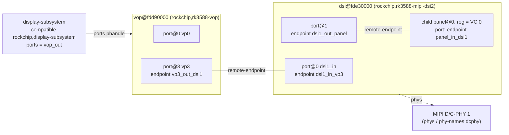
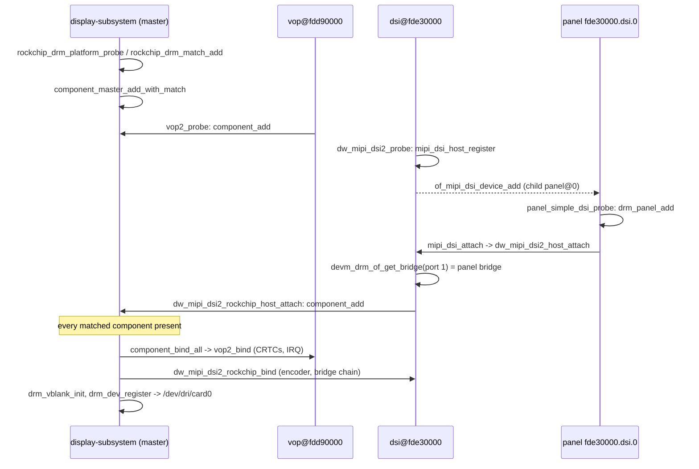

# Experiment 15: Device Tree & Driver Walkthrough (DSI Panel Bring-up from the Kernel Side)

## 1. Objective
[Experiment 03](./03_DSI_Panel_Bringup.md) worked from the **registers up**: it measured the 1024x600 timing (H_total 1354, V_total 636), checked PCLK, and found the values in the VOP2 VP3 registers. This experiment works from the **kernel side down**. It answers these questions:

* How does the Device Tree describe the path **VOP2 video port → MIPI-DSI controller → panel** (the OF graph)?
* Where does the panel's video timing live (in the DT or in a panel driver), and how does it become the `drm_display_mode` that `modetest` prints?
* Which driver functions probe and bind the pipeline, and where is the mode actually written to the VOP2?
* How do you inspect the live DT and debug a pipeline that never shows up (deferred probe, unbound components)?

This is a **documentation-only** experiment. No new code is added. Section 5 lists commands to run on the board, with placeholders for their output.

---

## 2. Environment
See the [Test Environment](../README.md#test-environment) section.

Sources checked for this document:

| Label used below | Source | Revision checked |
| :--- | :--- | :--- |
| **mainline master** | `torvalds/linux` | commit `f49a343b305c` (Makefile: 7.3.0-rc4) |
| **mainline vX.Y** | `torvalds/linux` | the tag named in the text (mostly `v6.1`, plus tags used to date features) |
| **LubanCat BSP** | `https://github.com/LubanCat/kernel`, branch `lbc-develop-6.1` | commit `1bc19c520831` (Makefile: 6.1.99) |

> **Verification legend.** "Verified in mainline vX" means the function, node or value was read in that exact revision. "LubanCat BSP" means it was read in the vendor branch above. **The board's running kernel was not checked.** It may be a different vendor branch; for example, `stable-5.10-rk3588` also exists in the same repository. Run `uname -a` on the board (Section 5) before relying on any BSP detail.

---

## 3. Background / Key Concepts

### 3.1 The OF graph in one paragraph
The DT describes display pipelines with the generic **OF graph** binding. A device has a `ports` container holding one or more `port@N` nodes. Each port holds one or more `endpoint` nodes. Each endpoint points at its peer with `remote-endpoint = <&label>`, and the peer points back. The `reg` of a port selects the *function* of the port (for example, DSI `port@0` = input, `port@1` = output). The `reg` of an endpoint distinguishes several links on the same port. Drivers walk the graph with helpers from `drivers/of/property.c`, such as `of_graph_get_remote_node()`, `of_graph_get_endpoint_by_regs()` and `of_graph_get_remote_port_parent()`. Mainline master's `of_graph_get_remote_node()` also returns `NULL` if the remote device is not `status = "okay"` (it calls `of_device_is_available()`). That check matters in 3.6.

### 3.2 RK3588 SoC nodes in mainline (file names change between tags)
The RK3588 SoC `.dtsi` has been renamed during mainline history. Verified by fetching each tag:

| Tag | RK3588 SoC dtsi | VOP2 node present | DSI controller nodes present |
| :--- | :--- | :--- | :--- |
| v6.1, v6.2 | **none** (no `rk3588*.dtsi` at all) | – | – |
| v6.3 – v6.7 | `rk3588s.dtsi` | no | no |
| v6.8 – v6.10 | `rk3588s.dtsi` | yes (`vop@fdd90000`) | no |
| v6.11 – v6.15 | `rk3588-base.dtsi` (+ `rk3588s.dtsi` wrapper) | yes | no |
| v6.16 – master | `rk3588-base.dtsi` | yes | yes (`dsi@fde20000`, `dsi@fde30000`) |

The VOP2 node in mainline master `arch/arm64/boot/dts/rockchip/rk3588-base.dtsi` (abridged):

```dts
vop: vop@fdd90000 {
	compatible = "rockchip,rk3588-vop";
	reg = <0x0 0xfdd90000 0x0 0x4200>, <0x0 0xfdd95000 0x0 0x1000>;
	reg-names = "vop", "gamma-lut";
	interrupts = <GIC_SPI 156 IRQ_TYPE_LEVEL_HIGH 0>;
	clock-names = "aclk", "hclk", "dclk_vp0", "dclk_vp1",
		      "dclk_vp2", "dclk_vp3", "pclk_vop", "pll_hdmiphy0";
	iommus = <&vop_mmu>;
	power-domains = <&power RK3588_PD_VOP>;
	status = "disabled";

	vop_out: ports {
		vp0: port@0 { reg = <0>; };
		vp1: port@1 { reg = <1>; };
		vp2: port@2 { reg = <2>; };
		vp3: port@3 { reg = <3>; };
	};
};
```

The second DSI controller in the same file (abridged):

```dts
dsi1: dsi@fde30000 {
	compatible = "rockchip,rk3588-mipi-dsi2";
	reg = <0x0 0xfde30000 0x0 0x10000>;
	interrupts = <GIC_SPI 168 IRQ_TYPE_LEVEL_HIGH 0>;
	phys = <&mipidcphy1 PHY_TYPE_DPHY>;
	phy-names = "dcphy";
	power-domains = <&power RK3588_PD_VOP>;
	status = "disabled";

	ports {
		dsi1_in:  port@0 { reg = <0>; };   /* pixels from a VOP2 VP */
		dsi1_out: port@1 { reg = <1>; };   /* to the panel         */
	};
};
```

The top-level `display-subsystem` node (`compatible = "rockchip,display-subsystem"`, `ports = <&vop_out>`) is not a real device. It is the anchor for the DRM "master" driver described in 3.6.

**Cross-check with Experiment 06.** The VOP2 interrupt is `GIC_SPI 156`. For GICv3, `gic_irq_domain_translate()` in `drivers/irqchip/irq-gic-v3.c` maps an SPI to hwirq `param[1] + 32` (verified in v6.1 and master). 156 + 32 = **188**, which is exactly the `GICv3 188 Level ... fdd90000.vop` line captured in [Experiment 06](./06_VBlank_and_PageFlip.md). `vop_mmu` uses the same SPI, which explains why `fdd97e00.iommu` shares that line.

### 3.3 Board level: how a VP is wired to a DSI panel
**Mainline has no LubanCat 5 board file.** The directory listing of `arch/arm64/boot/dts/rockchip/` in mainline master contains `rk3566-lubancat-1.dts`, `rk3568-lubancat-2.dts` and `rk3588s-lubancat-4.dts`, but no LubanCat 5. The LubanCat 4 file only wires `vp0` to HDMI0.

The closest real mainline example of **VP3 → DSI → panel** is `arch/arm64/boot/dts/rockchip/rk3588s-gameforce-ace.dts` (mainline master, abridged):

```dts
&vp3 {
	vp3_out_dsi0: endpoint@ROCKCHIP_VOP2_EP_MIPI0 {
		reg = <ROCKCHIP_VOP2_EP_MIPI0>;          /* = 4 */
		remote-endpoint = <&dsi0_in_vp3>;
	};
};

&dsi0_in {
	dsi0_in_vp3: endpoint { remote-endpoint = <&vp3_out_dsi0>; };
};

&dsi0 {
	status = "okay";
	panel@0 {
		compatible = "huiling,hl055fhav028c", "himax,hx8399c";
		reg = <0>;                                /* DSI virtual channel */
		port {
			mipi_panel_in: endpoint { remote-endpoint = <&dsi0_out_panel>; };
		};
	};
};

&dsi0_out {
	dsi0_out_panel: endpoint { remote-endpoint = <&mipi_panel_in>; };
};
```

In mainline, the **endpoint `reg` under a VP names the output interface**. The values come from `include/dt-bindings/soc/rockchip,vop2.h`: `RGB0=1, HDMI0=2, EDP0=3, MIPI0=4, LVDS0=5, MIPI1=6, LVDS1=7, HDMI1=8, EDP1=9, DP0=10, DP1=11`. v6.1 only defines values 1–7; 8–11 are present by v6.8. The panel sits in **two places**:

1. It is a *child node* of the DSI controller. `mipi_dsi_host_register()` in `drivers/gpu/drm/drm_mipi_dsi.c` creates a `mipi_dsi_device` for every available child through `of_mipi_dsi_device_add()`. The `reg` is the DSI virtual channel (see `Documentation/devicetree/bindings/display/dsi-controller.yaml`).
2. It is a *graph peer* of DSI `port@1`, so that the DRM bridge chain can find it.

**Vendor DT for LubanCat 5 (BSP, not mainline).** The LubanCat vendor kernel repository exists (`git ls-remote https://github.com/LubanCat/kernel` succeeds). On branch `lbc-develop-6.1` it contains `arch/arm64/boot/dts/rockchip/rk3588-lubancat-5.dts` and a set of display overlays, including
`arch/arm64/boot/dts/rockchip/overlay/rk3588-lubancat-5-dsi1-vp3-1024x600-7inch-ebf410173-overlay.dts`.
Its name (DSI1, **VP3**, **1024x600**) matches the author's setup, but **it has not been confirmed that this overlay is the one loaded on the author's board.** Section 5 shows how to confirm it from the live DT. Its graph part (abridged):

```dts
fragment@1 { target = <&route_dsi1>;  __overlay__ { status = "okay"; connect = <&vp3_out_dsi1>; }; };
fragment@2 { target = <&dsi1_in_vp3>; __overlay__ { status = "okay"; }; };
fragment@3 {
	target = <&dsi1>;
	__overlay__ {
		status = "okay";
		dsi1_panel: panel@0 {
			compatible = "simple-panel-dsi";
			reg = <0>;
			ports { port@0 { reg = <0>;
				panel_in_dsi1: endpoint { remote-endpoint = <&dsi1_out_panel>; }; }; };
		};
		ports { port@1 { reg = <1>;
			dsi1_out_panel: endpoint { remote-endpoint = <&panel_in_dsi1>; }; }; };
	};
};
```

In the BSP, the `vp3 → dsi1` endpoints already exist, but disabled, in the vendor `rk3588s.dtsi`: `vp3_out_dsi1: endpoint@1` inside `vp3: port@3`, and `dsi1_in_vp3: endpoint@1` with `status = "disabled"` inside `dsi1_in: port@0`. The overlay only switches them on. Differences from mainline that you will see in the live DT:

| Aspect | Mainline master | LubanCat BSP (`lbc-develop-6.1`) |
| :--- | :--- | :--- |
| VP endpoint `reg` | interface ID from `rockchip,vop2.h` (e.g. `MIPI1 = 6`) | small index (`vp3_out_dsi0 = 0`, `vp3_out_dsi1 = 1`, `vp3_out_rgb = 2`) |
| VOP `reg-names` | `"vop", "gamma-lut"` | `"regs", "gamma_lut"` |
| `display-subsystem` | only `ports` | also a `route { route-dsi1 { connect = <&vp3_out_dsi1>; logo,... } }` block, parsed by `rockchip_drm_show_logo()` / `of_parse_display_resource()` in BSP `rockchip_drm_logo.c` (bootloader-logo handover, not in mainline) |
| Per-VP properties | none | `rockchip,plane-mask`, `rockchip,primary-plane` (in the board `.dts`, parsed in BSP `vop2_bind()`) |
| DSI panel binding | panel-specific `compatible` | generic `"simple-panel-dsi"` + `display-timings` + `panel-init-sequence` |

**Consequence:** a mainline DT and a BSP DT are **not interchangeable**. Each only works with its own kernel.

### 3.4 Diagram: the OF graph for the author's pipeline
The labels follow the BSP overlay above. The structure is the same in mainline, except for the endpoint `reg` values.



### 3.5 Describing the panel: three models
**(a) Panel driver with built-in modes (mainline style).** `drivers/gpu/drm/panel/panel-simple.c` (mainline master) registers two drivers: `panel_simple_platform_driver` (DPI/LVDS/eDP panels) and `panel_simple_dsi_driver` (`dsi_of_match[]`, e.g. `"auo,b080uan01"`, `"lg,acx467akm-7"`, …). In the DSI case, `panel_simple_dsi_probe()` copies `flags`, `format` and `lanes` from the per-panel `struct panel_desc_dsi` into the `mipi_dsi_device` and then calls `mipi_dsi_attach()`. The timing is C data in the driver. The DT only names the panel (see `Documentation/devicetree/bindings/display/panel/panel-simple-dsi.yaml`). Mainline has **no generic "timings-from-DT" DSI compatible** in `panel-simple.c`. The generic `"panel-dpi"` compatible (timing from a `panel-timing` node, parsed by `panel_dpi_probe()` with `of_get_display_timing()`) is in the platform table only.

**(b) `panel-timing` override.** For a known panel whose descriptor has `timings` (not fixed `modes`), `panel_simple_probe()` accepts a `panel-timing` child node and applies it through `panel_simple_parse_panel_timing_node()`. The binding is `Documentation/devicetree/bindings/display/panel/panel-timing.yaml` (properties `clock-frequency`, `hactive`, `hfront-porch`, `hsync-len`, `hback-porch`, `vactive`, `vfront-porch`, `vsync-len`, `vback-porch`, `hsync-active`, …).

**(c) BSP generic DSI panel (`simple-panel-dsi`).** In the LubanCat BSP `panel-simple.c`, `panel_simple_of_get_desc_data()` builds the whole descriptor from the DT. It reads a `display-timings` node (via `of_get_drm_display_mode(..., OF_USE_NATIVE_MODE)`) or a `panel-timing` node, the `*-delay-ms` values and `panel-init-sequence`. `panel_simple_dsi_probe()` reads `dsi,flags`, `dsi,format` and `dsi,lanes`. `panel_simple_prepare()` sends the init sequence through `panel_simple_xfer_dsi_cmd_seq()`. This is what the LubanCat overlay uses.

#### From porches to the Experiment 03 totals
Mainline `drm_display_mode_from_videomode()` (`drivers/gpu/drm/drm_modes.c`) converts DT timing into a DRM mode:

```text
hsync_start = hactive     + hfront-porch        vsync_start = vactive     + vfront-porch
hsync_end   = hsync_start + hsync-len           vsync_end   = vsync_start + vsync-len
htotal      = hsync_end   + hback-porch         vtotal      = vsync_end   + vback-porch
clock [kHz] = clock-frequency [Hz] / 1000   (integer division)
```

The Experiment 03 totals therefore constrain only the **sums** of the porches:

```text
hfront-porch + hsync-len + hback-porch = 1354 - 1024 = 330
vfront-porch + vsync-len + vback-porch =  636 -  600 =  36
clock-frequency ≈ 1354 × 636 × 60 = 51,668,640 Hz  →  mode clock 51668 kHz (the value in Exp 03)
```

> **The individual porch values are NOT known from Experiments 01–11.** They must be read from the board's live DT (Section 5, step 2) or from the `modetest -c` mode line (`hss hse` columns). The values below come from the **vendor overlay source file**, not from the board.

The LubanCat BSP overlay `rk3588-lubancat-5-dsi1-vp3-1024x600-7inch-ebf410173-overlay.dts` contains:

```dts
display-timings {
	native-mode = <&dsi1_timing0>;
	dsi1_timing0: timing0 {
		clock-frequency = <51668640>;
		hactive = <1024>;  hfront-porch = <160>; hsync-len = <10>; hback-porch = <160>;
		vactive = <600>;   vfront-porch = <12>;  vsync-len = <1>;  vback-porch = <23>;
		hsync-active = <0>; vsync-active = <0>; de-active = <0>; pixelclk-active = <0>;
	};
};
```

Check against Exp 03: 160 + 10 + 160 = **330** ✔, 12 + 1 + 23 = **36** ✔, and 51,668,640 / 1000 = **51668** ✔. The file is consistent with every number measured in Experiment 03. That makes it a strong candidate, but it is still not proof that the board uses it. If it is the loaded overlay, the expected `modetest -c` mode line (columns `hdisp hss hse htot vdisp vss vse vtot clock`, see `dump_mode()` in libdrm 2.4.125 `tests/modetest/modetest.c`) is:

```text
1024 1184 1194 1354   600 612 613 636   51668      (flags: nhsync, nvsync)
```

This line is **derived from the overlay, not observed**. `hsync-active = <0>` becomes `DISPLAY_FLAGS_HSYNC_LOW` in `of_parse_display_timing()` (`drivers/video/of_display_timing.c`), and then `DRM_MODE_FLAG_NHSYNC`.

### 3.6 Probe and bind: how the pieces become one `/dev/dri/card0`
Verified in mainline master unless noted. The Rockchip DRM driver uses the **component framework** (`drivers/base/component.c`). One *aggregate* device (the `display-subsystem`) waits until every sub-device has called `component_add()`, and then binds them all at once.

1. **Module init.** `rockchip_drm_init()` (`drivers/gpu/drm/rockchip/rockchip_drm_drv.c`) registers the sub-drivers with `ADD_ROCKCHIP_SUB_DRIVER()`: `vop2_platform_driver`, `dw_mipi_dsi2_rockchip_driver`, … (the DSI2 entry exists since v6.14; v6.1 has only `dw_mipi_dsi_rockchip_driver`). It then registers `rockchip_drm_platform_driver` (`compatible = "rockchip,display-subsystem"`).
2. **Master probe.** `rockchip_drm_platform_probe()` → `rockchip_drm_platform_of_probe()` (needs at least one available VOP behind `ports`) → `rockchip_drm_match_add()`. For each sub-driver, that call adds **every platform device the driver matches** to the match list (`platform_find_device_by_driver()` uses `platform_match()`, i.e. compatible matching; a `status = "disabled"` node has no platform device, so it is not in the list). Then `component_master_add_with_match()`.
3. **VOP2 probe.** `vop2_probe()` (in `rockchip_vop2_reg.c`, both v6.1 and master) only calls `component_add(dev, &vop2_component_ops)`.
4. **DSI host probe.** `dw_mipi_dsi2_rockchip_probe()` → `dw_mipi_dsi2_probe()` (`drivers/gpu/drm/bridge/synopsys/dw-mipi-dsi2.c`) → `mipi_dsi_host_register()`, which creates the panel's `mipi_dsi_device` (named `<host>.<channel>`, e.g. `fde30000.dsi.0`).
5. **Panel probe.** `panel_simple_dsi_probe()` → `panel_simple_probe()` (ends with `drm_panel_add()`) → `mipi_dsi_attach()` → host `dw_mipi_dsi2_host_attach()`. That call does `devm_drm_of_get_bridge(dev, np, 1, 0)` (follows DSI `port@1` to the panel and wraps it in a *panel bridge*; returns `-EPROBE_DEFER` while the panel is not yet registered), sets `bridge->pre_enable_prev_first = true`, and finally calls the platform hook `dw_mipi_dsi2_rockchip_host_attach()` → **`component_add()`**.
   **The DSI controller becomes a component only after its panel attaches.** The same pattern exists in `dw_mipi_dsi_rockchip_host_attach()` (v6.1 and master) and in the LubanCat BSP `dw_mipi_dsi2_host_attach()`.
6. **Aggregate bind.** Once all components are present, `rockchip_drm_bind()` runs `drmm_mode_config_init()` → `component_bind_all()` → `rockchip_drm_init_iommu()` → `drm_vblank_init()` → `drm_mode_config_reset()` → `drm_kms_helper_poll_init()` → `drm_dev_register()` (the `/dev/dri/card0` moment; `drm_dev_register()` logs `Initialized %s ...`).
   * `vop2_bind()` → `vop2_create_crtcs()` (master; v6.1 calls it `vop2_create_crtc()`). For each VP it calls `of_graph_get_remote_node(dev->of_node, i, -1)`. **A CRTC and its primary plane are created only for VPs that have an available remote endpoint.** `vop2_bind()` also calls `devm_request_irq(..., vop2_isr, IRQF_SHARED, ...)`.
   * `dw_mipi_dsi2_rockchip_bind()` → `rockchip_dsi2_drm_create_encoder()` (sets `possible_crtcs` with `drm_of_find_possible_crtcs()`, which walks the graph back to the VOP) → `rockchip_drm_encoder_set_crtc_endpoint_id(..., 0, 0)` (reads the *remote* endpoint `reg` on the VP side, e.g. `ROCKCHIP_VOP2_EP_MIPI1`, and stores it as `crtc_endpoint_id`) → `dw_mipi_dsi2_bind()` → `drm_bridge_attach()`. `dw_mipi_dsi2_bridge_attach()` in turn attaches the panel bridge.



**Version notes (mainline):** RK3588 support in the VOP2 driver (`"rockchip,rk3588-vop"`, `rk3588_set_intf_mux()`) first appears in **v6.8**. `v6.1` `rockchip_vop2_reg.c` only describes RK3566/RK3568. The RK3588 DSI host driver is **`dw-mipi-dsi2-rockchip.c`** (compatibles `rockchip,rk3576-mipi-dsi2` and `rockchip,rk3588-mipi-dsi2`) plus the bridge core `bridge/synopsys/dw-mipi-dsi2.c`, both first present in **v6.14**. The older `dw-mipi-dsi-rockchip.c` has no RK3588 compatible (checked in master). The D/C-PHY driver `drivers/phy/rockchip/phy-rockchip-samsung-dcphy.c` first appears in **v6.15**, and the SoC `dsi@` nodes in **v6.16**. **A v6.1-based BSP therefore ships its own RK3588 VOP2/DSI2 code.** In the LubanCat BSP, `rockchip_drm_vop2.c` is 14,798 lines versus 2,973 in mainline master, and `dw-mipi-dsi2-rockchip.c` is 2,093 versus 511. Function names mostly overlap (`vop2_bind`, `vop2_crtc_atomic_enable`, `vop2_isr`), but the code does not.

### 3.7 Modeset: where the timing reaches the hardware
At commit time, the atomic helpers enable the CRTC first and the encoder/bridge chain afterwards. Mainline master `drm_atomic_helper_commit_modeset_enables()` calls `drm_atomic_helper_commit_crtc_enable()` → `drm_atomic_helper_commit_encoder_bridge_pre_enable()` → `drm_atomic_helper_commit_encoder_bridge_enable()`. v6.1 does the same work inline: CRTC `atomic_enable`, then per encoder `drm_atomic_bridge_chain_pre_enable()`, encoder `atomic_enable`, and `drm_atomic_bridge_chain_enable()`.

**1. `vop2_crtc_atomic_enable()`** (`rockchip_drm_vop2.c`, mainline master) does the following, in order:

* It enables `vp->dclk` (and `vop2_enable()` on first use).
* For each encoder, it calls `vop2->ops->setup_intf_mux(vp, rkencoder->crtc_endpoint_id, polflags)`. On RK3588 this is `rk3588_set_intf_mux()` (`rockchip_vop2_reg.c`). For `ROCKCHIP_VOP2_EP_MIPI1` it sets `RK3588_SYS_DSP_INFACE_EN_MIPI1` and a mux value from `rk3588_get_mipi_port_mux()` (VP2→0, **VP3→1**, VP1→3). It returns the DCLK rate computed by `rk3588_calc_cru_cfg()`.
* It writes the timing into the VP register block (`RK3568_VP0_CTRL_BASE` 0xC00 + `vp->id` × 0x100, so **VP3 = 0xF00**; mainline `rk3588_vop` VP3 data also has `.offset = 0xf00` and `max_output = {2048, 1536}`, matching the "2K" VP3 of [Experiment 01](./01_Hardware_Inventory.md)):

| Register (mainline name) | Offset in VP | VP3 address | Value written |
| :--- | :--- | :--- | :--- |
| `RK3568_VP_DSP_HTOTAL_HS_END` | 0x48 | `0xfdd90f48` | `htotal << 16 \| hsync_len` |
| `RK3568_VP_DSP_HACT_ST_END` | 0x4C | `0xfdd90f4c` | `hact_st << 16 \| hact_end`, with `hact_st = htotal − hsync_start` |
| `RK3568_VP_DSP_VTOTAL_VS_END` | 0x50 | `0xfdd90f50` | `vtotal << 16 \| vsync_len` |
| `RK3568_VP_DSP_VACT_ST_END` | 0x54 | `0xfdd90f54` | `vact_st << 16 \| vact_end`, with `vact_st = vtotal − vsync_start` |

* It then calls `clk_set_rate(vp->dclk, clock)`, `vop2_post_config()`, `vop2_cfg_done()`, writes `RK3568_VP_DSP_CTRL`, and finally calls `drm_crtc_vblank_on()`.

   The LubanCat BSP uses the **same layout for VP3**: its `rockchip_vop_reg.h` defines `RK3588_VP3_DSP_HTOTAL_HS_END 0xF48` and `RK3588_VP3_DSP_VTOTAL_VS_END 0xF50`, and its `vop2_crtc_atomic_enable()` writes `htotal_pw = (htotal << 16) | hsync_len`. This links back to [Experiment 03](./03_DSI_Panel_Bringup.md):
   * `027c` (636) at `fdd90f50` is the upper half of `VTOTAL_VS_END`.
   * `054a` (1354) belongs to `HTOTAL_HS_END` at `0xf48`. Mainline's `vop2_regs_print()` prints four words per line, labelled with the address of the first word, so `0xf48` is the third word of the `fdd90f40:` line. Whether the BSP dump uses the same format was not checked.
   * The **lower 16 bits** of these registers hold `hsync_len` and `vsync_len`, and `HACT_ST_END`/`VACT_ST_END` give the back porches. **The individual porches can therefore be recovered from a register dump:**

```text
hsync-len   = HTOTAL_HS_END[15:0]          vsync-len   = VTOTAL_VS_END[15:0]
hback-porch = HACT_ST_END[31:16] - hsync-len   vback-porch = VACT_ST_END[31:16] - vsync-len
hfront-porch= htotal - HACT_ST_END[15:0]   vfront-porch= vtotal - VACT_ST_END[15:0]
```

   *If* the vendor overlay timing is active, the expected words are `0x054a000a`, `0x00aa04aa`, `0x027c0001` and `0x00180270`. These values are computed, not observed.

**2. Bridge chain (DSI host, then panel).** `dw_mipi_dsi2_bridge_mode_set()` stores the adjusted mode. `dw_mipi_dsi2_bridge_atomic_pre_enable()` powers the DSI host up (`dw_mipi_dsi2_mode_set()`, comment: "Power up the dsi ctl into a command mode"). Because the host set `pre_enable_prev_first` on the panel bridge (the flag exists since **v6.3**; `include/drm/drm_bridge.h`: "most frequently a requirement for DSI devices which need the host to be initialised before the peripheral"), the host's pre-enable runs **before** `panel_bridge_atomic_pre_enable()` → `drm_panel_prepare()` → `panel_simple_prepare()`. In the BSP, this is where `panel-init-sequence` is sent, in LP command mode. Then `dw_mipi_dsi2_bridge_atomic_enable()` switches the host to video mode (`dw_mipi_dsi2_set_vid_mode()` when `MIPI_DSI_MODE_VIDEO` is set), and `panel_bridge_atomic_enable()` → `drm_panel_enable()` (typically turns on the backlight). Disable runs in reverse: `drm_panel_disable()` … `drm_panel_unprepare()` (`drivers/gpu/drm/bridge/panel.c`). The encoder `dw_mipi_dsi2_encoder_atomic_check()` sets `output_mode` (`ROCKCHIP_OUT_MODE_P888` for RGB888) and `output_type = DRM_MODE_CONNECTOR_DSI`, which `vop2_crtc_atomic_enable()` consumes.

**3. The heartbeat.** `vop2_crtc_enable_vblank()` unmasks `VP_INT_FS_FIELD`. In `vop2_isr()`, an `FS_FIELD` interrupt calls `drm_crtc_handle_vblank()`. That produces the 60 interrupts per second counted in Experiment 06.

---

## 4. Implementation
Nothing is compiled in this experiment. The "implementation" is a set of inspection procedures. Everything is read-only, apart from optionally enabling DRM debug output.

### 4.1 Inspecting the live Device Tree
* `/proc/device-tree` is a symlink to `/sys/firmware/devicetree/base`. It is created by `of_core_init()` in `drivers/of/base.c` with `proc_symlink("device-tree", NULL, "/sys/firmware/devicetree/base")` (v6.1 and master).
* The live tree is the DT **after** the bootloader applied any overlays. That makes it the only reliable answer to "which overlay is active?".
* Properties are raw big-endian cells. Strings are NUL-terminated.

```bash
# Decompile the live tree (Ubuntu package: device-tree-compiler). dtc's "fs" input format
# reads a /proc/device-tree style directory (scripts/dtc/dtc.c: dt_from_fs()).
sudo dtc -I fs -O dts -o live.dts /proc/device-tree 2>/dev/null
# Labels are gone in the output; remote-endpoint shows up as a raw phandle number.
# Match it against the "phandle = <...>" property of the target node.

# Is DSI1 enabled, and which driver is it using?
tr -d '\0' < /proc/device-tree/dsi@fde30000/compatible; echo
tr -d '\0' < /proc/device-tree/dsi@fde30000/status; echo
ls -l /sys/bus/platform/devices/fde30000.dsi/driver

# Read the panel's timing cells (u32, big-endian).
T=$(find /proc/device-tree/dsi@fde30000 -type d -name 'timing0' | head -1)
for p in clock-frequency hactive hfront-porch hsync-len hback-porch \
         vactive vfront-porch vsync-len vback-porch; do
    printf '%-16s %s\n' "$p" "$(od -An -tu4 --endian=big "$T/$p" | tr -d ' ')"
done
```

### 4.2 Why a DSI pipeline can be "silently missing"
From 3.6 step 5: the DSI controller only calls `component_add()` after its panel has attached. The aggregate `display-subsystem` binds **only when every matched component is present**. So an enabled DSI node whose panel never probes (wrong `compatible`, panel driver not built, regulator or GPIO not ready) keeps the **whole Rockchip DRM device** from binding, including any HDMI output. There are two debugfs views of this:

* **`/sys/kernel/debug/devices_deferred`.** Created by `deferred_probe_initcall()` in `drivers/base/dd.c` (v6.1 and master). `deferred_devs_show()` prints `<device>\t<reason>` for each device on the deferred-probe list. A panel waiting in `devm_drm_of_get_bridge()` / `of_drm_find_panel()` (which return `-EPROBE_DEFER`) shows up here.
* **`/sys/kernel/debug/device_component/<aggregate device>`.** Created by `component_debugfs_add()` in `drivers/base/component.c` (v6.1 and master). `component_devices_show()` prints the aggregate device as `bound`/`not bound`, and each matched device as `bound`, `not bound`, or `(unknown) not registered`. The last one is exactly the "never called `component_add()`" case. The master probe itself returned 0, so **the master never appears in `devices_deferred`**. Look here instead.

Useful kernel log lines: `component_bind()` logs `bound <dev> (ops <fn>)` at info level for every component, `drm_dev_register()` logs `Initialized ...`, and `vop2_crtc_atomic_enable()` has `drm_dbg(... "Update mode to %dx%d%s%d, type: %d for vp%d")`. That last one is a `DRM_UT_DRIVER` message, enabled with bit `0x02` of `drm.debug` (bit list in `drivers/gpu/drm/drm_print.c`, v6.1). The BSP may log different text.

### 4.3 High-Level Logic Flow (kernel side, pseudocode)
```c
// Boot: DT (+ overlays applied by the bootloader) -> platform devices for status="okay" nodes
rockchip_drm_init():
    register sub-drivers (vop2, dw-mipi-dsi2, hdmi, ...);
    register display-subsystem driver;

rockchip_drm_platform_probe(display-subsystem):
    match = { every platform device matching a sub-driver };   // disabled nodes excluded
    component_master_add_with_match(match);                     // returns 0, then waits

vop2_probe():            component_add(vop2);
dw_mipi_dsi2_probe():    mipi_dsi_host_register();              // creates fde30000.dsi.0
panel_simple_dsi_probe():
    drm_panel_add();
    mipi_dsi_attach()    -> dw_mipi_dsi2_host_attach():
        bridge = devm_drm_of_get_bridge(dsi, port=1, ep=0);     // -EPROBE_DEFER if panel missing
        component_add(dsi);                                     // last missing piece

rockchip_drm_bind():     // runs once all components are present
    component_bind_all():
        vop2_bind():  for vp in VP0..VP3: if remote endpoint available -> CRTC + primary plane
                      request_irq(vop2_isr)
        dsi2_bind():  encoder(possible_crtcs from OF graph), crtc_endpoint_id = VP-side ep reg
                      attach bridge chain: dsi2 bridge -> panel bridge (connector modes from panel)
    drm_vblank_init(); drm_dev_register();                      // /dev/dri/card0 appears

// Later, a userspace modeset (modetest -s / atomic commit, Exp 02/10):
commit_modeset_enables():
    vop2_crtc_atomic_enable(): setup_intf_mux(VP3 -> MIPI1); write HTOTAL/HACT/VTOTAL/VACT;
                               clk_set_rate(dclk_vp3, ~51.67 MHz); cfg_done; vblank_on
    bridge pre_enable: DSI host up (command mode) -> drm_panel_prepare (init sequence)
    encoder enable
    bridge enable:     DSI video mode -> drm_panel_enable (backlight)
vop2_isr(): FS_FIELD -> drm_crtc_handle_vblank()                // 60 IRQs/s, Exp 06
```

---

## 5. Results (pending hardware verification)
None of the following has been run for this document. Run each step on the LubanCat 5 and paste the output into the placeholder. The expectations come from the source analysis in Section 3.

**Step 0: which kernel and DT are we on?** Everything BSP-related depends on this.
```bash
uname -a
tr -d '\0' < /proc/device-tree/model; echo
tr '\0' ' ' < /proc/device-tree/compatible; echo
```
Expect a model like `Embedfire LubanCat-5` (the vendor `rk3588-lubancat-5.dts` sets `model = "Embedfire LubanCat-5"`). A `-v2` or `io` board variant uses a different `.dts`.
> TODO(on-hardware): paste the output here.

**Step 1: which overlay is active?** (For how overlays are selected at boot, see the LubanCat image documentation; that mechanism was not verified here.)
```bash
ls /proc/device-tree/dsi@fde30000/
tr -d '\0' < /proc/device-tree/dsi@fde30000/panel@0/compatible; echo
ls /proc/device-tree/__symbols__ 2>/dev/null | grep -Ei 'dsi|vp3' | head
```
Expect `panel@0` with `simple-panel-dsi` if the `dsi1-vp3-1024x600` overlay is loaded.
> TODO(on-hardware): paste the output here.

**Step 2: read the porches from the live DT** (the loop from 4.1). If the vendor overlay is active, expect `51668640 1024 160 10 160 600 12 1 23`.
> TODO(on-hardware): paste the output here. Check that hfp+hsync+hbp = 330 and vfp+vsync+vbp = 36.

**Step 3: confirm the graph.** In `live.dts`, find the `vop@fdd90000/ports/port@3` endpoint that is enabled and follow its `remote-endpoint` phandle to `dsi@fde30000/ports/port@0`. Then follow `port@1` to the panel.
> TODO(on-hardware): paste the relevant `live.dts` excerpt here.

**Step 4: driver binding.**
```bash
sudo mount -t debugfs none /sys/kernel/debug 2>/dev/null
sudo cat /sys/kernel/debug/devices_deferred
sudo ls /sys/kernel/debug/device_component/
sudo cat /sys/kernel/debug/device_component/display-subsystem
dmesg | grep -Ei 'display-subsystem|bound|dsi|panel|Initialized' | head -40
```
Expect `devices_deferred` to be empty, and every line under `display-subsystem` to read `bound`. The BSP component framework may format this differently or not have it; that was not checked.
> TODO(on-hardware): paste the output here.

**Step 5: mode line.** `modetest -M rockchip -c` (see [Experiment 02](./02_Modetest_Mastery.md)). Compare the DSI connector's first mode with the derived line in 3.5 (`1024 1184 1194 1354 600 612 613 636 51668`).
> TODO(on-hardware): paste the DSI connector block here.

**Step 6: registers.** Repeat the [Experiment 03](./03_DSI_Panel_Bringup.md) dump and record the **full** 32-bit words at `0xfdd90f48`, `0xf4c`, `0xf50` and `0xf54`. Apply the formulas in 3.7 to recover the porches, and check that they match Steps 2 and 5.
> TODO(on-hardware): paste the VP3 lines of the register dump here.

**Step 7: optional driver trace.**
```bash
echo 0x06 | sudo tee /sys/module/drm/parameters/debug    # DRIVER + KMS
sudo modetest -M rockchip -s <connector>@<crtc>:1024x600  # IDs from Step 5, never hard-coded
dmesg | grep -Ei 'vp3|Update mode|dclk' | tail -20
echo 0 | sudo tee /sys/module/drm/parameters/debug
```
Mainline would log `Update mode to 1024x600p60, type: 16 for vp3` (16 = `DRM_MODE_CONNECTOR_DSI`). The BSP text may differ.
> TODO(on-hardware): paste the output here.

---

## 6. Analysis / Engineering Insights
* **One missing panel can hide every display.** Because of the component model (3.6), an enabled but broken DSI branch stops `rockchip_drm_bind()` for all outputs. The symptom is "no `/dev/dri/card0` at all", not "DSI connector disconnected". Check `device_component/display-subsystem` first. `devices_deferred` shows the *panel* (if it is deferring), never the master.
* **The DT is the contract between the three drivers.** The VOP2 driver never learns "DSI1" from a register. It learns it from the endpoint `reg` on the VP side of the graph (`crtc_endpoint_id`, read by `rockchip_drm_encoder_set_crtc_endpoint_id()`), and it programs the SoC output mux from that value. A wrong endpoint `reg` gives a perfectly valid-looking CRTC that drives the wrong PHY.
* **CRTC count comes from the DT (mainline).** Mainline `vop2_create_crtcs()` skips VPs with no available remote endpoint. Experiment 01 saw **four** CRTCs. Under mainline rules, that would need all four VPs to have enabled remote endpoints. The BSP's `vop2_create_crtc()` logic and its `rockchip,plane-mask` handling were not analysed, so treat the four-CRTC result as BSP behaviour.
* **Timings: data in DT versus data in C.** The BSP's `simple-panel-dsi` puts timing, DSI flags, lanes and the init sequence in the DT, so one driver serves every vendor panel. Mainline wants a panel-specific compatible and descriptor. When moving to mainline, the overlay's `display-timings` and `panel-init-sequence` need to become a panel driver entry (and a binding), not a copied DT node.
* **Registers are a second source of truth for timing.** The `HTOTAL_HS_END`/`HACT_ST_END` pair encodes all three horizontal parameters (3.7), so a single debugfs dump can confirm the porches without the DT. That is useful when the DT on disk and the DT in use might differ.
* **Enable ordering is part of the DSI contract.** The host must be up (LP command mode) before `drm_panel_prepare()` sends init commands, and in video mode before `drm_panel_enable()`. Mainline encodes this with `pre_enable_prev_first` (v6.3+). A v6.1-based BSP predates that flag and needs its own ordering, which was not analysed here.

---

## 7. Key Takeaways
* The pipeline is **display-subsystem → VOP2 `port@3` (VP3) ⇄ DSI `port@0`, DSI `port@1` ⇄ panel**. Links are `remote-endpoint` pairs, and a node with `status = "disabled"` is invisible to the drivers.
* Mainline has RK3588 VOP2 since v6.8, the DSI2 host since v6.14, the D/C-PHY since v6.15 and SoC DSI nodes since v6.16. It has **no LubanCat 5 board DT**. The vendor DT and overlays live in `github.com/LubanCat/kernel`.
* Porch values: Experiment 03 fixes only the sums (330 horizontal, 36 vertical). The candidate vendor overlay gives 160/10/160 and 12/1/23, which is consistent with Exp 03 but must be confirmed from the live DT, `modetest -c`, or the VP3 registers.
* The mode reaches the hardware in `vop2_crtc_atomic_enable()`: `setup_intf_mux()`, the `HTOTAL/HACT/VTOTAL/VACT` writes, and `clk_set_rate(dclk)`. The panel is powered through the bridge chain (`drm_panel_prepare()` → `drm_panel_enable()`).
* For debugging, use `/proc/device-tree` (post-overlay truth), `dtc -I fs`, `/sys/kernel/debug/devices_deferred` and `/sys/kernel/debug/device_component/`.

### Bring-up checklist (DT → bind → mode → IRQ)
| # | Check | How | Pass criterion |
| :--- | :--- | :--- | :--- |
| 1 | Right DT/overlay loaded | Section 5, Steps 0–1 | `dsi@fde30000` `okay`, `panel@0` present |
| 2 | Graph closed | Step 3 | VP3 endpoint ⇄ DSI `port@0`; DSI `port@1` ⇄ panel, all enabled |
| 3 | Timing sane | Step 2 | porch sums 330 / 36; clock ≈ 51.67 MHz |
| 4 | Panel probed and attached | Step 4 | panel not in `devices_deferred` |
| 5 | All components bound | Step 4 | `display-subsystem` and every component `bound`; `Initialized` in dmesg |
| 6 | Connector and mode | Step 5, [Exp 02](./02_Modetest_Mastery.md) | DSI connector lists the 1024x600 mode |
| 7 | Timing in hardware | Step 6, [Exp 03](./03_DSI_Panel_Bringup.md) | VP3 `HTOTAL/VTOTAL` = 1354/636, porches match Step 2 |
| 8 | Heartbeat | [Exp 06](./06_VBlank_and_PageFlip.md) | `fdd90000.vop` IRQ (GICv3 188) +60/s |
| 9 | Picture | [Exp 07](./07_Userspace_KMS_Implementation.md) / [Exp 10](./10_Atomic_KMS_Implementation.md) | test pattern visible |

---

## 8. References
Mainline sources were read at commit `f49a343b305c` ("master") and at the tags named in the text. BSP sources were read at LubanCat `lbc-develop-6.1` commit `1bc19c520831`.

**Device Tree (mainline master)**
* [`arch/arm64/boot/dts/rockchip/rk3588-base.dtsi`](https://raw.githubusercontent.com/torvalds/linux/f49a343b305c0b6c19a3b50c0bbf10bcd0e2e8fd/arch/arm64/boot/dts/rockchip/rk3588-base.dtsi): `vop`, `vp0..vp3`, `dsi0`, `dsi1`, `mipidcphy0/1`, `display-subsystem`
* [`arch/arm64/boot/dts/rockchip/rk3588s-gameforce-ace.dts`](https://raw.githubusercontent.com/torvalds/linux/f49a343b305c0b6c19a3b50c0bbf10bcd0e2e8fd/arch/arm64/boot/dts/rockchip/rk3588s-gameforce-ace.dts): mainline VP3 → DSI0 → panel example
* [`include/dt-bindings/soc/rockchip,vop2.h`](https://raw.githubusercontent.com/torvalds/linux/f49a343b305c0b6c19a3b50c0bbf10bcd0e2e8fd/include/dt-bindings/soc/rockchip,vop2.h): `ROCKCHIP_VOP2_EP_*`
* Bindings: [`rockchip-vop2.yaml`](https://raw.githubusercontent.com/torvalds/linux/f49a343b305c0b6c19a3b50c0bbf10bcd0e2e8fd/Documentation/devicetree/bindings/display/rockchip/rockchip-vop2.yaml), [`rockchip,rk3588-mipi-dsi2.yaml`](https://raw.githubusercontent.com/torvalds/linux/f49a343b305c0b6c19a3b50c0bbf10bcd0e2e8fd/Documentation/devicetree/bindings/display/rockchip/rockchip,rk3588-mipi-dsi2.yaml), [`panel-timing.yaml`](https://raw.githubusercontent.com/torvalds/linux/f49a343b305c0b6c19a3b50c0bbf10bcd0e2e8fd/Documentation/devicetree/bindings/display/panel/panel-timing.yaml); also in-tree `Documentation/devicetree/bindings/display/dsi-controller.yaml` and `.../panel/panel-simple-dsi.yaml`

**DRM / driver core (mainline master unless noted)**
* [`drivers/gpu/drm/rockchip/rockchip_drm_drv.c`](https://raw.githubusercontent.com/torvalds/linux/f49a343b305c0b6c19a3b50c0bbf10bcd0e2e8fd/drivers/gpu/drm/rockchip/rockchip_drm_drv.c): `rockchip_drm_init`, `rockchip_drm_platform_probe`, `rockchip_drm_match_add`, `rockchip_drm_bind`, `rockchip_drm_encoder_set_crtc_endpoint_id`, `rockchip_drm_endpoint_is_subdriver` (same functions in v6.1)
* [`drivers/gpu/drm/rockchip/rockchip_drm_vop2.c`](https://raw.githubusercontent.com/torvalds/linux/f49a343b305c0b6c19a3b50c0bbf10bcd0e2e8fd/drivers/gpu/drm/rockchip/rockchip_drm_vop2.c): `vop2_bind`, `vop2_create_crtcs` (v6.1: `vop2_create_crtc`), `vop2_crtc_atomic_enable`, `vop2_crtc_mode_valid`, `vop2_crtc_enable_vblank`, `vop2_isr`, `vop2_regs_print`; `rockchip_drm_vop2.h` register offsets (same offsets in v6.1)
* [`drivers/gpu/drm/rockchip/rockchip_vop2_reg.c`](https://raw.githubusercontent.com/torvalds/linux/f49a343b305c0b6c19a3b50c0bbf10bcd0e2e8fd/drivers/gpu/drm/rockchip/rockchip_vop2_reg.c): `rk3588_vop`, `rk3588_set_intf_mux`, `rk3588_get_mipi_port_mux`, `rk3588_calc_cru_cfg`, `vop2_probe` ([v6.1 version](https://raw.githubusercontent.com/torvalds/linux/v6.1/drivers/gpu/drm/rockchip/rockchip_vop2_reg.c): RK3566/RK3568 only)
* [`drivers/gpu/drm/rockchip/dw-mipi-dsi2-rockchip.c`](https://raw.githubusercontent.com/torvalds/linux/f49a343b305c0b6c19a3b50c0bbf10bcd0e2e8fd/drivers/gpu/drm/rockchip/dw-mipi-dsi2-rockchip.c) (since v6.14): `dw_mipi_dsi2_rockchip_probe`, `dw_mipi_dsi2_rockchip_host_attach`, `dw_mipi_dsi2_rockchip_bind`, `rockchip_dsi2_drm_create_encoder`, `dw_mipi_dsi2_encoder_atomic_check`
* [`drivers/gpu/drm/bridge/synopsys/dw-mipi-dsi2.c`](https://raw.githubusercontent.com/torvalds/linux/f49a343b305c0b6c19a3b50c0bbf10bcd0e2e8fd/drivers/gpu/drm/bridge/synopsys/dw-mipi-dsi2.c) (since v6.14): `dw_mipi_dsi2_host_attach`, `dw_mipi_dsi2_bridge_attach`, `dw_mipi_dsi2_bridge_mode_set`, `dw_mipi_dsi2_bridge_atomic_pre_enable`, `dw_mipi_dsi2_bridge_atomic_enable`, `dw_mipi_dsi2_bind`
* `drivers/gpu/drm/rockchip/dw-mipi-dsi-rockchip.c`: `dw_mipi_dsi_rockchip_host_attach` (v6.1 and master; no RK3588 compatible)
* [`drivers/gpu/drm/panel/panel-simple.c`](https://raw.githubusercontent.com/torvalds/linux/f49a343b305c0b6c19a3b50c0bbf10bcd0e2e8fd/drivers/gpu/drm/panel/panel-simple.c): `panel_simple_probe`, `panel_simple_dsi_probe`, `panel_dpi_probe`, `panel_simple_parse_panel_timing_node`, `panel_simple_prepare`, `panel_simple_enable`
* [`drivers/gpu/drm/bridge/panel.c`](https://raw.githubusercontent.com/torvalds/linux/f49a343b305c0b6c19a3b50c0bbf10bcd0e2e8fd/drivers/gpu/drm/bridge/panel.c): `devm_drm_of_get_bridge`, `panel_bridge_atomic_pre_enable/enable/disable/post_disable`
* `drivers/gpu/drm/drm_panel.c`: `drm_panel_prepare`, `drm_panel_enable`, `drm_panel_disable`, `drm_panel_unprepare`, `of_drm_find_panel` (v6.1 and master)
* `drivers/gpu/drm/drm_of.c`: `drm_of_find_possible_crtcs`, `drm_of_find_panel_or_bridge` (v6.1 and master)
* `drivers/gpu/drm/drm_mipi_dsi.c`: `mipi_dsi_host_register`, `of_mipi_dsi_device_add` (device name `"%s.%d"`, v6.1 and master)
* `drivers/gpu/drm/drm_modes.c`: `drm_display_mode_from_videomode`, `of_get_drm_display_mode`; `drivers/video/of_display_timing.c`: `of_parse_display_timing`, `of_get_display_timing`
* `drivers/gpu/drm/drm_atomic_helper.c`: `drm_atomic_helper_commit_modeset_enables` (v6.1 and master); `include/drm/drm_bridge.h`: `pre_enable_prev_first` (since v6.3)
* [`drivers/base/component.c`](https://raw.githubusercontent.com/torvalds/linux/f49a343b305c0b6c19a3b50c0bbf10bcd0e2e8fd/drivers/base/component.c): `component_master_add_with_match`, `component_add`, `component_bind`, `component_devices_show`, `component_debugfs_add`; in-tree doc [`Documentation/driver-api/component.rst`](https://raw.githubusercontent.com/torvalds/linux/f49a343b305c0b6c19a3b50c0bbf10bcd0e2e8fd/Documentation/driver-api/component.rst)
* [`drivers/base/dd.c`](https://raw.githubusercontent.com/torvalds/linux/f49a343b305c0b6c19a3b50c0bbf10bcd0e2e8fd/drivers/base/dd.c): `deferred_probe_initcall` (creates `devices_deferred`), `deferred_devs_show` (v6.1 and master); `drivers/base/platform.c`: `platform_find_device_by_driver`
* `drivers/of/property.c`: `of_graph_get_remote_node`; `drivers/of/base.c`: `of_core_init` (`/proc/device-tree` symlink); `scripts/dtc/dtc.c`: `-I fs` input
* `drivers/irqchip/irq-gic-v3.c`: `gic_irq_domain_translate` (SPI + 32, v6.1 and master)
* `drivers/gpu/drm/drm_print.c` (v6.1): `drm.debug` category bits

**LubanCat BSP (`github.com/LubanCat/kernel`, `lbc-develop-6.1` @ `1bc19c520831`)**
* [`arch/arm64/boot/dts/rockchip/overlay/rk3588-lubancat-5-dsi1-vp3-1024x600-7inch-ebf410173-overlay.dts`](https://raw.githubusercontent.com/LubanCat/kernel/1bc19c520831b6d0ca7d7afb4639189a2064e9bc/arch/arm64/boot/dts/rockchip/overlay/rk3588-lubancat-5-dsi1-vp3-1024x600-7inch-ebf410173-overlay.dts)
* [`arch/arm64/boot/dts/rockchip/rk3588-lubancat-5.dts`](https://raw.githubusercontent.com/LubanCat/kernel/1bc19c520831b6d0ca7d7afb4639189a2064e9bc/arch/arm64/boot/dts/rockchip/rk3588-lubancat-5.dts), [`arch/arm64/boot/dts/rockchip/rk3588s.dtsi`](https://raw.githubusercontent.com/LubanCat/kernel/1bc19c520831b6d0ca7d7afb4639189a2064e9bc/arch/arm64/boot/dts/rockchip/rk3588s.dtsi) (`display_subsystem` routes, `vp3` endpoints, `dsi1`)
* `drivers/gpu/drm/panel/panel-simple.c`: `panel_simple_of_get_desc_data`, `panel_simple_dsi_probe`, `panel_simple_prepare`, `panel_simple_xfer_dsi_cmd_seq`
* `drivers/gpu/drm/rockchip/rockchip_drm_vop2.c` (`vop2_bind`, `vop2_create_crtc`, `vop2_crtc_atomic_enable`), `rockchip_vop_reg.h` (`RK3588_VP3_DSP_*`), `rockchip_drm_logo.c` (`rockchip_drm_show_logo`, `of_parse_display_resource`), `dw-mipi-dsi2-rockchip.c` (`dw_mipi_dsi2_host_attach`, `dw_mipi_dsi2_bind`)

**Userspace**
* libdrm 2.4.125 `tests/modetest/modetest.c`: `dump_mode()` column order (`hdisp hss hse htot vdisp vss vse vtot`)
