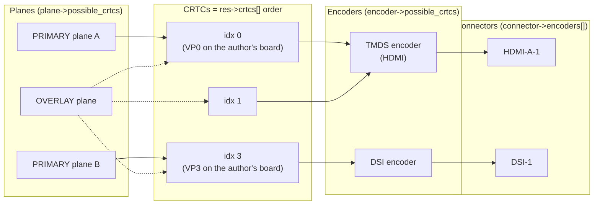
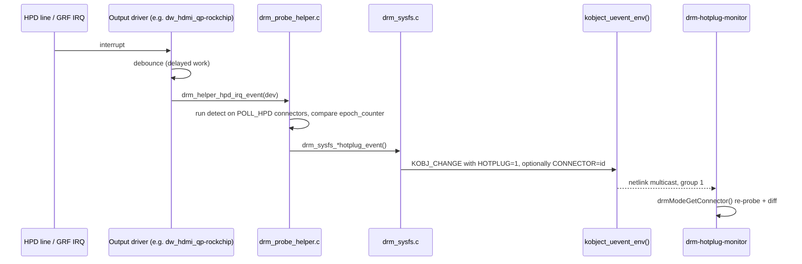

# Experiment 16: Multi-Display Topology & Hotplug

## 1. Objective
[Experiment 01](./01_Hardware_Inventory.md) introduced the `possible_crtcs` bitmask as "a critical constraint during multi-display bring-up" but never printed the full routing graph. This experiment turns that sentence into a tool, `src/drm-hotplug-monitor.c`, which:

1. **`--topology`** (default): prints the complete routing matrix: connectors → encoders (`drmModeConnector->encoders[]`) → CRTCs (`encoder->possible_crtcs`) and planes → CRTCs (`plane->possible_crtcs`). It shows how CRTC indices map to CRTC IDs, lists each connector's status, current route and preferred mode, then **solves the multi-display assignment problem**: it gives every connected connector its own CRTC, if the masks allow it.
2. **`--monitor`**: listens for kernel hotplug uevents on a raw `NETLINK_KOBJECT_UEVENT` socket (no libudev), re-probes the connectors and prints a diff of what changed.

The program is **read-only**. It never performs a modeset, never allocates a framebuffer and never changes a property.

---

## 2. Environment
See the [Test Environment](../README.md#test-environment) section.

Specific to this experiment:
* A second, hot-pluggable display (HDMI or DP) is needed to see hotplug events. The DSI panel on VP3 is a fixed panel and is not expected to generate them.
* `--monitor` works without root for the netlink part (see §3.5), but opening `/dev/dri/card0` normally needs root or membership in the `video` group.
* No other library besides libdrm and libc. udev is **not** used.

---

## 3. Background / Key Concepts

### 3.1 The routing graph

*The edges are illustrative only. The real edges on your board are exactly what `--topology` prints. The only board facts used here come from the existing docs: VP3 drives the DSI panel, and there are four CRTCs, VP0–VP3.*

Each arrow is a bitmask or ID list that the kernel exposes:

| Link | Where userspace reads it | Indexed by |
| :--- | :--- | :--- |
| connector → encoder | `drmModeConnector->encoders[]` (list of encoder **IDs**) | object ID |
| encoder → CRTC | `drmModeEncoder->possible_crtcs` | CRTC **index** |
| encoder ↔ encoder (cloning) | `drmModeEncoder->possible_clones` | encoder **index** |
| plane → CRTC | `drmModePlane->possible_crtcs` | CRTC **index** |

### 3.2 `possible_crtcs` is indexed by CRTC *position*, not ID
* The kernel builds masks with `drm_crtc_mask()` = `1 << drm_crtc_index(crtc)` (`include/drm/drm_crtc.h`, v6.1 and master). The `drm_encoder.possible_crtcs` kernel-doc says it uses "drm_crtc_index() as the index into the bitfield" (`include/drm/drm_encoder.h`, master).
* `DRM_IOCTL_MODE_GETRESOURCES` fills `res->crtcs[]` by walking `drm_for_each_crtc()`, which is the same list order that defines the index (`drivers/gpu/drm/drm_mode_config.c`, `drm_mode_getresources`, v6.1 and master). So **bit *i* ⇔ `res->crtcs[i]`**, and the object ID (e.g. 208) does not appear in the mask at all.
* For leased DRM file descriptors the kernel remaps the mask. `drm_lease_filter_crtcs()` (`drivers/gpu/drm/drm_lease.c`, v6.1) renumbers the bits so that they index the CRTCs *visible to that fd*. The rule "bit *i* = `res->crtcs[i]` of *this* fd" therefore still holds. It is also why you must never compute indices from another process's output.
* On DT platforms, an encoder's mask usually comes from the OF graph: `drm_of_find_possible_crtcs()` ORs `drm_of_crtc_port_mask()` over every endpoint of the encoder's port (`drivers/gpu/drm/drm_of.c`, v6.1 and master). The mainline Rockchip HDMI-QP glue calls it (`drivers/gpu/drm/rockchip/dw_hdmi_qp-rockchip.c`, `dw_hdmi_qp_rockchip_bind`, master). **The mask therefore reflects how the board's device tree wires VOP2 video ports to outputs**, not just what the silicon can do.
* **Mainline VOP2 caveat (CRTC index ≠ VP number).** In mainline `vop2_create_crtcs()` (`drivers/gpu/drm/rockchip/rockchip_drm_vop2.c`, master), a video port with no remote endpoint in the DT is skipped (`continue`), and the bit used for each primary plane is a running counter `nvp` over the *registered* VPs. If a board leaves VP0 unconnected, "VP1" becomes CRTC index 0. The author's board exposes four CRTCs ([Experiment 01](./01_Hardware_Inventory.md)), so every VP is registered there, but this is one more reason to decode masks at runtime. (BSP kernels carry vendor changes; not verified against the LubanCat BSP.)
* Also from that mainline function: each registered VP gets **one PRIMARY plane whose `possible_crtcs` has exactly one bit** (`possible_crtcs = BIT(nvp)`). The remaining windows become OVERLAY planes whose mask is built from each window's `possible_vp_mask`.

### 3.3 `possible_clones`
`possible_clones` is a bitmask of **encoder indices** (`drm_encoder_index()`), listing encoders that can be driven *by the same CRTC* at the same time (mirroring one CRTC to two outputs). If a driver implements no cloning it may leave the field 0, and the core then sets the encoder's own bit (kernel-doc of `drm_encoder.possible_clones`, `include/drm/drm_encoder.h`, master). The kernel returns it unchanged in `drm_mode_getencoder()` (`drivers/gpu/drm/drm_encoder.c`, v6.1 and master). `--topology` prints `(only itself: no cloning)` when the mask is exactly the encoder's own bit. This experiment solves the *extended desktop* case (one CRTC per display), not cloning.

### 3.4 The multi-display assignment problem
Lighting N displays simultaneously means picking, for every connected connector, **one encoder** from its `encoders[]` and **one CRTC** from that encoder's `possible_crtcs`, with every CRTC and encoder used at most once. This is bipartite matching. The naive "take the first CRTC whose bit is set" strategy (what `drm-atomic-demo.c` does for a single display) can fail even when a solution exists. If connector A accepts idx {0,1} and connector B accepts only idx {0}, greedy gives A → 0 and leaves B stranded. The correct answer is A → 1, B → 0.

**Why VP0 matters for 8K.** [Experiment 01](./01_Hardware_Inventory.md) lists VP0 as the video port that "supports up to 8K output". The same page notes that the source of those per-VP limits is still to be recorded, and that the mainline driver's limits differ. If that statement holds for the BSP on the board, an 8K sink can only be served by CRTC index 0 (VP0 on the author's board). Every other display must then fit on the remaining ports. That is exactly the kind of constraint the static masks **do not** show: `possible_crtcs` only states which wiring is possible. Resolution, clock and bandwidth limits are enforced in the driver's `atomic_check`, and you can only discover them with a `DRM_MODE_ATOMIC_TEST_ONLY` commit ([Experiment 10](./10_Atomic_KMS_Implementation.md)).

### 3.5 From HPD pin to userspace: the hotplug path


**Which uevent keys does the DRM core send?** All of these are `KOBJ_CHANGE` events on the card's primary minor device (`dev->primary->kdev`), sent through `kobject_uevent_env()`:

| Function (`drivers/gpu/drm/drm_sysfs.c`) | Extra env strings | Present in |
| :--- | :--- | :--- |
| `drm_sysfs_hotplug_event()` | `"HOTPLUG=1"` | v5.10, v5.15, v6.1, master |
| `drm_sysfs_connector_hotplug_event()` | `"HOTPLUG=1"`, `"CONNECTOR=%u"` | first seen in **v5.17** (absent in v5.16); v6.1, master |
| `drm_sysfs_connector_status_event()` | `"HOTPLUG=1"`, `"CONNECTOR=%u"`, `"PROPERTY=%u"` | v5.10 … v6.5 (incl. v6.1) |
| `drm_sysfs_connector_property_event()` | same three strings | renamed from the above in **v6.6**; master |
| `drm_sysfs_lease_event()` | `"LEASE=1"` (not a hotplug) | v6.1, master |

Who sends which:
* **v6.1:** `drm_helper_hpd_irq_event()` (`drm_probe_helper.c`) sends a per-connector event (`CONNECTOR=`) only when **exactly one** HPD connector changed. Otherwise it sends the device-wide `HOTPLUG=1`. The polling worker `output_poll_execute()` always sends the device-wide event via `drm_kms_helper_hotplug_event()`. `drm_connector_helper_hpd_irq_event()` sends the per-connector variant.
* **master** (checked at 7.3-rc4): both `drm_helper_hpd_irq_event()` and `output_poll_execute()` call `drm_sysfs_connector_hotplug_event()` for **each** changed connector. The v6.1 "exactly one" logic (`first_changed_connector`) is still present in v7.2.
* The `PROPERTY=` variant is used for property changes, not plugging. Examples are HDCP `Content Protection` updates (`drm_hdcp_update_content_protection()`, `drivers/gpu/drm/display/drm_hdcp_helper.c`, v6.1 and master) and privacy-screen changes (`drm_connector_privacy_screen_notifier()`, `drm_connector.c`, master).

**Consequence for userspace:** `CONNECTOR=` is a *hint*. A robust client must handle a bare `HOTPLUG=1` by re-probing every connector, which is what this program does. It prints the hint when one is present.

**Wire format and netlink group** (`lib/kobject_uevent.c`, v6.1 and master):
* `alloc_uevent_skb()` writes a header `"<action>@<devpath>"` followed by the NUL-separated environment buffer, and sets `dst_group = 1`.
* `kobject_uevent_env()` always adds `ACTION=`, `DEVPATH=`, `SUBSYSTEM=` and `SEQNUM=`. `dev_uevent()` (`drivers/base/core.c`) adds `MAJOR=`, `MINOR=` and `DEVNAME=` for devices with a dev_t. For DRM that name is `dri/<minor>` (`drm_devnode()` in `drm_sysfs.c`).
* The broadcast goes to **multicast group 1** (`netlink_broadcast(..., 0, 1, ...)`). The kernel socket is created with `.groups = 1` and `NL_CFG_F_NONROOT_RECV`, so unprivileged processes may listen.
* The kernel's environment buffer is `UEVENT_BUFFER_SIZE` = 2048 bytes (`include/linux/kobject.h`, v6.1). The program's 8 KiB receive buffer is comfortably larger.

### 3.6 `drmModeGetConnector()` vs `drmModeGetConnectorCurrent()`
Both wrap `DRM_IOCTL_MODE_GETCONNECTOR` through `_drmModeGetConnector(fd, id, probe)` (`xf86drmMode.c`, libdrm 2.4.125):

| Call | First ioctl sends | Kernel behaviour (`drm_mode_getconnector()`, `drm_connector.c`) |
| :--- | :--- | :--- |
| `drmModeGetConnector()` | `count_modes = 0` | If the fd **is the current DRM master**, calls `connector->funcs->fill_modes()`: re-detect, re-read EDID, rebuild the mode list (a *forced probe*). |
| `drmModeGetConnectorCurrent()` | `count_modes = 1` (stack buffer) | Skips `fill_modes()` and reports what the kernel already knows. |

* The master-only condition exists in v5.15, v6.1 and master (`is_current_master` check with the debug message "demoting to read-only probe"). It is **absent in v5.10**, where any client forced a probe.
* The UAPI kernel-doc of `struct drm_mode_get_connector` (`include/uapi/drm/drm_mode.h`, v6.1 and master; also in the installed `/usr/include/libdrm/drm_mode.h`) says: *"User-space needs to force-probe connectors to ensure their metadata is up-to-date at startup and after receiving a hot-plug event"*, and warns that a forced probe "can be slow, might cause flickering and the ioctl will block".
* Subtle point: on the HPD path the kernel **already ran `->detect()`** before sending the uevent (`check_connector_changed()` → `drm_helper_probe_detect()`, `drm_probe_helper.c`, v6.1). So the connection *status* is fresh even through `GetConnectorCurrent`. What a non-probing call may miss is an updated **mode list / EDID**, which is built by `fill_modes()`.
* Master matters: the first opener of a card node with no master becomes master automatically (`drm_master_open()`, `drm_auth.c`, v6.1 and master). The program reports whether its fd is master, using the same trick as libdrm's `drmIsMaster()`: `drmAuthMagic(fd, 0)` fails with `-EACCES` for non-masters (`drm_ioctl_permit()` for the `DRM_MASTER`-flagged `DRM_IOCTL_AUTH_MAGIC`, `drm_ioctl.c`, v6.1) and with `-EINVAL` for a master (`drm_authmagic()`, `drm_auth.c`, v6.1).
* **libdrm versions** (introduction versions upstream not verified; gitlab.freedesktop.org was not reachable). The Ubuntu `debian/libdrm2.symbols` shipped with 2.4.125 records minimum versions `drmModeGetConnector` 2.4.3, `drmModeGetConnectorCurrent` **2.4.61**, `drmIsMaster` 2.4.99, `drmModeConnectorGetPossibleCrtcs` 2.4.112 and `drmModeGetConnectorTypeName` 2.4.112. The program therefore uses `GetConnectorCurrent`, re-implements `drmIsMaster` with `drmAuthMagic`, and keeps its own connector-name table.

### 3.7 RK3588 in mainline: outputs, HDMI driver and HPD
All of the following is **mainline** (`torvalds/linux`). The LubanCat 5 BSP kernel carries Rockchip vendor drivers and may differ in every point.

* **VOP2 support for RK3588** appears in `drivers/gpu/drm/rockchip/rockchip_vop2_reg.c` from **v6.8** (no `rk3588` in v6.7). Upstream v6.1 describes only RK3566/RK3568.
* **Output interfaces:** `rk3588_set_intf_mux()` (`rockchip_vop2_reg.c`, master) accepts `ROCKCHIP_VOP2_EP_HDMI0/1`, `EDP0/1`, `MIPI0/1` and `DP0/1` (IDs defined in `include/dt-bindings/soc/rockchip,vop2.h`). Any other endpoint ID triggers "Invalid interface id".
* **Encoder drivers with an `rk3588` compatible in `drivers/gpu/drm/rockchip/` (master):**
  * `dw_hdmi_qp-rockchip.c` (`rockchip,rk3588-dw-hdmi-qp`): in the Makefile from **v6.13**.
  * `analogix_dp-rockchip.c` (`rockchip,rk3588-edp`).
  * `dw-mipi-dsi2-rockchip.c` (`rockchip,rk3588-mipi-dsi2`): in the Makefile from v6.14 (absent in v6.13).
  * `dw_dp-rockchip.c` (`rockchip,rk3588-dp`): in the Makefile from v6.18.
* **HDMI driver:** the Rockchip glue `dw_hdmi_qp-rockchip.c` sits on the Synopsys bridge `drivers/gpu/drm/bridge/synopsys/dw-hdmi-qp.c`. It creates a `DRM_MODE_ENCODER_TMDS` encoder and a `drm_bridge_connector` (master).
* **HPD is interrupt-driven** in mainline. The glue requests a threaded IRQ named `"hpd"` (`devm_request_threaded_irq(..., "dw-hdmi-qp-hpd")`). The hard-IRQ handler reads `RK3588_GRF_SOC_STATUS1` and masks the interrupt. The threaded handler clears it and schedules `hpd_work` after `HOTPLUG_DEBOUNCE_MS` (150 ms). `dw_hdmi_qp_rk3588_hpd_work()` then calls **`drm_helper_hpd_irq_event()`**, which is the entry point of the §3.5 path (v6.13 and master; v6.13 handles only the HDMI0 status bits, master also handles HDMI1 via `port_id`).
* **Connector polling flags:** `dw-hdmi-qp.c` sets `DRM_BRIDGE_OP_HPD`, and `drm_bridge_connector_init()` then sets `connector->polled = DRM_CONNECTOR_POLL_HPD`. Without HPD but with detect support it would use `POLL_CONNECT | POLL_DISCONNECT` (master). In master, `DRM_BRIDGE_OP_HPD` is skipped if the DT has `no-hpd`, which would fall back to the poll worker. `rockchip_drm_drv.c` calls `drm_kms_helper_poll_init()` (master). In v6.1 the poll period is `DRM_OUTPUT_POLL_PERIOD` = `10*HZ`.
* **Not verified:** which of these paths the LubanCat 5 BSP kernel uses, and whether its HDMI driver sends `CONNECTOR=`-tagged events. Check with `--monitor` (§5).

---

## 4. Implementation

### Key implementation details
* **Snapshot model.** `collect_topology()` copies CRTCs (ID + current mode), encoders, connectors and planes into plain arrays (`struct topology`). The printer, the solver and the hotplug diff all work on these snapshots, and `--monitor` keeps two of them (old/new).
* **Index ↔ ID decoding.** `print_crtc_mask()` renders each mask as `0x5 -> idx{0,2} = CRTC{88,168}` (example format only) and flags bits beyond `count_crtcs` as a driver bug.
* **Routing matrix.** Rows are connectors, encoders and planes; columns are CRTC indices, with the ID printed below each index. `X` = allowed, `*` = currently in use, `.` = impossible. A connector's row is the OR of its encoders' masks (the same thing libdrm's newer `drmModeConnectorGetPossibleCrtcs()` computes).
* **Assignment solver.** `solve_assignment()` backtracks over connected connectors. For each one it tries the **current** encoder/CRTC first (to minimise changes, as a compositor would), then every other allowed pair, then "leave it dark". It keeps the best partial solution and prunes branches that cannot beat it. For each assigned CRTC it also reports a PRIMARY plane whose `possible_crtcs` covers it.
* **Raw uevent socket.** `socket(AF_NETLINK, SOCK_DGRAM | SOCK_CLOEXEC, NETLINK_KOBJECT_UEVENT)`, `bind()` with `nl_groups = 1` and `nl_pid = 0` (kernel picks the port), and `SO_RCVBUF` raised to 1 MiB (best effort). The socket is opened **before** the baseline scan so a plug event racing with startup is queued rather than lost.
* **Filtering.** Messages are received with `recvmsg()` and dropped unless `nl_pid == 0` (sent by the kernel). The header must contain `@`, `SUBSYSTEM=drm`, and `MAJOR`/`MINOR` must match `fstat()` of our fd (works with `/dev/dri/by-path/` symlinks). Only then is `HOTPLUG=1` handled.
* **Overflow.** `recvmsg()` returning `ENOBUFS` means the queue overflowed and events were lost. The program then performs a full re-scan and diff instead of trusting the stream.
* **`PROPERTY=`.** When present, the property ID is resolved to its name and current value (enum names decoded) on the named connector.
* **Signals.** `SIGINT`/`SIGTERM` are installed without `SA_RESTART`, so `poll()` returns `EINTR` and the loop exits cleanly.
* **Options.** `--no-probe` uses `drmModeGetConnectorCurrent()`. `--drop-master` calls `drmDropMaster()` right after `open()` so another KMS program can become master while the monitor runs; forced probes are then demoted by the kernel. `DRM_CLIENT_CAP_UNIVERSAL_PLANES` is set only so PRIMARY/CURSOR planes are listed.

### Compilation & usage
```bash
# Built by the universal Makefile together with all other experiments
make

# Topology + assignment (default). Forced probe if we are DRM master.
sudo ./src/drm-hotplug-monitor
sudo ./src/drm-hotplug-monitor --topology --no-probe   # no EDID re-read

# Hotplug monitor (Ctrl+C to stop)
sudo ./src/drm-hotplug-monitor --monitor
sudo ./src/drm-hotplug-monitor --monitor --drop-master  # let another KMS app run

# Another device node
sudo ./src/drm-hotplug-monitor -d /dev/dri/card1
```

### High-Level Logic Flow (C-Style Pseudocode)
```c
// ---- --topology ----
res = drmModeGetResources(fd);             // res->crtcs[] defines index space
for each encoder: possible_crtcs, possible_clones
for each connector:
    c = probe ? drmModeGetConnector(fd, id)          // forced probe (master only)
              : drmModeGetConnectorCurrent(fd, id);  // cached state
    reachable = OR(enc[e].possible_crtcs for e in c->encoders)
for each plane: possible_crtcs, "type" property
print matrix;  solve_assignment();          // backtracking bipartite matching

// ---- --monitor ----
nl = socket(AF_NETLINK, SOCK_DGRAM, NETLINK_KOBJECT_UEVENT);
bind(nl, {AF_NETLINK, .nl_pid = 0, .nl_groups = 1});   // group 1 = kernel
old = snapshot();
while (!stop) {
    poll(nl);  recvmsg(nl, &from);          // ENOBUFS -> full rescan
    if (from.nl_pid != 0) continue;         // not from kernel
    ev = parse("action@devpath\0KEY=VAL\0...");
    if (ev.SUBSYSTEM != "drm" || ev.MAJOR:MINOR != our card) continue;
    if (ev.HOTPLUG != "1") continue;        // e.g. LEASE=1
    new = snapshot();                       // re-probe ALL connectors
    if (ev.CONNECTOR && ev.PROPERTY) print property name/value;
    diff(old, new);  old = new;
}
```

---

## 5. Results (pending hardware verification)
Nothing in this section has been run on the LubanCat 5 yet. The host-side checks done so far are: the program compiles with zero warnings under `-Wall -Wextra -Werror`. On an x86 development container (not the target), the uevent parser correctly decoded a real kernel `change` uevent, and a sanitizer-instrumented harness exercised the solver and diff logic on synthetic topologies. These checks are **not** hardware results.

### 5.1 Topology
```bash
sudo ./src/drm-hotplug-monitor --topology
```
What to look for:
* Four CRTC rows. The index → ID mapping should match `modetest -M rockchip -p` ([Experiment 01](./01_Hardware_Inventory.md)).
* The DSI connector's current route should end at the CRTC that [Experiment 01](./01_Hardware_Inventory.md) identifies as VP3.
* Each encoder's `possible_crtcs`: this is the board's DT wiring (§3.2). Compare it with `modetest -M rockchip -e`.
* PRIMARY planes: in mainline each PRIMARY plane's mask has one bit (§3.2). Record whether the BSP behaves the same.
* `possible_clones`: record whether any encoder advertises cloning.

> TODO(on-hardware): paste the output of `sudo ./src/drm-hotplug-monitor --topology` here (DSI panel only).

> TODO(on-hardware): paste the output again with an HDMI monitor connected, including the "Multi-display assignment" section.

### 5.2 Hotplug
```bash
sudo ./src/drm-hotplug-monitor --monitor
# then unplug / re-plug the HDMI cable
```
Expected, per the kernel sources in §3.5 (not yet observed):
* One `[drm] ... HOTPLUG=1` block per detected change. Whether `CONNECTOR=` appears depends on the kernel and driver path (§3.5, §3.7). Record it.
* A diff such as `~ CONN <id> HDMI-A-1: disconnected -> connected`, followed by `modes 0 -> N` and a new preferred mode.
* On unplug, the reverse. Depending on the driver, the mode list may or may not be cleared. Record what you see.
* With `--no-probe`, compare whether the mode count updates on plug. This shows the `fill_modes()` difference from §3.6.

> TODO(on-hardware): paste the `--monitor` output for one unplug + re-plug cycle.

> TODO(on-hardware): record whether the BSP kernel sends `CONNECTOR=` and how long after the physical plug the event arrives (e.g. by running `udevadm monitor --kernel --property` in parallel, if udev is installed).

---

## 6. Analysis / Engineering Insights
* **Masks describe wiring; `TEST_ONLY` describes feasibility.** The solver answers "is there a routing?". Only the driver's `atomic_check` can answer "does this routing work at these resolutions?". A production bring-up tool should feed the solver's answer into a `DRM_MODE_ATOMIC_TEST_ONLY` commit and, on failure, try the next assignment. That is the natural extension of this experiment and of [Experiment 10](./10_Atomic_KMS_Implementation.md).
* **Stable routing beats optimal routing.** Trying the current binding first means a hotplug on HDMI does not move the DSI panel to another CRTC. Moving it would force a full modeset (and a visible blank) on a display the user did not touch.
* **Uevents are hints, not state.** Events can be coalesced (a device-wide `HOTPLUG=1`), dropped (`ENOBUFS`), or can race with a scan. The only reliable pattern is: open the listener first, take a snapshot, and on *any* hotplug event re-read everything and diff.
* **Forced probes cost time and may flicker** (UAPI doc, §3.6). Probing only after a hotplug event (never in a timer loop) follows the kernel's guidance. Holding DRM master just to monitor also blocks other KMS clients, which is why `--drop-master` exists.
* **Why no libudev?** systemd-udevd re-broadcasts processed events on a *different* netlink group, prefixed with a `"libudev"` header. In systemd's `sd-device` monitor, `MONITOR_GROUP_KERNEL` = 1 and `MONITOR_GROUP_UDEV` = 2 (`src/libsystemd/sd-device/device-monitor-private.h` and `device-monitor.c`, systemd `main`). This program listens only to group 1 and rejects any datagram without an `action@devpath` header. For a minimal Ubuntu Lite image without a compositor, the raw kernel group is enough and removes a dependency. The trade-off: udev rules (tagging, permissions, symlinks) have not necessarily run when the kernel event arrives. That is irrelevant for connector hotplug on an already-open card.

---

## 7. Key Takeaways
* `possible_crtcs` bit *i* means `res->crtcs[i]` **of this fd**, never a CRTC ID. In mainline VOP2 the index may not even equal the VP number.
* Multi-display bring-up is a matching problem. Greedy "first CRTC that fits" can fail where backtracking succeeds.
* DRM hotplug = `KOBJ_CHANGE` uevent with `HOTPLUG=1`, optionally `CONNECTOR=<id>` (v5.17+) and `PROPERTY=<id>`, multicast on netlink group 1.
* `drmModeGetConnector()` forces a probe only for the DRM master. `drmModeGetConnectorCurrent()` never probes.
* In mainline, RK3588 HDMI (`dw_hdmi_qp`, v6.13+) HPD is IRQ-driven with a debounce work item that calls `drm_helper_hpd_irq_event()`. The BSP may differ.

---

## 8. References
Kernel sources (fetched from `raw.githubusercontent.com/torvalds/linux/<tag>/...`; "master" was 7.3-rc4 when checked):
* `drivers/gpu/drm/drm_sysfs.c`: `drm_sysfs_hotplug_event`, `drm_sysfs_connector_hotplug_event`, `drm_sysfs_connector_status_event` (≤ v6.5) / `drm_sysfs_connector_property_event` (≥ v6.6), `drm_sysfs_lease_event`, `drm_devnode`. Checked in v5.10, v5.15, v5.16, v5.17, v6.0–v6.6, master.
* `drivers/gpu/drm/drm_probe_helper.c`: `drm_kms_helper_hotplug_event`, `drm_kms_helper_connector_hotplug_event`, `drm_helper_hpd_irq_event`, `drm_connector_helper_hpd_irq_event`, `check_connector_changed`, `output_poll_execute`, `DRM_OUTPUT_POLL_PERIOD` (v6.1, v7.2, master).
* `lib/kobject_uevent.c`: `kobject_uevent_env`, `alloc_uevent_skb`, `uevent_net_broadcast_untagged`, `uevent_net_init` (v6.1, master).
* `drivers/base/core.c`: `dev_uevent` (v6.1, master). `include/linux/kobject.h`: `UEVENT_BUFFER_SIZE` (v6.1).
* `drivers/gpu/drm/drm_connector.c`: `drm_mode_getconnector` (v5.10, v5.15, v6.1, master), `drm_connector_enum_list` and `drm_connector_privacy_screen_notifier` (master).
* `drivers/gpu/drm/drm_encoder.c`: `drm_mode_getencoder`, `drm_encoder_enum_list` (v6.1, master). `include/drm/drm_encoder.h`: `possible_crtcs`/`possible_clones` kernel-doc (master).
* `include/drm/drm_crtc.h`: `drm_crtc_mask`. `drivers/gpu/drm/drm_mode_config.c`: `drm_mode_getresources`. `drivers/gpu/drm/drm_plane.c`: `drm_mode_getplane` (v6.1, master).
* `drivers/gpu/drm/drm_lease.c`: `drm_lease_filter_crtcs` (v6.1).
* `drivers/gpu/drm/drm_of.c`: `drm_of_find_possible_crtcs`, `drm_of_crtc_port_mask` (v6.1, master).
* `drivers/gpu/drm/drm_auth.c`: `drm_master_open`, `drm_authmagic`. `drivers/gpu/drm/drm_ioctl.c`: `drm_ioctl_permit` (v6.1).
* `drivers/gpu/drm/display/drm_hdcp_helper.c`: `drm_hdcp_update_content_protection` (v6.1, master).
* `include/uapi/drm/drm_mode.h`: `struct drm_mode_get_connector` kernel-doc, "Force-probing a connector" (v6.1, master).
* Rockchip (mainline only): `drivers/gpu/drm/rockchip/Makefile` (v6.1, v6.8, v6.11–v6.18, master), `rockchip_drm_vop2.c` (`vop2_create_crtcs`, master), `rockchip_vop2_reg.c` (`rk3588_set_intf_mux`; RK3588 since v6.8), `dw_hdmi_qp-rockchip.c` (v6.13, master), `rockchip_drm_drv.c` (master), `include/dt-bindings/soc/rockchip,vop2.h` (master), `drivers/gpu/drm/bridge/synopsys/dw-hdmi-qp.c` (v6.13, v7.0, master), `drivers/gpu/drm/display/drm_bridge_connector.c` (`drm_bridge_connector_init`, master).
* Example raw links: [drm_sysfs.c @ v6.1](https://raw.githubusercontent.com/torvalds/linux/v6.1/drivers/gpu/drm/drm_sysfs.c), [kobject_uevent.c @ v6.1](https://raw.githubusercontent.com/torvalds/linux/v6.1/lib/kobject_uevent.c), [dw_hdmi_qp-rockchip.c @ master](https://raw.githubusercontent.com/torvalds/linux/master/drivers/gpu/drm/rockchip/dw_hdmi_qp-rockchip.c).

libdrm (2.4.125 source tree and installed headers):
* `xf86drmMode.c`: `_drmModeGetConnector`, `drmModeGetConnector`, `drmModeGetConnectorCurrent`, `drmModeConnectorGetPossibleCrtcs`.
* `xf86drmMode.h`: comments on `drmModeGetConnector` / `drmModeGetConnectorCurrent`.
* `xf86drm.c`: `drmIsMaster`, `drmAuthMagic`.
* Ubuntu packaging `debian/libdrm2.symbols` (libdrm 2.4.125-1ubuntu0.1): minimum symbol versions quoted in §3.6.
* `modetest -h` (libdrm-tests 2.4.125): `-c`, `-e`, `-p` for cross-checking.

systemd (only for the libudev comparison in §6):
* `src/libsystemd/sd-device/device-monitor-private.h` (`MONITOR_GROUP_*`), `src/libsystemd/sd-device/device-monitor.c` (`"libudev"` prefix), systemd `main`.
