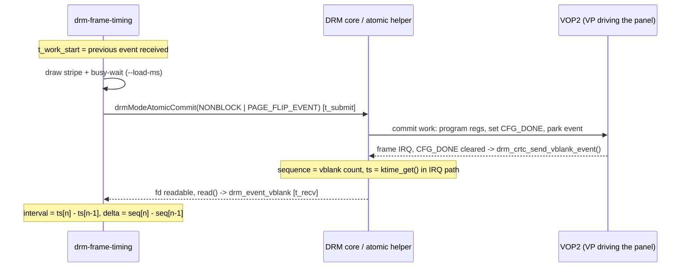

# Experiment 17: Frame Timing Measurement (Quantifying VBlank Sync)

## 1. Objective
[Experiment 09](./09_VBlank_and_Tearing_Analysis.md) concluded *qualitatively* that vblank-synchronised page flips give "perfectly smooth" animation. This experiment turns that conclusion into numbers. Every atomic page flip requested with `DRM_MODE_PAGE_FLIP_EVENT` comes back as a `DRM_EVENT_FLIP_COMPLETE` event that carries the kernel's **vblank sequence number** and a **timestamp**. By recording these for a few hundred flips, `src/drm-frame-timing.c` measures:

* the real flip-to-flip interval, and how it compares with the refresh period implied by the mode timings (the same arithmetic as [Experiment 03](./03_DSI_Panel_Bringup.md)),
* jitter (standard deviation and a text histogram),
* **missed vblanks**, counted as gaps in the sequence number (`delta > 1`),
* **commit → event latency**, i.e. how long a frame takes from `drmModeAtomicCommit()` until userspace learns it is on screen,
* what happens when per-frame "render" work (`--load-ms`) takes longer than one refresh period.

---

## 2. Environment
See the [Test Environment](../README.md#test-environment) section.

Specific to this experiment:
* Needs **DRM master** (run from a text VT with no compositor, normally via `sudo`), exactly like Experiments 07–11.
* Uses only libdrm + libc (the report avoids `<math.h>` so that the Makefile's `-ldrm`-only link line is enough).
* Kernel timestamps are compared with userspace `CLOCK_MONOTONIC`, so the program checks `DRM_CAP_TIMESTAMP_MONOTONIC` first (see 3.3).

---

## 3. Background / Key Concepts

### 3.1 What the flip event contains
Every flip-complete event is a `struct drm_event_vblank` (identical in v6.1 and master, `include/uapi/drm/drm.h`):

```c
struct drm_event_vblank {
	struct drm_event base;   /* type = DRM_EVENT_FLIP_COMPLETE, length */
	__u64 user_data;         /* the pointer we passed to drmModeAtomicCommit() */
	__u32 tv_sec;            /* vblank timestamp, seconds  */
	__u32 tv_usec;           /* vblank timestamp, microseconds */
	__u32 sequence;          /* vblank counter value */
	__u32 crtc_id;           /* 0 on older kernels that do not support this */
};
```

* The atomic ioctl creates the event and fills `crtc_id` and `user_data` (`drivers/gpu/drm/drm_atomic_uapi.c`, `create_vblank_event()`, v6.1 and master).
* `sequence` and `tv_sec/tv_usec` are filled in when the event is sent: `drm_crtc_send_vblank_event()` reads the counter and time of the most recently processed vblank with `drm_vblank_count_and_time()` and passes them to `send_vblank_event()`, which splits the `ktime_t` into seconds/microseconds (`drivers/gpu/drm/drm_vblank.c`, v6.1 and master). The comment there explains why 32-bit seconds are fine: *"This is safe as we always use monotonic timestamps since linux-4.15"*.
* The same timestamp is used to signal any out-fence of the commit (`drm_send_event_timestamp_locked()`, same function), so `OUT_FENCE_PTR` from [Experiment 11](./11_DMA_BUF_and_Fence_Sync.md) and this event agree on "when".

A flip request that only touches a plane still produces a CRTC event: `drm_atomic_get_plane_state()` pulls the plane's current CRTC into the atomic state (`drivers/gpu/drm/drm_atomic.c`, v6.1 and master), and `prepare_signaling()` attaches an event to every CRTC in the state (`drm_atomic_uapi.c`). If no CRTC were involved, `DRM_MODE_PAGE_FLIP_EVENT` would fail with `-EINVAL` (same function). Combining `DRM_MODE_PAGE_FLIP_EVENT` with `DRM_MODE_ATOMIC_TEST_ONLY` is also rejected with `-EINVAL` (`drm_mode_atomic_ioctl()`), which is why the program's one-off flip `TEST_ONLY` check leaves the event flag out.

### 3.2 Where the timestamp and sequence come from on VOP2 (mainline)
In the **mainline** Rockchip VOP2 driver (`drivers/gpu/drm/rockchip/rockchip_drm_vop2.c`, `vop2_crtc_atomic_flush()` and `vop2_isr()`, checked at v6.1 and master):

1. `vop2_crtc_atomic_flush()` writes the new configuration, sets the video port's `CFG_DONE` bit (`vop2_cfg_done()`), and parks the commit's event in `vp->event`.
2. On each `VP_INT_FS_FIELD` interrupt, `vop2_isr()` calls `drm_crtc_handle_vblank()` and then sends the parked event **only if the port's `CFG_DONE` bit has cleared**, i.e. the hardware has taken the new configuration. If the bit is still set, the event waits for the next interrupt.
3. VOP2 provides neither a `get_vblank_timestamp` hook nor a hardware frame counter (no `max_vblank_count`/`get_vblank_counter` in `rockchip_drm_vop2.c` or `rockchip_drm_drv.c`). In that case `drm_update_vblank_count()` falls back to `diff = in_vblank_irq ? 1 : 0`, and the timestamp comes from `ktime_get()` in `drm_get_last_vbltimestamp()` (v6.1) / `drm_crtc_get_last_vbltimestamp()` (master): *"Return current monotonic/gettimeofday timestamp as best estimate"*.

What this means for the measurement:
* On this driver, `sequence` counts **VOP2 frame interrupts** (+1 per interrupt), so a gap of 2 between two consecutive flip events means exactly one refresh went by without a new frame.
* `tv_sec/tv_usec` is **the `CLOCK_MONOTONIC` time at which the interrupt handler ran**, not a hardware-latched time. Interrupt latency therefore appears as jitter in the flip-to-flip interval. Only the software-visible side of the display is measured, not the panel itself.
* Step 2 is also how a missed deadline shows up: a commit whose registers are not latched in time gets its event one interrupt later, which shows as `delta = 2`.

> Note: in upstream **v6.1** this driver only describes RK3566/RK3568; RK3588 support was added in a later mainline release. The LubanCat 5 runs a Rockchip **BSP** kernel whose VOP2 driver is vendor code and may deliver events and timestamps differently. Everything in this subsection is **not verified** against the BSP source.

### 3.3 Why `DRM_CAP_TIMESTAMP_MONOTONIC` matters
The program computes two latencies that mix clocks: `commit → vblank` (`kernel ts − submit time`) and `vblank → wakeup` (`receive time − kernel ts`). Both only make sense if the kernel timestamp uses the same clock as our `clock_gettime(CLOCK_MONOTONIC)`. `CLOCK_REALTIME` can be stepped by NTP or `date`, and its offset from `CLOCK_MONOTONIC` is arbitrary.

* The UAPI header documents the cap: 0 = `CLOCK_REALTIME`, 1 = `CLOCK_MONOTONIC`; *"Starting kernel version 4.15, this capability is always set to 1"* (`include/uapi/drm/drm.h`, v6.1 and master).
* In both v6.1 and master, `drm_getcap()` returns 1 unconditionally for `DRM_CAP_TIMESTAMP_MONOTONIC` (`drivers/gpu/drm/drm_ioctl.c`).

The program still queries the cap and **disables the mixed-clock statistics** if it reads 0. It also queries `DRM_CAP_CRTC_IN_VBLANK_EVENT` to say whether `crtc_id` in the event can be trusted.

### 3.4 `-EBUSY` from a nonblocking commit
Mainline Rockchip uses the generic `drm_atomic_helper_commit` (`rockchip_drm_fb.c`, `rockchip_drm_mode_config_funcs`, v6.1 and master). Its `drm_atomic_helper_setup_commit()` → `stall_checks()` returns `-EBUSY` for a `NONBLOCK` commit while the previous commit on the same CRTC has not signalled `flip_done`. The kernel comment: *"Userspace is not allowed to get ahead of the previous commit with nonblocking ones."* The same check exists per plane and per connector in `drm_atomic_helper_setup_commit()` (`drivers/gpu/drm/drm_atomic_helper.c`, v6.1 and master; the doc comment says *"-EBUSY when userspace schedules nonblocking commits too fast"*).

`flip_done` is completed in `drm_send_event_helper()` (`drivers/gpu/drm/drm_file.c`) **before** the event is queued to the file and readers are woken. So a client that waits for each flip event before submitting the next flip, as this program does, should never see `-EBUSY`. The program still counts and retries it (1 ms back-off, at most 100 retries) so that a non-zero count shows up in the report if it ever happens on the BSP.

### 3.5 libdrm event dispatch
`drmHandleEvent()` (`xf86drmMode.c`, libdrm 2.4.125) `read()`s whole events from the fd and, for `DRM_EVENT_FLIP_COMPLETE`, calls:
* `page_flip_handler2(fd, sequence, tv_sec, tv_usec, crtc_id, user_data)` if `evctx->version >= 3`, else
* `page_flip_handler(fd, sequence, tv_sec, tv_usec, user_data)` if `evctx->version >= 2`.

The locally installed header (libdrm 2.4.125) defines `DRM_EVENT_CONTEXT_VERSION 4`. `page_flip_handler2` came in with the libdrm commit *"Add CRTC ID to vblank event"* (committed 2017-04-06, per a GitHub mirror of libdrm's history). **Which libdrm release first shipped it is not verified.** Because the board's libdrm version is unknown, the program checks `DRM_EVENT_CONTEXT_VERSION >= 3` at compile time and otherwise falls back to version 2 / `page_flip_handler`, recording `crtc_id = 0`. The fallback path was compile-tested by forcing the condition false.

### 3.6 The expected period for the 1024x600 panel
Experiment 03 reported `PCLK = 51668 kHz`, `H_total = 1354`, `V_total = 636`. Rearranging its formula:

$$T_{frame} = \frac{H_{total} \times V_{total}}{PCLK} = \frac{1354 \times 636}{51\,668\,000\ \text{Hz}} = \frac{861\,144}{51\,668\,000}\ \text{s} \approx 16\,666.873\ \mu s$$

$$f_{refresh} = \frac{1}{T_{frame}} \approx 59.99926\ \text{Hz}$$

So the nominal refresh is **slightly below 60 Hz**, by about 0.00074 Hz (≈ −12.4 ppm). The reason is that `clock` is stored as an integer number of kHz: exactly 60 Hz would need 1354 × 636 × 60 = 51 668.64 kHz, which the field cannot represent. The kernel does the same integer arithmetic for its frame duration, `framedur_ns = frame_size * 1000000 / dotclock` = 16 666 873 ns (`drm_calc_timestamping_constants()`, `drm_vblank.c`). `mode.vrefresh` shows **60** because `drm_mode_vrefresh()` rounds to the nearest integer (`DIV_ROUND_CLOSEST_ULL`, `drivers/gpu/drm/drm_modes.c`, v6.1).

> This is a *nominal* figure. The rate the RK3588 clock tree actually generates for a 51 668 kHz request is **not verified**. Measuring that rate is one of the goals of this experiment.

### 3.7 Timeline of one measured frame



---

## 4. Implementation

### Key implementation details
* **Pipeline discovery**: first connected connector, its preferred mode (falling back to `modes[0]`), the CRTC already routed to it (falling back to the first CRTC in `possible_crtcs`), and the primary plane for that CRTC. No IDs are hard-coded.
* **Modeset**: one blocking atomic commit (connector `CRTC_ID`, CRTC `ACTIVE` + `MODE_ID` blob, plane `FB_ID`/`CRTC_*`/`SRC_*` in 16.16), validated with `DRM_MODE_ATOMIC_TEST_ONLY | ALLOW_MODESET` first.
* **Flip loop**: two XRGB8888 dumb buffers. Per frame: draw a 16 px stripe into the back buffer (erasing only the old stripe, so drawing costs very little CPU), optionally spin for `--load-ms`, then submit a plane-only atomic commit with `DRM_MODE_ATOMIC_NONBLOCK | DRM_MODE_PAGE_FLIP_EVENT`, `select()` + `drmHandleEvent()` until the event arrives, swap.
* **Per-flip sample**: `sequence`, `crtc_id`, kernel timestamp, `CLOCK_MONOTONIC` just before the commit ioctl, ioctl duration, `CLOCK_MONOTONIC` in the event handler, the frame's work time, and the number of `-EBUSY` retries.
* **Report**: nominal period from `clock/htotal/vtotal` (with the same interlace/doublescan/vscan adjustments as `drm_mode_vrefresh()`), flip-interval mean/min/max/stddev + p50/p90/p99, an interval histogram whose bins are centred on multiples of the period, the sequence-delta distribution and **missed vblanks = Σ(delta − 1)**, per-vblank period (`interval / delta`) with its deviation from nominal in ppm, a jitter histogram (`interval − delta × nominal`, 10 µs bins), and the latency statistics.
* **Ctrl+C / SIGTERM**: the handler only sets a flag. A flip already in flight is waited for, then the summary so far is printed and the CRTC is restored. If it was active (e.g. fbcon), its previous fb/mode is re-applied to the connectors that were routed to it. If it was off, it is disabled again with an atomic commit.

### Compilation / usage
The universal Makefile builds every `src/*.c`, so `make` produces `src/drm-frame-timing`. To build just this file:

```bash
gcc -Wall -Wextra -O2 $(pkg-config --cflags libdrm) \
    -o src/drm-frame-timing src/drm-frame-timing.c $(pkg-config --libs libdrm)

sudo ./src/drm-frame-timing                     # 600 flips, no extra load
sudo ./src/drm-frame-timing -n 1800             # ~30 s at ~60 Hz
sudo ./src/drm-frame-timing --load-ms 10        # 10 ms "render" per frame
sudo ./src/drm-frame-timing --load-ms 20 --csv /tmp/load20.csv
sudo ./src/drm-frame-timing -d /dev/dri/card1   # other DRM device
./src/drm-frame-timing --help
```

CSV columns: `index, sequence, seq_delta, crtc_id, vblank_ts_us, submit_mono_ns, recv_mono_ns, interval_us, submit_to_recv_us, work_us, ioctl_us, ebusy_retries`.

### High-Level Logic Flow (C-style pseudocode)
```c
drmSetClientCap(fd, DRM_CLIENT_CAP_UNIVERSAL_PLANES, 1);
drmSetClientCap(fd, DRM_CLIENT_CAP_ATOMIC, 1);
drmGetCap(fd, DRM_CAP_TIMESTAMP_MONOTONIC, &mono);    // may we mix clocks?

period_us = htotal * vtotal * 1000.0 / clock_khz;      // Experiment 03, inverted
saved = drmModeGetCrtc(fd, crtc_id);                   // for restore
atomic_modeset(bufs[0]);                               // TEST_ONLY, then commit

ev.version = 3; ev.page_flip_handler2 = on_flip;      // v2 fallback on old libdrm
t_work = now();
for (n = 0; n < frames && !stop; n++) {
    draw_stripe(back);
    spin_until(t_work + load_ms);                      // simulated render cost
    s[n].submit = now();
    drmModeAtomicCommit(fd, {plane.FB_ID = back},
                        NONBLOCK | PAGE_FLIP_EVENT, &ctx);   // -EBUSY -> retry
    while (pending) { select(fd); drmHandleEvent(fd, &ev); } // on_flip() fills
                                                             // seq, ts, recv time
    s[n].delta = s[n].seq - s[n-1].seq;               // >1 => missed vblank(s)
    t_work = s[n].recv;
    swap(front, back);
}
report(s, n);             // intervals, histogram, missed vblanks, latencies
restore(saved);
```

---

## 5. Results (pending hardware verification)
This program has **not yet been run on the LubanCat 5**. Nothing below is a measurement. The sections say what to run, what the arithmetic predicts, and where to paste the real output.

### 5.1 Baseline (no load)
```bash
sudo ./src/drm-frame-timing -n 600 --csv /tmp/baseline.csv
```
What to look for:
* The startup line should print `Nominal period = ... 16666.873 us -> 59.99926 Hz (mode.vrefresh=60)` if the panel mode matches Experiment 03.
* `DRM_CAP_TIMESTAMP_MONOTONIC=1` is expected on any kernel ≥ 4.15 (see 3.3).
* Expectation: almost all `seq delta = 1`, mean interval close to the nominal period, and `missed vblanks` at or near 0. The deviation-from-nominal line (ppm) shows how far the real pixel clock is from the 51 668 kHz request. Because the timestamp is taken in the IRQ path (3.2), the jitter histogram shows interrupt latency, not panel timing.

> TODO(on-hardware): paste the full output of `sudo ./src/drm-frame-timing -n 600` here.

> TODO(on-hardware): record mean interval, stddev, measured Hz, ppm deviation from 16666.873 µs, and missed-vblank count.

### 5.2 Load sweep: when does the frame rate halve?
```bash
for l in 0 5 10 12 14 15 16 17 20 30 35; do
    echo "== load $l ms"; sudo ./src/drm-frame-timing -n 300 --load-ms $l | \
        grep -E 'interval  |seq delta|missed|effective'
done
```
Prediction from the loop structure (not a measurement): each frame's work starts when the previous flip event is received, so it begins roughly one "vblank → wakeup" latency after the vblank. A flip can only land on the next vblank if *wakeup latency + load + commit path (ioctl → registers programmed → `CFG_DONE` latched)* fits inside one period (≈ 16.67 ms). Beyond that point the event arrives one vblank later (`delta = 2`, interval ≈ 33.3 ms, ≈ 30 Hz). Loads above two periods should give `delta = 3` (≈ 20 Hz), and so on. The exact threshold depends on commit-path latency, which is unknown for the BSP driver.

| `--load-ms` | Expected `seq delta` | Measured mean interval | Measured missed vblanks |
| :--- | :--- | :--- | :--- |
| 0 | 1 | TODO(on-hardware) | TODO(on-hardware) |
| 10 | 1 (if commit path < ~6 ms) | TODO(on-hardware) | TODO(on-hardware) |
| 15–17 | threshold region, mixture of 1 and 2 | TODO(on-hardware) | TODO(on-hardware) |
| 20 | 2 (≈ 33.3 ms, ≈ 30 Hz) | TODO(on-hardware) | TODO(on-hardware) |
| 35 | 3 (≈ 50 ms, ≈ 20 Hz) | TODO(on-hardware) | TODO(on-hardware) |

> TODO(on-hardware): fill in the table above and note the smallest `--load-ms` at which `delta = 2` first appears.

### 5.3 Latency breakdown
From the baseline run, record `commit -> event received`, `commit -> vblank timestamp`, `vblank ts -> event received` and `nonblocking commit ioctl`. `vblank ts -> event received` is the IRQ-to-userspace wake-up cost. `commit -> vblank timestamp` is how long a submitted frame waits for scanout; with no load it should be at most about one period.

> TODO(on-hardware): paste the `[4] Latency` block here. Note any non-zero `EBUSY retries` (none are expected, see 3.4).

### 5.4 Ctrl+C behaviour
> TODO(on-hardware): confirm that Ctrl+C mid-run prints the partial summary and that the console (fbcon) comes back.

---

## 6. Analysis / Engineering Insights
* **"No tearing" is necessary but not sufficient.** Experiment 09 checked that every frame is swapped during blanking. This experiment checks that a new frame arrives **every** blanking interval. A pipeline can be tear-free and still stutter: each `delta = 2` repeats a frame on screen, and the eye sees that as judder in the moving stripe.
* **The sequence number is the ground truth for missed frames.** Timestamps carry IRQ jitter (3.2), but on this driver the counter moves by exactly one per frame interrupt. Deciding "late" from `delta` is more reliable than a threshold such as "interval > 1.5 × period".
* **Frame rate is quantised.** With vsync, a frame whose work overruns the budget waits for the *next* vblank, so the rate drops from ~60 to ~30 Hz, not to ~55 Hz. This is the textbook argument for triple buffering or for starting work earlier. The load sweep in 5.2 is meant to show the cliff.
* **Integer kHz clocks bias the refresh rate.** The 1024x600 mode is nominally 59.99926 Hz, not 60 Hz (3.6). Over one hour that is about 2.7 frames fewer than a true 60 Hz source (3600 s × 0.00074 Hz). This matters for A/V sync or for pacing video that expects exactly 60 fps. The real PLL output may differ again, and the per-vblank period and ppm lines in the report measure it directly.
* **Compare clocks only after checking which clocks they are.** `DRM_CAP_TIMESTAMP_MONOTONIC` is always 1 on modern kernels, but checking it keeps the tool honest on old BSPs, and it documents why the subtraction is valid.
* **Nonblocking ≠ queue.** With the atomic helpers, userspace cannot queue a second nonblocking flip on the same CRTC before the first completes (`-EBUSY`, 3.4). Deeper pipelining needs a different design (e.g. more buffers plus waiting on events), not faster `drmModeAtomicCommit()` calls.

---

## 7. Key Takeaways
1. Each `DRM_EVENT_FLIP_COMPLETE` carries `sequence`, `tv_sec/tv_usec` and `crtc_id`. That is enough to measure refresh period, jitter and dropped frames without any external instrument.
2. Missed vblanks = Σ(`seq delta` − 1). Mainline VOP2 has no hardware frame counter, so `sequence` is a per-interrupt software count, and the timestamp is `ktime_get()` taken in the interrupt path (BSP behaviour not verified).
3. The 1024x600 mode's nominal period is 861 144 / 51 668 kHz ≈ 16 666.873 µs (≈ 59.99926 Hz). `mode.vrefresh = 60` is a rounded value.
4. Check `DRM_CAP_TIMESTAMP_MONOTONIC` before subtracting kernel timestamps from `CLOCK_MONOTONIC`. It has been fixed at 1 since Linux 4.15.
5. `-EBUSY` on a nonblocking atomic commit means "the previous commit on this CRTC/plane has not reached `flip_done` yet". Waiting for the flip event before the next commit avoids it.
6. When frame work exceeds the refresh period, vsync'd output drops to integer fractions of the refresh rate (60 → 30 → 20 Hz). The numbers in section 5 should confirm this on hardware.

---

## 8. References
Kernel sources were read from the tags below (raw files fetched from `raw.githubusercontent.com/torvalds/linux/<tag>/...`). Each item was checked at **v6.1** and **master** unless noted.
* `include/uapi/drm/drm.h`: `struct drm_event_vblank`, `DRM_EVENT_FLIP_COMPLETE`, `DRM_CAP_TIMESTAMP_MONOTONIC`, `DRM_CAP_CRTC_IN_VBLANK_EVENT`.
* `drivers/gpu/drm/drm_vblank.c`: `send_vblank_event()`, `drm_crtc_send_vblank_event()`, `drm_crtc_arm_vblank_event()`, `drm_handle_vblank()`, `drm_handle_vblank_events()`, `drm_update_vblank_count()`, `drm_get_last_vbltimestamp()` (v6.1) / `drm_crtc_get_last_vbltimestamp()` (master), `drm_calc_timestamping_constants()`, `drm_vblank_offdelay`.
* `drivers/gpu/drm/drm_atomic_helper.c`: `stall_checks()`, `drm_atomic_helper_setup_commit()`.
* `drivers/gpu/drm/drm_atomic_uapi.c`: `create_vblank_event()`, `prepare_signaling()`, `drm_mode_atomic_ioctl()`.
* `drivers/gpu/drm/drm_atomic.c`: `drm_atomic_get_plane_state()`.
* `drivers/gpu/drm/drm_file.c`: `drm_send_event_helper()`, `drm_send_event_timestamp_locked()`.
* `drivers/gpu/drm/drm_ioctl.c`: `drm_getcap()`.
* `drivers/gpu/drm/drm_modes.c`: `drm_mode_vrefresh()` (v6.1).
* `drivers/gpu/drm/rockchip/rockchip_drm_vop2.c`: `vop2_crtc_atomic_flush()`, `vop2_isr()` (mainline; v6.1 covers RK3566/RK3568 only, and the Rockchip BSP driver may differ).
* `drivers/gpu/drm/rockchip/rockchip_drm_fb.c`: `rockchip_drm_mode_config_funcs` (`.atomic_commit = drm_atomic_helper_commit`).
* `drivers/gpu/drm/rockchip/rockchip_drm_drv.c`: `drm_vblank_init()` call.
* libdrm 2.4.125 (Ubuntu `libdrm_2.4.125.orig.tar.xz` and the installed headers): `xf86drmMode.c` `drmHandleEvent()`, `drmModeAtomicCommit()`; `xf86drm.h` `drmEventContext`, `DRM_EVENT_CONTEXT_VERSION`; `xf86drm.c` `drmGetCap()`.
* libdrm commit "Add CRTC ID to vblank event" (introduces `page_flip_handler2`, committed 2017-04-06; release version not verified).
* Kernel documentation: "Vertical Blanking" in the KMS chapter and "Atomic Modeset Helper Functions Reference" in the KMS helpers chapter of the DRM GPU documentation (docs.kernel.org, not link-checked from this environment).
* Previous experiments: [03 DSI Panel Bring-up](./03_DSI_Panel_Bringup.md), [09 VBlank Sync vs. Tearing](./09_VBlank_and_Tearing_Analysis.md), [10 Atomic KMS](./10_Atomic_KMS_Implementation.md), [11 DMA-BUF & Fence Sync](./11_DMA_BUF_and_Fence_Sync.md).
