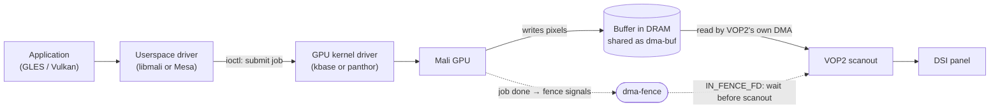

# Experiment 18: GPU Driver Stack Discovery

## 1. Objective
Experiments 01–17 treated the CPU as the only producer of pixels. On a real system the **GPU** renders the frames and the display controller only scans them out. Before writing any GPU code, this experiment finds out **which GPU driver stack the LubanCat 5 actually runs**, because the two possible stacks differ in almost every interface a program would use (device node, ioctls, userspace libraries, debugging tools).

This is a read-only experiment. Experiments 19 (GPU render → dma-buf → KMS) and 20 (tracing the path) will be designed from its results.

---

## 2. Environment
See the [Test Environment](../README.md#test-environment) section. Additionally install `mesa-utils` (provides `eglinfo` on Ubuntu 24.04) if it is not present:
```bash
sudo apt install mesa-utils
```

---

## 3. Background / Key Concepts

### 3.1 The GPU does not "DMA to the display"
The GPU and the display controller never talk to each other directly. They meet in **memory**:



1. The GPU **writes** the rendered frame into a buffer in DRAM.
2. The buffer is shared with the display driver as a **dma-buf** (zero-copy, [Experiment 11](./11_DMA_BUF_and_Fence_Sync.md)).
3. The display controller **reads** it with its own DMA engine during scanout.
4. A **dma-fence** tells the display side when the GPU has finished writing ([Experiment 05](./05_Composition_and_Sync.md)); the swap itself happens at VBlank ([Experiment 09](./09_VBlank_and_Tearing_Analysis.md)).

Experiment 11 simulated step 1 with the CPU. Experiment 19 will replace it with the real GPU.

### 3.2 Two possible driver stacks for the RK3588 GPU
The RK3588 GPU is a Mali Valhall-generation part with a CSF (Command Stream Frontend). Both driver tables below list **Mali-G610** by name: `gpuinfo_show()` in the BSP kbase driver (`GPU_ID_PRODUCT_LODX`) and `panthor_hw.c` in mainline. Which one the board has is read at runtime from the GPU ID register; section 5 records it.

| | **Rockchip / LubanCat BSP** | **Mainline Linux** |
| :--- | :--- | :--- |
| Kernel driver | Arm **kbase** (`drivers/gpu/arm/bifrost/`) | **panthor** (`drivers/gpu/drm/panthor/`, since `v6.10`) |
| Enabled by | `CONFIG_MALI_BIFROST=y`, `CONFIG_MALI_CSF_SUPPORT=y` in `lubancat_linux_rk3588_defconfig` | `CONFIG_DRM_PANTHOR` |
| DT `compatible` of the GPU node | `"arm,mali-bifrost"` (`rk3588s.dtsi` in the LubanCat tree) | `"rockchip,rk3588-mali", "arm,mali-valhall-csf"` (`rk3588-base.dtsi`) |
| Is it a DRM driver? | **No.** A misc device named `"mali%d"` → `/dev/mali0`, mode `0666`, with its own ioctl set | **Yes.** `DRIVER_RENDER` only (no modesetting) → `/dev/dri/renderD*` |
| Userspace GLES/EGL | Rockchip **libmali** (closed source) | **Mesa** (open source) |
| Debug interfaces | sysfs `gpuinfo` attribute, debugfs directory `mali0/` (e.g. `ctx/`) | Generic DRM debugfs, `drm.debug`, `gpu_scheduler` tracepoints (not yet verified for panthor) |
| Imports dma-buf? | Yes: `kbase_mem_from_umm()` calls `dma_buf_get(fd)` (memory type `KBASE_MEM_TYPE_IMPORTED_UMM`) | Yes, through the DRM PRIME helpers |

Sources: LubanCat kernel `github.com/LubanCat/kernel`, branch `lbc-develop-6.1` (`arch/arm64/configs/lubancat_linux_rk3588_defconfig`; `drivers/gpu/arm/bifrost/mali_kbase_core_linux.c`, `device/mali_kbase_device.c`, `mali_kbase.h`, `mali_kbase_mem_linux.c`; `arch/arm64/boot/dts/rockchip/rk3588s.dtsi`); mainline `torvalds/linux` master (`drivers/gpu/drm/panthor/panthor_drv.c`, `panthor_hw.c`; `arch/arm64/boot/dts/rockchip/rk3588-base.dtsi`), with the panthor introduction checked by its absence in `v6.9` and presence in `v6.10`. All checked on the branch heads, not on the image installed on the board.

Notes:
* The LubanCat defconfig does **not** enable `CONFIG_DRM_PANFROST` or `CONFIG_DRM_PANTHOR`. Mainline panfrost also matches `"arm,mali-bifrost"`, but its match table has `"arm,mali-valhall-jm"` and no CSF entry; CSF GPUs are handled by panthor.
* With the BSP stack, the **kernel** side (kbase) is open source and can be read, but the **userspace** driver is not. A GLES call can therefore be followed from the ioctl boundary downwards, not inside libmali.
* The LubanCat defconfig also enables DMA-BUF heaps (`CONFIG_DMABUF_HEAPS_SYSTEM`, `CONFIG_DMABUF_HEAPS_CMA`), i.e. `/dev/dma_heap/*`, a vendor-neutral way to allocate buffers that both the GPU and the display can import.

### 3.3 "Userspace → driver → kernel" for the GPU
The same layering as for KMS applies, with different names at each level:

| Layer | KMS (Experiments 07–17) | GPU, BSP stack | GPU, mainline stack |
| :--- | :--- | :--- | :--- |
| API | libdrm calls in `src/*.c` | EGL / OpenGL ES | EGL / OpenGL ES / Vulkan |
| Userspace driver | libdrm (thin) | libmali (closed) | Mesa panfrost / panvk |
| Device node | `/dev/dri/card0` | `/dev/mali0` | `/dev/dri/renderD*` |
| Kernel entry | `drm_ioctl()` | kbase `kbase_fops` ioctls | `drm_ioctl()` → panthor ioctls |
| Hardware | VOP2 | Mali GPU (CSF firmware) | Mali GPU (CSF firmware) |

---

## 4. Implementation
No new C program. The discovery is part of `tools/collect-results.sh` (files `18-*.txt`), so it runs with the rest of the hardware validation:

```bash
sudo tools/collect-results.sh
```

What it records, and why:

| File | Command (summary) | Answers |
| :--- | :--- | :--- |
| `18-dev-nodes.txt` | `ls -la /dev/mali* /dev/dri/ /dev/dma_heap/` | kbase (`/dev/mali0`) or DRM render node? Which DMA-BUF heaps exist? |
| `18-gpu-modules.txt` | `/sys/module`, `lsmod` filtered for mali/kbase/panfrost/panthor | Which GPU driver is loaded (built-in drivers never show in `lsmod`; they may or may not have a `/sys/module` entry, so also check the next rows) |
| `18-gpu-dt-node.txt` | `compatible`/`status` of `gpu@*` in `/proc/device-tree` | Which binding the running DT uses |
| `18-gpu-driver-binding.txt` | `readlink /sys/bus/platform/devices/*.gpu/driver` | Which driver actually bound to the GPU device |
| `18-gpuinfo.txt` | `cat .../gpuinfo` | GPU product name and core count as reported by kbase |
| `18-mali-debugfs-ls.txt` | `ls /sys/kernel/debug/mali0/` | Available kbase debug files |
| `18-render-node-names.txt` | `cat /sys/kernel/debug/dri/*/name` | Which DRM devices exist (display, GPU render node) |
| `18-gpu-devfreq.txt` | `/sys/class/devfreq/*` | GPU DVFS: current and available frequencies |
| `18-gpu-libs.txt` | `ldconfig -p`, `ls libmali*`, package list | Is libmali or Mesa providing EGL/GLES/GBM? |
| `18-eglinfo.txt` | `eglinfo` | EGL vendor, client APIs, and **extensions** |
| `18-vulkaninfo.txt` | `vulkaninfo --summary` (if installed) | Whether a Vulkan driver is present |
| `18-dmesg-gpu.txt` | `dmesg` filtered | Driver probe messages, firmware loading |

---

## 5. Results (pending hardware verification)
> `TODO(on-hardware)`: fill in from `hw-results-*/18-*.txt`.

| Question | Answer |
| :--- | :--- |
| GPU kernel driver bound (`18-gpu-driver-binding.txt`) | `TODO` |
| Device node (`/dev/mali0` or `/dev/dri/renderD*`) | `TODO` |
| GPU product / cores (`18-gpuinfo.txt`) | `TODO` |
| Userspace GLES/EGL provider (libmali or Mesa) and version | `TODO` |
| EGL vendor string (`eglinfo`) | `TODO` |
| `EGL_EXT_image_dma_buf_import` available? | `TODO` |
| `EGL_KHR_platform_gbm` / `EGL_MESA_platform_gbm` available? | `TODO` |
| `EGL_ANDROID_native_fence_sync` available? | `TODO` |
| DMA-BUF heaps in `/dev/dma_heap/` | `TODO` |

---

## 6. Analysis: how the results decide Experiment 19
The three EGL extensions in the table above determine which zero-copy path Experiment 19 can use:

| If `eglinfo` shows … | Path for Experiment 19 |
| :--- | :--- |
| a GBM platform extension | Classic "kmscube" style: create a GBM surface on `/dev/dri/card0`, render with GLES, turn each GBM buffer object into a KMS framebuffer. |
| `EGL_EXT_image_dma_buf_import` (with or without GBM) | Allocate the buffer ourselves (dumb buffer from the display device, or a DMA-BUF heap), import it into EGL as a render target, render, then scan it out with an atomic commit. This is the most direct continuation of Experiment 11. |
| `EGL_ANDROID_native_fence_sync` | The GPU's completion can be exported as a sync-file fd and passed to KMS as `IN_FENCE_FD`, making the GPU → display hand-off fully explicit (Experiment 11's explicit-fence mode with a real producer). |
| none of the above | Fall back to rendering into an off-screen EGL surface and copying with `glReadPixels` into a dumb buffer. This works but is **not** zero-copy; it is useful as a baseline to measure what zero-copy saves. |

Which of these libmali supports has **not** been verified; that is exactly what `18-eglinfo.txt` answers.

---

## 7. Key Takeaways
* GPU and display share frames through memory (dma-buf) and synchronize through fences; neither DMAs into the other.
* On the LubanCat BSP the GPU is driven by Arm's **kbase** (`/dev/mali0`, not a DRM device) with closed userspace (**libmali**); mainline uses the DRM driver **panthor** with open Mesa userspace.
* The EGL extensions exposed by the userspace driver decide how a zero-copy GPU → KMS pipeline can be built, so they are measured before any GPU code is written.

## 8. References
* LubanCat kernel, branch `lbc-develop-6.1`: `arch/arm64/configs/lubancat_linux_rk3588_defconfig`, `arch/arm64/boot/dts/rockchip/rk3588s.dtsi`, `drivers/gpu/arm/bifrost/` (`mali_kbase_core_linux.c`: `kbase_dt_ids`, `gpuinfo_show`, misc device setup; `device/mali_kbase_device.c`: device name; `mali_kbase.h`: `KBASE_DRV_NAME`; `mali_kbase_mem_linux.c`: `kbase_mem_from_umm`)
* Mainline `torvalds/linux`: `drivers/gpu/drm/panthor/panthor_drv.c` (`driver_features`, `of_match`), `drivers/gpu/drm/panthor/panthor_hw.c`, `drivers/gpu/drm/panfrost/panfrost_drv.c` (`of_match`), `arch/arm64/boot/dts/rockchip/rk3588-base.dtsi` (`gpu@fb000000`)
* Kernel documentation: [`Documentation/driver-api/dma-buf.rst`](https://github.com/torvalds/linux/blob/master/Documentation/driver-api/dma-buf.rst)
* Ubuntu 24.04 package `mesa-utils` 9.0.0 (`eglinfo`, `es2_info`)
